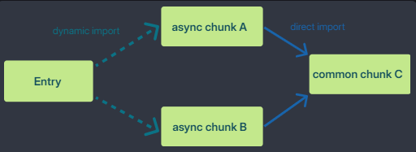

vite v8.0.16

https://vite.dev/

- [1. Guide](#1-guide)
  - [1.1. Getting Started](#11-getting-started)
  - [1.2. Why Vite](#12-why-vite)
  - [1.3. Features](#13-features)
  - [1.4. Using Plugins](#14-using-plugins)
  - [1.5. Dependency Pre-Bundling](#15-dependency-pre-bundling)
  - [1.6. Static Asset Handling](#16-static-asset-handling)
  - [1.7. Building for Production](#17-building-for-production)
  - [1.8. Deploying a Static Site](#18-deploying-a-static-site)
  - [1.9. Env Variables and Modes](#19-env-variables-and-modes)
  - [1.10. Troubleshooting](#110-troubleshooting)
- [2. Config](#2-config)


# 1. Guide

## 1.1. Getting Started

consists of two major parts: **dev server** & bundler **Rolldown**

During development, Vite assumes that a modern browser is used (esnext). For production builds, Vite by default targets Baseline Widely Available browsers (released at least 2.5 years ago). 

https://vite.dev/guide/#trying-vite-online

```bash
npm create vite@latest my-vue-app -- --template vue
npm create vite@latest . -- --template react
```

https://vite.dev/guide/#community-templates

https://vite.dev/guide/#manual-installation

`index.html` is front-and-central instead of being tucked away inside `public`. `Vite` is a server, and index.html is the entry point to your application. URLs inside index.html are automatically rebased so there's no need for special `%PUBLIC_URL%` placeholders.

Absolute URLs in your source code will be resolved using the project root as base

```json
  "scripts": {
    "dev": "vite", // start dev server, aliases: `vite dev`, `vite serve`
    "build": "vite build", // build for production
    "preview": "vite preview" // local static web server serves files from dist
  }
```
You can specify additional CLI options like `--port` or `--open`.

## 1.2. Why Vite

Traditional build tools (often called bundlers) would process your entire application upfront before anything could be shown in the browser. Vite split the work into two parts:
- **Dependencies** (libraries that rarely change) are pre-bundled once using fast native tooling, so they're ready instantly.
- **Source code** is served on-demand over native ESM. The browser loads only what it needs for the current page, and Vite transforms each file as it's requested.

When you edited a file, Vite used Hot Module Replacement (HMR) over native ESM to update just that module in the browser, without a full page reload or waiting for a rebuild.

Rolldown uses Oxc for parsing, transforming, and minifying.

## 1.3. Features

`import { someMethod } from 'my-dep'`

Vite will detect such bare module imports in all served source files and perform the following:

- [Pre-bundle](https://vite.dev/guide/dep-pre-bundling) them to improve page loading speed and convert CommonJS / UMD modules to ESM. 
- Rewrite the imports to valid URLs like `/node_modules/.vite/deps/my-dep.js?v=f3sf2ebd` so that the browser can import them properly.

https://vite.dev/guide/features#hot-module-replacement

Vite only performs transpilation on `.ts` files and does NOT perform type checking. This principle applies to other static analysis checks such as `ESLint`.

- For production builds, you can run `tsc --noEmit` in addition to Vite's build command.
- During development, if you need more than IDE hints, we recommend running `tsc --noEmit --watch` in a separate process, or use `vite-plugin-checker`
- Use the `Type-Only Imports and Export syntax` to avoid potential problems
- Vite respects some of the options in `tsconfig.json` and sets the corresponding Oxc Transformer options. When the options are set in both the Vite config and the `tsconfig.json`, the value in the Vite config takes precedence.
- https://vite.dev/guide/features#typescript-compiler-options
- https://vite.dev/guide/features#client-types

Any HTML files in your project root can be directly accessed by its respective directory path:
```
<root>/index.html -> http://localhost:5173/
<root>/about.html -> http://localhost:5173/about.html
<root>/blog/index.html -> http://localhost:5173/blog/index.html
```
https://vite.dev/guide/features#html

https://vite.dev/guide/features#frameworks (plugins)

https://vite.dev/guide/features#css

https://vite.dev/guide/features#static-assets

https://vite.dev/guide/features#json

https://vite.dev/guide/features#content-security-policy-csp

**Build Optimizations**

Vite automatically extracts the CSS used by modules in an async chunk and generates a separate file for it. 

In real world applications, Rollup often generates "common" chunks - code that is shared between two or more other chunks. 



Vite automatically rewrites code-split dynamic import calls with a preload step so that when A is requested, C is fetched in parallel: `Entry ---> (A + C)`

## 1.4. Using Plugins

```ts
import { defineConfig } from 'vite'
export default defineConfig({
  plugins: [],
})
```
`plugins` also accepts presets including several plugins as a single element. Falsy plugins will be ignored.

You can enforce the position of a plugin with the enforce modifier: `pre`, `default`, `post`

https://vite.dev/guide/api-plugin#plugin-ordering

use the `apply` property to only invoke them during `'build'` or `'serve'`

## 1.5. Dependency Pre-Bundling

In cases where you want to explicitly include/exclude dependencies from the list, use the [optimizeDeps config options](https://vite.dev/config/dep-optimization-options).

Vite caches the pre-bundled dependencies in `node_modules/.vite`

Resolved dependency requests are strongly cached. these requests will never hit the dev server again. 

https://vite.dev/guide/dep-pre-bundling#caching

## 1.6. [Static Asset Handling](https://vite.dev/guide/assets)

## 1.7. [Building for Production](https://vite.dev/guide/build)

## 1.8. [Deploying a Static Site](https://vite.dev/guide/static-deploy)

## 1.9. [Env Variables and Modes](https://vite.dev/guide/env-and-mode)

## 1.10. [Troubleshooting](https://vite.dev/guide/troubleshooting)

# 2. [Config](https://vite.dev/config/)