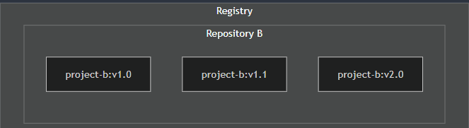

https://docs.docker.com/


- [1. Get started](#1-get-started)
  - [1.1. What is Docker?](#11-what-is-docker)
  - [1.2. Introduction](#12-introduction)
    - [1.2.1. Develop with containers](#121-develop-with-containers)
    - [1.2.2. Build and push your first image](#122-build-and-push-your-first-image)
  - [1.3. Docker concepts](#13-docker-concepts)
    - [1.3.1. The basics](#131-the-basics)
      - [1.3.1.1. What is a registry?](#1311-what-is-a-registry)
      - [1.3.1.2. What is Docker Compose?](#1312-what-is-docker-compose)
    - [1.3.2. Building images](#132-building-images)
      - [1.3.2.1. Understanding the image layers](#1321-understanding-the-image-layers)
      - [1.3.2.2. Writing a Dockerfile](#1322-writing-a-dockerfile)
      - [1.3.2.3. Build, tag, and publish an image](#1323-build-tag-and-publish-an-image)
      - [1.3.2.4. Using the build cache](#1324-using-the-build-cache)
      - [1.3.2.5. Multi-stage builds](#1325-multi-stage-builds)
    - [1.3.3. Running containers](#133-running-containers)
      - [1.3.3.1. Publishing and exposing ports](#1331-publishing-and-exposing-ports)
      - [1.3.3.2. Overriding container defaults](#1332-overriding-container-defaults)
      - [1.3.3.3. Persisting container data](#1333-persisting-container-data)
      - [1.3.3.4. Sharing local files with containers](#1334-sharing-local-files-with-containers)
      - [1.3.3.5. Multi-container applications](#1335-multi-container-applications)
- [2. Guides](#2-guides)
  - [2.1. React.js language-specific guide](#21-reactjs-language-specific-guide)
  - [2.2. Node.js language-specific guide](#22-nodejs-language-specific-guide)
- [3. Manuals](#3-manuals)
  - [3.1. AI and agents](#31-ai-and-agents)
  - [3.2. Application development](#32-application-development)
    - [3.2.1. Docker Engine](#321-docker-engine)
      - [3.2.1.1. Storage](#3211-storage)
- [4. Reference](#4-reference)


# 1. Get started

## 1.1. What is Docker?

Docker uses a client-server architecture. The Docker client (`docker`) talks to the Docker daemon (`dockerd`), which does the heavy lifting of building, running, and distributing your Docker containers.

Another Docker client is Docker Compose, that lets you work with applications consisting of a set of containers.

An image is a read-only template with instructions for creating a Docker container. To build your own image, you create a Dockerfile with a simple syntax for defining the steps needed to create the image and run it. Each instruction in a Dockerfile creates a layer in the image. When you change the Dockerfile and rebuild the image, only those layers which have changed are rebuilt. 

```bash
docker run -i -t ubuntu /bin/bash
```
- `docker pull ubuntu`
- `docker container create`
- Docker allocates a read-write filesystem to the container, as its final layer. 
- Docker creates a network interface to connect the container to the default network
- Docker starts the container and executes `/bin/bash`. container is running interactively and attached to your terminal (due to the -i and -t flags)
- When you run `exit` to terminate the `/bin/bash` command, the container stops but isn't removed.

## 1.2. Introduction

### 1.2.1. Develop with containers

```bash
docker compose up
```

if developers wanted their running containers to see local code changes in real-time using just `up`, they had to rely on Bind Volumes
```yaml
volumes:
      - .:/app # ⚠️ The old way: Maps your entire local folder into the container
```

```bash
docker compose watch
```

you explicitly define rules inside your docker-compose.yml file telling Docker exactly how to handle file updates.
```yaml
develop:
      watch:
        # Action 1: Sync simple frontend/backend code changes instantly
        - action: sync
        ...
```

**Start the project**

```bash
git clone https://github.com/docker/getting-started-todo-app
cd getting-started-todo-app
docker compose watch
```

React frontend, Node backend, MySQL database, phpMyAdmin , Traefik proxy

### 1.2.2. Build and push your first image

When choosing base images, Docker Hub offers two categories of trusted, Docker-maintained images:

- Docker Official Images (DOI)
- Docker Hardened Images (DHI) – Minimal, secure, production-ready images with near-zero CVEs, designed to reduce attack surface and simplify compliance.
  
Create repository (getting-started-todo-app) on Docker Hub.

```bash
docker build -t <DOCKER_USERNAME>/getting-started-todo-app .
docker image ls # to check built images
docker push <DOCKER_USERNAME>/getting-started-todo-app
```

## 1.3. Docker concepts

### 1.3.1. The basics

#### 1.3.1.1. What is a registry?

repository is a collection of related container images within a registry. 



Docker tags allow you to label and version your images.
```
docker tag <DOCKER_USERNAME>/getting-started-todo-app <DOCKER_USERNAME>/getting-started-todo-app:1.0
docker push <YOUR_DOCKER_USERNAME>/getting-started-todo-app:1.0
```
When you build and push a Docker image without explicitly specifying a version name, Docker automatically assigns it the `latest` tag. For real deployments, you should explicitly tag every single image

#### 1.3.1.2. What is Docker Compose?

With Docker Compose, you can define all of your containers and their configurations in a single YAML file. If you include this file in your code repository, anyone that clones your repository can get up and running with a single command.

```bash
git clone https://github.com/dockersamples/todo-list-app 
cd todo-list-app
docker compose up -d --build
docker compose down # remove all containers
```

### 1.3.2. Building images

#### 1.3.2.1. Understanding the image layers

Each layer in an image contains a set of filesystem changes - additions, deletions, or modifications. 

Layers let you extend images of others by reusing their base layers, allowing you to add only the data that your application needs.

- After each layer is downloaded, it is extracted into its own directory on the host filesystem.
- When you run a container from an image, a union filesystem is created where layers are stacked on top of each other, creating a new and unified view.
- When the container starts, its root directory is set to the location of this unified directory, using `chroot`.

```bash
docker run --name=base-container -ti ubuntu # you should see a new shell prompt.
apt update && apt install -y nodejs
node -e 'console.log("Hello world!")'
docker container commit -m "Add node" base-container node-base
docker image history node-base

IMAGE          CREATED          CREATED BY                             SIZE      COMMENT
9e274734bb25   10 seconds ago   /bin/bash                              157MB     Add node
cd1dba651b30   7 days ago       /bin/sh -c #(nop)  CMD ["/bin/bash"]   0B
<missing>      7 days ago       /bin/sh -c #(nop) ADD file:6089c6be¦   110MB
...
<missing>      7 days ago       /bin/sh -c #(nop)  ARG RELEASE          0B

docker run node-base node -e "console.log('Hello again')"
docker rm -f base-container

docker run --name=app-container -ti node-base
echo 'console.log("Hello from an app")' > app.js
docker container commit -c "CMD node app.js" -m "Add app" app-container sample-app
docker image history sample-app

IMAGE          CREATED              CREATED BY    SIZE      COMMENT
c1502e2ec875   About a minute ago   /bin/bash     33B       Add app
5310da79c50a   4 minutes ago        /bin/bash     126MB     Add node
...
```

#### 1.3.2.2. Writing a Dockerfile

```docker
FROM python:3.13 # he base image that the build will extend.
WORKDIR /usr/local/app # the path in the image where files will be copied and commands will be executed.

# Install the application dependencies
COPY requirements.txt ./ # COPY <host-path> <image-path>
RUN pip install --no-cache-dir -r requirements.txt # run the specified command

# Copy in the source code
COPY src ./src
EXPOSE 8080

# Setup an app user so the container doesn't run as the root user
RUN useradd app
USER app # sets the default user for all subsequent instructions.

# sets the default command a container using this image will run
CMD ["uvicorn", "app.main:app", "--host", "0.0.0.0", "--port", "8080"]
```
https://docs.docker.com/reference/dockerfile

#### 1.3.2.3. Build, tag, and publish an image

```bash
docker build . # the builder will find the Dockerfile and other referenced files.
# With the previous command, the image will have no name, but the output will provide the ID of the image
docker run sha256:9924dfd9350407b3df01d1a0e1033b1e543523ce7d5d5e2c83a724480ebe8f00
```

https://docs.docker.com/get-started/docker-concepts/building-images/build-tag-and-publish-an-image/#tagging-images

```bash
docker build -t my-username/my-image .
# If you've already built an image, you can add another tag to the image
docker image tag my-username/my-image another-username/another-image:v1
```

#### 1.3.2.4. Using the build cache

Here are a few examples of situations that can cause cache to be invalidated:

- Any changes to the command of a `RUN` instruction invalidates that layer.
- Any changes to files copied into the image with the `COPY` or `ADD` instructions.
- Once one layer is invalidated, all following layers are also invalidated

`docker image history`output, you see that each command in the Dockerfile becomes a new layer in the image

```docker
FROM node:22-alpine
WORKDIR /app
COPY package.json yarn.lock ./
RUN yarn install --production 
COPY . . 
EXPOSE 3000
CMD ["node", "src/index.js"]
```

`.dockerignore`
```txt
node_modules
```

#### 1.3.2.5. Multi-stage builds

in a single build container: downloading dependencies, compiling code, and packaging the application. All those layers end up in your final image. This approach works, but it leads to bulky images carrying unnecessary weight and increasing your security risks

```docker
# Stage 1: Build Environment
FROM builder-image AS build-stage 
# Install build tools (e.g., Maven, Gradle)
# Copy source code
# Build commands (e.g., compile, package)

# Stage 2: Runtime environment
FROM runtime-image AS final-stage  
#  Copy application artifacts from the build stage (e.g., JAR file)
COPY --from=build-stage /path/in/build/stage /path/to/place/in/final/stage
# Define runtime configuration (e.g., CMD, ENTRYPOINT) 
```

if you don't explicitly specify a target stage using the `--target` flag in the `docker build` command, Docker will automatically build the last stage by default. 

### 1.3.3. Running containers

#### 1.3.3.1. Publishing and exposing ports

```bash
docker run -d -p HOST_PORT:CONTAINER_PORT nginx
# any traffic sent to port 8080 on your host machine will be forwarded to port 80 within the container
docker run -d -p 8080:80 nginx
```

the `EXPOSE` instructions used to specify ports aren't published by default.
```bash
docker run -P nginx
```

Use Docker Compose
```yaml
services:
  app:
    image: docker/welcome-to-docker
    ports:
      - 8080:80
```

#### 1.3.3.2. Overriding container defaults

```bash
docker run -d -p HOST_PORT:CONTAINER_PORT postgres
docker run -e foo=bar postgres
docker run --env-file .env postgres
docker run --memory="512m" --cpus="0.5" postgres
```

`docker stats` command to monitor the real-time resource usage of running containers.

```bash
docker network create mynetwork
docker network ls
docker run -d --network mynetwork postgres
```
> On a custom network, containers can resolve each other by name or alias.
> All containers without a --network specified are attached to the default bridge network, hence can be a risk, as unrelated containers are then able to communicate.

```yaml
services:
  postgres:
    image: postgres:18
    entrypoint: ["docker-entrypoint.sh", "postgres"]
    command: ["-h", "localhost", "-p", "5432"]
    environment:
      POSTGRES_PASSWORD: secret 
```

See https://docs.docker.com/reference/dockerfile#entrypoint, https://docs.docker.com/reference/dockerfile#cmd

#### 1.3.3.3. Persisting container data

```bash
docker run --name=db -e POSTGRES_PASSWORD=secret -d -v postgres_data:/var/lib/postgresql postgres:18
docker exec -ti db psql -U postgres

docker volume ls
docker volume prune # remove all unused (unattached) volumes

docker rm -f db # stop the container and then remove it
docker volume rm postgres_data
```

#### 1.3.3.4. Sharing local files with containers

If you want to ensure that data generated or modified inside the container persists even after the container stops running, you would opt for a volume.

If you have specific files or directories on your host system that you want to directly share with your container, like configuration files or development code, then you would use a bind mount.

Both `-v` (or `--volume`) and `--mount` flags used with the `docker run` command let you use bind mounts

If the host location doesn’t exist when using `-v`, a directory will be automatically created.

```bash
docker run -v /HOST/PATH:/CONTAINER/PATH -it nginx
```
The `--mount` flag offers more advanced features and granular control, making it suitable for complex mount scenarios or production deployments. doesn't automatically create directory for you

```bash
docker run --mount type=bind,source=/HOST/PATH,target=/CONTAINER/PATH,readonly nginx
```

Named volume: `type=volume,src=my-volume,target=/usr/local/data`

Bind mount: `type=bind,src=/path/to/data,target=/usr/local/data`

#### 1.3.3.5. [Multi-container applications](https://docs.docker.com/get-started/docker-concepts/running-containers/multi-container-applications/)

In this hands-on guide, you'll first see how to build and run using the `docker run` commands. You’ll also see how you can simplify the entire deployment process using Docker Compose.

```
git clone https://github.com/dockersamples/nginx-node-redis
```
...

```bash
docker compose up -d --build
docker compose down
docker compose stop
docker compose start
```

# 2. Guides

https://docs.docker.com/guides/?languages=js

## 2.1. [React.js language-specific guide](https://docs.docker.com/guides/reactjs/)

...

## 2.2. [Node.js language-specific guide](https://docs.docker.com/guides/nodejs/)

...


# 3. Manuals

## 3.1. AI and agents

https://docs.docker.com/ai-overview/

## 3.2. Application development

### 3.2.1. Docker Engine

#### 3.2.1.1. [Storage](https://docs.docker.com/engine/storage/)

- tmpfs mounts: A tmpfs mount stores files directly in the host machine's memory, ensuring the data is not written to disk


# 4. Reference

```bash
docker system prune --volumes
```
