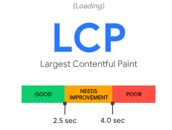
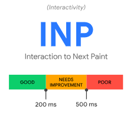

https://web.dev/articles/vitals

- [1. Core Web Vitals](#1-core-web-vitals)
- [2. Other Web Vitals](#2-other-web-vitals)

# 1. Core Web Vitals

- [Largest Contentful Paint (LCP)](https://web.dev/articles/lcp): LCP reports the render time of the largest image, text block, or video visible in the viewport, relative to when the user first navigated to the page.
  
  
- [Interaction to Next Paint (INP)](https://web.dev/articles/inp): The intent of INP is not to measure all the eventual effects of an interaction—such as network fetches and UI updates from other asynchronous operations—but the time that the next paint is being blocked. By delaying visual feedback, users may get the impression that the page is not responding quickly enough.
  
  
- [Cumulative Layout Shift (CLS)](https://web.dev/articles/cls): Unexpected layout shifts can disrupt the user experience in many ways, from causing them to lose their place while reading if the text moves suddenly, to making them click the wrong link or button. it doesn't count as a layout shift—as long as the change doesn't cause other visible elements to change their start position.
  
  Good CLS values are 0.1 or less [see](https://web.dev/articles/cls#layout-shift-score)

# 2. Other Web Vitals

- First Contentful Paint (FCP) measures the time from when the user first navigated to the page to when any part of the page's content is rendered on the screen.
- Time to First Byte (TTFB) measures the time between the request for a resource and when the first byte of a response begins to arrive.

