https://developer.mozilla.org/en-US/docs/Learn_web_development

- [1. Getting started modules](#1-getting-started-modules)
  - [1.1. The web standards model](#11-the-web-standards-model)
    - [1.1.1. The web standards model](#111-the-web-standards-model)
- [2. Core learning modules](#2-core-learning-modules)
  - [2.1. Structuring content with HTML](#21-structuring-content-with-html)
    - [2.1.1. Basic HTML syntax](#211-basic-html-syntax)
    - [2.1.2. Web page metadata](#212-web-page-metadata)
    - [2.1.3. Emphasis and importance](#213-emphasis-and-importance)
    - [2.1.4. Lists](#214-lists)
    - [2.1.5. Advanced text features](#215-advanced-text-features)
    - [2.1.6. Structuring documents](#216-structuring-documents)
    - [2.1.7. Creating links](#217-creating-links)
    - [2.1.8. HTML images](#218-html-images)
    - [2.1.9. HTML video and audio](#219-html-video-and-audio)
    - [2.1.10. HTML table accessibility](#2110-html-table-accessibility)
    - [2.1.11. Forms and buttons in HTML](#2111-forms-and-buttons-in-html)
    - [2.1.12. From object to iframe — general embedding technologies](#2112-from-object-to-iframe--general-embedding-technologies)
  - [2.2. CSS styling basics](#22-css-styling-basics)
    - [2.2.1. Basic CSS selectors](#221-basic-css-selectors)
    - [2.2.2. Attribute selectors](#222-attribute-selectors)
    - [2.2.3. Pseudo-classes and pseudo-elements](#223-pseudo-classes-and-pseudo-elements)
    - [2.2.4. Combinators](#224-combinators)
    - [2.2.5. The box model](#225-the-box-model)
    - [2.2.6. Handling conflicts](#226-handling-conflicts)
    - [2.2.7. CSS values and units](#227-css-values-and-units)
    - [2.2.8. Sizing items in CSS](#228-sizing-items-in-css)
    - [2.2.9. Backgrounds and borders](#229-backgrounds-and-borders)
    - [2.2.10. Images, media, and form elements](#2210-images-media-and-form-elements)
    - [2.2.11. Styling tables](#2211-styling-tables)
    - [2.2.12. Cascade layers](#2212-cascade-layers)
    - [2.2.13. Handling different text directions](#2213-handling-different-text-directions)
  - [2.3. CSS text styling](#23-css-text-styling)
    - [2.3.1. Fundamental text and font styling](#231-fundamental-text-and-font-styling)
    - [2.3.2. Styling lists](#232-styling-lists)
    - [2.3.3. Styling links](#233-styling-links)
    - [2.3.4. Web fonts](#234-web-fonts)
  - [2.4. CSS layout](#24-css-layout)
    - [2.4.1. Introduction to CSS layout](#241-introduction-to-css-layout)
    - [2.4.2. Floats](#242-floats)
    - [2.4.3. Positioning](#243-positioning)
    - [2.4.4. Flexbox](#244-flexbox)
    - [2.4.5. CSS grid layout](#245-css-grid-layout)
    - [2.4.6. Media query fundamentals](#246-media-query-fundamentals)
    - [2.4.7. Practical positioning examples](#247-practical-positioning-examples)
    - [2.4.8. Supporting older browsers](#248-supporting-older-browsers)
    - [2.4.9. Multiple-column layout](#249-multiple-column-layout)
  - [2.5. Dynamic scripting with JavaScript](#25-dynamic-scripting-with-javascript)
    - [2.5.1. Functions](#251-functions)
    - [2.5.2. Event bubbling](#252-event-bubbling)
    - [2.5.3. JavaScript object basics](#253-javascript-object-basics)
    - [2.5.4. DOM scripting introduction](#254-dom-scripting-introduction)
    - [2.5.5. JSON](#255-json)
    - [2.5.6. JavaScript debugging and error handling](#256-javascript-debugging-and-error-handling)
  - [2.6. Accessibility on the web](#26-accessibility-on-the-web)
    - [2.6.1. Accessibility tools](#261-accessibility-tools)
    - [2.6.2. Accessible HTML](#262-accessible-html)
    - [2.6.3. Accessible CSS and JS](#263-accessible-css-and-js)
    - [2.6.4. WAI-ARIA basics](#264-wai-aria-basics)
    - [2.6.5. Accessible multimedia](#265-accessible-multimedia)
    - [2.6.6. Mobile accessibility](#266-mobile-accessibility)
- [3. Extension modules](#3-extension-modules)
  - [3.1. Advanced JavaScript objects](#31-advanced-javascript-objects)
    - [3.1.1. Object prototypes](#311-object-prototypes)
    - [3.1.2. Object-oriented programming](#312-object-oriented-programming)
    - [3.1.3. Classes in JavaScript](#313-classes-in-javascript)
  - [3.2. Client-side web APIs](#32-client-side-web-apis)
    - [3.2.1. Client-side storage](#321-client-side-storage)
  - [3.3. Asynchronous JavaScript](#33-asynchronous-javascript)
    - [3.3.1. How to use promises](#331-how-to-use-promises)
    - [3.3.2. How to implement a promise-based API](#332-how-to-implement-a-promise-based-api)
    - [3.3.3. Introducing workers](#333-introducing-workers)
  - [3.4. Web forms](#34-web-forms)
    - [3.4.1. How to structure a web form](#341-how-to-structure-a-web-form)
    - [3.4.2. The HTML5 input types](#342-the-html5-input-types)
    - [3.4.3. Other form controls](#343-other-form-controls)
    - [3.4.4. Styling web forms](#344-styling-web-forms)
    - [3.4.5. Advanced form styling](#345-advanced-form-styling)
    - [3.4.6. UI pseudo-classes](#346-ui-pseudo-classes)
    - [3.4.7. Client-side form validation](#347-client-side-form-validation)
    - [3.4.8. How to build custom form controls](#348-how-to-build-custom-form-controls)
  - [3.5. Understanding client-side web development tools](#35-understanding-client-side-web-development-tools)
    - [3.5.1. Client-side tooling overview](#351-client-side-tooling-overview)
  - [3.6. Server-side websites](#36-server-side-websites)
    - [3.6.1. First steps \> Server-side frameworks](#361-first-steps--server-side-frameworks)
    - [3.6.2. First steps \> Website security](#362-first-steps--website-security)
    - [3.6.3. Express (Node.js) \> Express/Node introduction](#363-express-nodejs--expressnode-introduction)
    - [3.6.4. Express (Node.js) \> Local library tutorial](#364-express-nodejs--local-library-tutorial)
    - [3.6.5. Express (Node.js) \> Setting up a Node development environment](#365-express-nodejs--setting-up-a-node-development-environment)
    - [3.6.6. Express (Node.js) \> Using a Database with Mongoose](#366-express-nodejs--using-a-database-with-mongoose)
    - [3.6.7. Express (Node.js) \> Routes and controllers](#367-express-nodejs--routes-and-controllers)
    - [3.6.8. Express (Node.js) \> Working with forms](#368-express-nodejs--working-with-forms)
    - [3.6.9. Express (Node.js) \> Deploying](#369-express-nodejs--deploying)
  - [3.7. Web performance](#37-web-performance)
    - [3.7.1. Perceived performance](#371-perceived-performance)
    - [3.7.2. Measuring performance](#372-measuring-performance)
    - [3.7.3. Multimedia: Images](#373-multimedia-images)
    - [3.7.4. Multimedia: video](#374-multimedia-video)
    - [3.7.5. JavaScript performance optimization](#375-javascript-performance-optimization)
    - [3.7.6. HTML performance optimization](#376-html-performance-optimization)
    - [3.7.7. CSS performance optimization](#377-css-performance-optimization)
  - [3.8. Testing](#38-testing)
    - [3.8.1. Testing strategies](#381-testing-strategies)


<!-- https://github.com/microsoft/vscode-docs-authoring/issues/932 -->
<!-- <div style="width: 1500px"> -->

# 1. [Getting started modules](https://developer.mozilla.org/en-US/docs/Learn_web_development/Getting_started/)

## 1.1. [The web standards model](https://developer.mozilla.org/en-US/docs/Learn_web_development/Getting_started/Web_standards)

### 1.1.1. The web standards model

- HyperText Markup Language, or HTML, is a markup language consisting of different elements you can wrap (mark up) content in to give it meaning (semantics) and structure.
- Cascading Style Sheets (CSS) is a rule-based language used to apply styles to your HTML 
- JavaScript is the programming language we use to add interactivity to websites,

# 2. [Core learning modules](https://developer.mozilla.org/en-US/docs/Learn_web_development/Core)

## 2.1. [Structuring content with HTML](https://developer.mozilla.org/en-US/docs/Learn_web_development/Core/Structuring_content)

### 2.1.1. Basic HTML syntax

**Void elements**

Not all elements follow the pattern of an opening tag, content, and a closing tag. Eg - ``

**Character references: including special characters in HTML**

In HTML, the characters <, >, ", ', and & are special characters (`&lt;`,`&gt;`,`&quot;`,`&apos;`,`&amp;`).
See [character references](https://en.wikipedia.org/wiki/List_of_XML_and_HTML_character_entity_references#List_of_character_entity_references_in_HTML)

### 2.1.2. Web page metadata

```html
<head>
  <meta charset="utf-8" />
  <title>MDN Web Docs</title>
  <meta name="author" content="Chris Mills" />
  <meta name="description" content="The MDN Web Docs." />
  <meta name="keywords" content="fill, in, your, keywords, here">

  <meta property="og:image" content="https://developer.mozilla.org/mdn-social-share.png" />
  <meta property="og:description" content="The Mozilla Developer..." />
  <meta property="og:title" content="Mozilla Developer Network" />

  <!-- iPad Pro with high-resolution Retina display: -->
  <link  rel="apple-touch-icon"  sizes="167x167"  href="/apple-touch-icon-167x167.png" />
  <!-- basic favicon -->
  <link rel="icon" href="/favicon.ico" />

  <link rel="stylesheet" href="my-css-file.css" />
  <script src="my-js-file.js" defer></script>

</head>
```

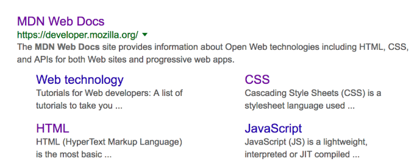
> Note: In Google, you will see some relevant subpages of MDN Web Docs listed below the main homepage link — these are called sitelinks, and are configurable in Google's webmaster tools — a way to make your site's search results better in the Google search engine.

> Note: Many <meta> features just aren't used anymore. For example, the keyword <meta> element (<meta name="keywords" content="fill, in, your, keywords, here">) — which is supposed to provide keywords for search engines to determine the relevance of that page for different search terms — is ignored by search engines, because spammers were just filling the keyword list with hundreds of keywords, biasing results.

**Setting the primary language of the document**

`<html lang="en-US">`

Your HTML document will be indexed more effectively by search engines if its language is set (allowing it to appear correctly in language-specific results, for example), and it is useful to people with visual impairments using screen readers (for example, the word "six" exists in both French and English, but is pronounced differently.)

`<p>Japanese example: <span lang="ja">ご飯が熱い。</span>.</p>`

### 2.1.3. Emphasis and importance

**Emphasis**

When we want to add emphasis in spoken language, we stress certain words, subtly altering the meaning of what we are saying

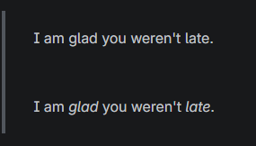

The first sentence sounds genuinely relieved that the person wasn't late. In contrast, the second one, with both the words "glad" and "late" in italics, sounds sarcastic or passive-aggressive, expressing annoyance that the person arrived a bit late. In HTML we use the `<em>` (emphasis) element to mark up such instances. these are recognized by screen readers,

**Strong importance**

To emphasize important words, we tend to stress them in spoken language and bold them in written language. In HTML we use the `<strong>` (strong importance) element to mark up such instances. 

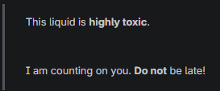

**Italic, bold, underline…**

Elements like this, which only affect presentation and not semantics, are known as presentational elements and should no longer be used because, as we've seen before, semantics is so important to accessibility, SEO, etc.

- `<i>` is used to convey a meaning traditionally conveyed by italic: foreign words, taxonomic designation, technical terms, a thought…
- `<b>` is used to convey a meaning traditionally conveyed by bold: keywords, product names, lead sentence…
- `<u>` is used to convey a meaning traditionally conveyed by underline: proper name, misspelling…

```html
<!-- scientific names -->
<p>
  The Ruby-throated Hummingbird (<i>Archilochus colubris</i>) is the most common
  hummingbird in Eastern North America.
</p>

<!-- foreign words -->
<p>
  The menu was a sea of exotic words like <i lang="uk-latn">vatrushka</i>,
  <i lang="id">nasi goreng</i> and <i lang="fr">soupe à l'oignon</i>.
</p>

<!-- a known misspelling -->
<p>Someday I'll learn how to <u class="spelling-error">spel</u> better.</p>
```

### 2.1.4. Lists

```html
<ul>
  <li>milk</li>
</ul>
<ol>
  <li>milk</li>
</ol>
```

**Description lists**

The purpose of description lists is to mark up a set of items and their associated descriptions, such as terms and definitions, or questions and answers.
Note that it is permitted to have a single term with multiple descriptions.

```html
<dl>
  <dt>Semantic HTML</dt>
  <dd>
    Use the elements based on their <b>semantic</b> meaning, not their
    appearance.
  </dd>
</dl>
```

### 2.1.5. Advanced text features

**Blockquotes**

If a section of block level content is quoted from somewhere else, you should wrap it in `<blockquote>`.

**Citations**

The content of the cite attribute sounds useful, but unfortunately browsers, screen readers, etc. don't really do much with it. There is a `<cite>` element, but this is meant to contain the title of the resource being quoted, e.g., the name of the book. There is no reason, however, why you couldn't link the text inside <cite> to the quote source in some way:

```html
<p>
  According to the <a href="/en-US/docs/Web/HTML/Reference/Elements/blockquote"><cite>MDN blockquote page</cite></a>:
</p>

  <!-- block quotations using <blockquote>-->
<blockquote cite="https://developer.mozilla.org/en-US/docs/Web/HTML/Reference/Elements/blockquote">
  <p>
    The <strong>HTML <code>&lt;blockquote&gt;</code> Element</strong> (or <em>HTML Block Quotation Element</em>) indicates that the enclosed text is an extended quotation.
  </p>
</blockquote>

<p>
  <!-- Inline quotations using <q>-->
  The quote element — <code>&lt;q&gt;</code> — is
  <q cite="https://developer.mozilla.org/en-US/docs/Web/HTML/Reference/Elements/q">
    intended for short quotations that don't require paragraph breaks.
  </q>
  — <a href="/en-US/docs/Web/HTML/Reference/Elements/q"><cite>MDN q page</cite></a>.
</p>
```
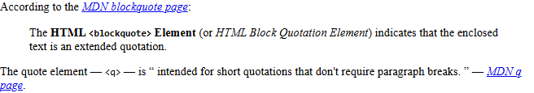

**Abbreviations**

If providing the expansion in addition to the abbreviation makes little sense, and the abbreviation or acronym is a fairly shortened term, provide the full expansion of the term as the value of the `title` attribute:

```html
<p> We use <abbr>HTML</abbr>, Hypertext Markup Language, to structure our webdocuments. </p>
<p> I think <abbr title="Reverend">Rev.</abbr> Green did it in the kitchen with the chainsaw.</p>
```

**Marking up contact details**

```html
<address>Chris Mills, Manchester, The Grim North, UK</address>

<address>
  <p>
    Chris Mills<br />
    Manchester<br />
    The Grim North<br />
    UK
  </p>

  <ul>
    <li>Tel: 01234 567 890</li>
    <li>Email: me@grim-north.co.uk</li>
  </ul>
</address>

<address>
  Page written by <a href="../authors/chris-mills/">Chris Mills</a>.
</address>
```

**Superscript and subscript**

```html
<p>My birthday is on the 25<sup>th</sup> of May 2001.</p>
<p>
  Caffeine's chemical formula is
  C<sub>8</sub>H<sub>10</sub>N<sub>4</sub>O<sub>2</sub>.
</p>
<p>If x<sup>2</sup> is 9, x must equal 3 or -3.</p>
```
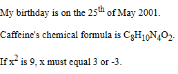

**Representing computer code**

- `<code>`: For marking up generic pieces of computer code.
- `<pre>`: For retaining whitespace (generally code blocks)
- `<var>`: For specifically marking up variable names.
- `<kbd>`: For marking up keyboard (and other types of) input entered into the computer.
- `<samp>`: For marking up the output of a computer program.

```html
<pre><code>const para = document.querySelector('p');

para.onclick = function() {
  alert('Owww, stop poking me!');
}</code></pre>

<p>
  You shouldn't use presentational elements like <code>&lt;font&gt;</code> and
  <code>&lt;center&gt;</code>.
</p>

<p>
  In the above JavaScript example, <var>para</var> represents a paragraph
  element.
</p>

<p>Select all the text with <kbd>Ctrl</kbd>/<kbd>Cmd</kbd> + <kbd>A</kbd>.</p>

<pre>$ <kbd>ping mozilla.org</kbd>
<samp>PING mozilla.org (63.245.215.20): 56 data bytes
64 bytes from 63.245.215.20: icmp_seq=0 ttl=40 time=158.233 ms</samp></pre>
```
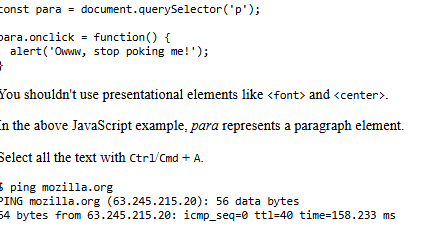

**Marking up times and dates**

There are many different ways that humans write down dates. But these different forms cannot be easily recognized by computers — what if you wanted to automatically grab the dates of all events in a page and insert them into a calendar?

```html
<time datetime="2016-01-20">20 January 2016</time>
```

### 2.1.6. Structuring documents

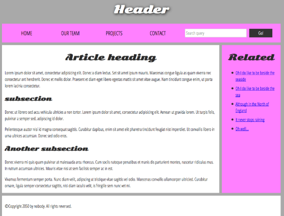

```html
<!doctype html>
<html lang="en-US">
  <head>
  </head>
  <body>
    <!-- The main header used across all the pages of our website -->
    <header>
      <h1>Header</h1>
    </header>
    <nav>
      <ul>
        <li><a href="#">Home</a></li>
      </ul>
      <!-- A Search form: another common non-linear
           way to navigate through a site. -->
      <form>
        <input type="search" name="q" placeholder="Search query" />
        <input type="submit" value="Go!" />
      </form>
    </nav>
    <!-- Our page's main content -->
    <main>
      <!-- An article -->
      <article>
        <h2>Article heading</h2>
        <p>
          Lorem ipsum dolor sit amet, consectetur adipisicing elit. Donec a diam
        </p>
        <section>
          <h3>Subsection</h3>
          <p> Donec ut librero sed accu vehicula ultricies a non tortor. Lorem</p>
          <p> Pelientesque auctor nisi id magna consequat sagittis. Curabitur</p>
        </section>
      </article>
      <!-- the aside content can also be nested within the main content -->
      <aside>
        <h2>Related</h2>
        <ul>
          <li><a href="#">Oh I do like to be beside the seaside</a></li>
        </ul>
      </aside>
    </main>
    <!-- The footer that is used across all the pages of our website -->
    <footer>
      <p>©Copyright 2050 by nobody. All rights reversed.</p>
    </footer>
  </body>
</html>
```

**HTML layout elements in more detail**

- `<main>` is for content unique to this page. Use only once per page, and put it directly inside <body>.
- `<article>` encloses a block of related content that makes sense on its own without the rest of the page (for example, a single blog post).
  
  [My Note](https://developer.mozilla.org/en-US/docs/Web/HTML/Reference/Elements/article)
  > A given document can have multiple articles in it; for example, on a blog that shows the text of each article one after another as the reader scrolls, each post would be contained in an `<article>` element, possibly with one or more `<section>`s within
- `<section>` is similar to `<article>`, but it is more for grouping together a single part of the page that constitutes one single piece of functionality (like a mini map, or a set of article headlines and summaries), or a theme. also note that you can break `<article>`s up into different `<section>`s, or vice-versa, depending on the context.
  
  [My Note](https://developer.mozilla.org/en-US/docs/Web/HTML/Reference/Elements/section)
  > If you are only using the element as a styling wrapper, use a `<div>` instead.

  > **Using a section without a heading**

  > If the global navigation is already wrapped in a `<nav>` element, you could conceivably wrap a previous/next menu in a:
  ```html
  <section>
    <a href="#">Previous article</a>
    <a href="#">Next article</a>
  </section>
  ```
  > Or what about some kind of button bar for controlling your app? This might not necessarily want a heading, but it is still a distinct section of the document:
  ```html
  <section>
    <button class="reply">Reply</button>
    <button class="fwd">Forward</button>
    <button class="del">Delete</button>
  </section>
  ```
- `<aside>` contains content that is not directly related to the main content but can provide additional information indirectly related to it (glossary entries, author biography, related links, etc.).
- `<header>` represents a group of introductory content. If it is a child of `<body>` it defines the global header of a webpage, but if it's a child of an `<article> or <section>` it defines a specific header for that section
  
  [My Note](https://developer.mozilla.org/en-US/docs/Web/HTML/Reference/Elements/header)
  ```html
  <article>
    <header>
      <h2>The Planet Earth</h2>
      <p>Posted on Wednesday, <time datetime="2017-10-04">4 October 2017</time>by Jane Smith</p>
    </header>
    <p> We live on a planet that's blue and green, with so many things still unseen.</p>
    <p><a href="https://example.com/the-planet-earth/">Continue reading…</a></p>
  </article>
  ```
- `<nav>` contains the main navigation functionality for the page. Secondary links, etc., would not go in the navigation.

**Non-semantic wrappers**

Sometimes you'll come across a situation where you can't find an ideal semantic element to group some items together or wrap some content. For cases like these, HTML provides the `<div> and <span>` elements.

```html
<p>
  The King walked drunkenly back to his room at 01:00, the beer doing nothing to aid him as he staggered through the door.
  <span class="editor-note">[Editor's note: At this point in the play, the lights should be down low].</span>
</p>
```
In this case, the editor's note is supposed to merely provide extra direction for the director of the play; it is not supposed to have extra semantic meaning.

imagine a shopping cart widget that you could choose to pull up at any point during your time on an e-commerce site:
```html
<div class="shopping-cart">
  <h2>Shopping cart</h2>
  <ul>
    <li>
      <p>
        <a href=""><strong>Silver earrings</strong></a>: $99.95.
      </p>
      
    </li>
    <li>…</li>
  </ul>
  <p>Total cost: $237.89</p>
</div>
```
This isn't really an `<aside>`, as it doesn't necessarily relate to the main content of the page (you want it viewable from anywhere). It doesn't even particularly warrant using a `<section>`, as it isn't part of the main content of the page. So a `<div>` is fine in this case. We've included a heading as a signpost to aid screen reader users in finding it.

**Line breaks and horizontal rules**

```html
<p>
  There once was a man named O'Dell<br />
  Who loved to write HTML
</p>
<p>
  Ron was backed into a corner by the marauding netherbeasts. Scared, but
</p>
<hr />
<p>
  Meanwhile, Harry was sitting at home, staring at his royalty statement and
</p>
```

### 2.1.7. Creating links

```html
<a href="https://developer.mozilla.org/en-US/"><h1>MDN Web Docs</h1></a>
<a href="https://developer.mozilla.org/en-US/"></a>
<a href="contacts.html#Mailing_address">mailing address</a>
<a href="/large-report.pdf" download>Download</a>
<a href="https://e.com/video/" target="_blank"> Watch</a>
```

### 2.1.8. HTML images

> Warning: Never point the src attribute at an image hosted on someone else's website without permission. This is called "hotlinking". It is considered unethical, since someone else would be paying the bandwidth costs for delivering the image when someone visits your page. It also leaves you with no control over the image being removed or replaced with something embarrassing.

> Note: Elements like `` and `<video>` are sometimes referred to as replaced elements.

**Annotating images with figures and figure captions**

```html
<figure>
  
  <figcaption>A T-Rex on display in the Manchester University Museum.</figcaption>
</figure>
```
A figure could be several images, a code snippet, audio, video, equations, a table, or something else.

**CSS background images**

 if an image has meaning, in terms of your content, you should use an HTML image. If an image is purely decoration, you should use CSS background images.

### 2.1.9. HTML video and audio

```html
<video src="rabbit320.webm" controls>
  <p>Your browser doesn't support HTML video. Here is a
    <a href="rabbit320.webm">link to the video</a> instead.
  </p>
</video>
```
This is supported in all modern browsers -
- A WebM container typically packages Vorbis or Opus audio with VP8/VP9 video. 
- An MP4 container often packages AAC or MP3 audio with H.264 video.

not only does each browser support a different set of container file formats, they also each support a different selection of codecs. In order to maximize the likelihood that your website or app will work on a user's browser, you may need to provide each media file you use in multiple formats. 

```html
<video controls>
  <source src="rabbit320.mp4" type="video/mp4" />
  <source src="rabbit320.webm" type="video/webm" />
  <p>...</p>
</video>
```

Refer to our [guide to media types and formats](https://developer.mozilla.org/en-US/docs/Web/Media/Guides/Formats) for help selecting the best containers and codecs for your needs, as well as to look up the right MIME types to specify for each.

**Displaying video text tracks**

transcript of the words being spoken in the audio/video? Well, thanks to HTML video, you can. To do so we use the WebVTT file format and the `<track>` element.

```html
<video controls>
  <source src="example.mp4" type="video/mp4" />
  <source src="example.webm" type="video/webm" />
  <track kind="subtitles" src="subtitles_es.vtt" srclang="es" label="Spanish" />
</video>
```

### 2.1.10. HTML table accessibility

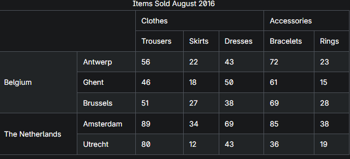

**Adding a caption to your table with <caption>**

```html
<table>
  <caption>
    Dinosaurs in the Jurassic period
  </caption>
  …
</table>
```

**Adding structure with `<thead>, <tbody>, and <tfoot>`**

These elements don't necessarily make the table any more accessible to screen reader users. however they are very useful for applying styling and layout enhancements via CSS, which can improve accessibility.

> Note: `<tbody>` is always included in every table, implicitly if you don't specify it in your code. 

**The scope attribute**

The scope attribute can be added to the `<th>` element to tell screen readers exactly what cells the header is a header for — is it a header for the row it is in, or the column.

```html
<thead>
  <tr>
    <th scope="col">Purchase</th>
    <th scope="col">Location</th>
  </tr>
  ...
  <tr>
    <th scope="row">Haircut</th>
    <td>Hairdresser</td>
  </tr>
</thead>
```
scope has two more possible values — colgroup and rowgroup. These are used for headings that sit over the top of multiple columns or rows.

```html
<thead>
  <tr>
    <th colspan="3" scope="colgroup">Clothes</th>
  </tr>
  <tr>
    <th scope="col">Trousers</th>
    <th scope="col">Skirts</th>
    <th scope="col">Dresses</th>
  </tr>
  ....
  <tr>
    <th rowspan="2" scope="rowgroup">The Netherlands</th>
    <th scope="row">Amsterdam</th>
    <td>89</td>
  </tr>
  <tr>
    <th scope="row">Utrecht</th>
    <td>80</td>
  </tr>
</thead>
```

**The id and headers attributes**

An alternative to using the scope attribute is to use id and headers attributes to create associations between data cells and header cells. The headers attribute is used to link a cell, `<td> or <th>`, to one or more header cells.

This method gives your HTML table a more explicit definition of the position of each cell, based on the headers for the column and the row it belongs to, kind of like a spreadsheet. For this to work well, your table should include both column and row headers.

```html
<colgroup>
  <col span="2" />
  <col span="3" />
</colgroup>
<thead>
  <tr>
    <th></th>
    <th></th>
    <th id="clothes" colspan="3">Clothes</th>
  </tr>
  <tr>
    <th></th>
    <th></th>
    <th id="trousers" headers="clothes">Trousers</th>
    <th id="skirts" headers="clothes">Skirts</th>
    <th id="dresses" headers="clothes">Dresses</th>
  </tr>
</thead>
<tbody>
  <tr>
    <th id="belgium" rowspan="2">Belgium</th>
    <th id="antwerp" headers="belgium">Antwerp</th>
    <td headers="belgium antwerp clothes trousers">56</td>
    <td headers="belgium antwerp clothes skirts">22</td>
    <td headers="belgium antwerp clothes dresses">43</td>
  </tr>
  <tr>
    <th id="ghent" headers="belgium">Ghent</th>
    <td headers="belgium ghent clothes trousers">41</td>
    <td headers="belgium ghent clothes skirts">17</td>
    <td headers="belgium ghent clothes dresses">35</td>
  </tr>
</tbody>
```

> Note: This method creates very precise associations between headers and data cells but it uses a lot more markup and does not leave any room for errors. The scope approach is usually sufficient for most tables.

### 2.1.11. Forms and buttons in HTML

```html
    <form action="./submit_page" method="get">
      <h2>Subscribe to our newsletter</h2>
      <p>
        <label for="name">Name (required):</label>
        <input type="text" name="name" id="name" required />
      </p>
      <p>
        <label for="email">Email (required):</label>
        <input type="email" name="email" id="email" required />
      </p>
      <p>
        <button>Sign me up!</button>
      </p>
    </form>
```

The action and method attributes cause the form data to be submitted in a URL along the following lines:

`/some/url/submit_page?name=Bob&email=bob%40bob.com`

**Other control types**

```html
    <form action="./payment_page" method="get">
      <h2>Register for the meetup</h2>
      <fieldset>
        <legend>Choose hotel room type:</legend>
        <div>
          <input type="radio" id="hotelChoice1" name="hotel" value="economy" checked />
          <label for="hotelChoice1">Economy (+$0)</label>
          <input type="radio" id="hotelChoice2" name="hotel" value="superior" disabled/>
          <label for="hotelChoice2">Superior (+$50)</label>
        </div>
      </fieldset>
      <fieldset>
        <legend>Choose classes to attend:</legend>
        <div>
          <input type="checkbox" id="yoga" name="yoga" />
          <label for="yoga">Yoga (+$10)</label>
          <input type="checkbox" id="coffee" name="coffee" />
          <label for="coffee">Coffee roasting (+$20)</label>
        </div>
      </fieldset>
      <p>
        <label for="transport">How are you getting here:</label>
        <select name="transport" id="transport">
          <option value="">--Please choose an option--</option>
          <option value="bike">Bike</option>
          <option value="walk">Walk</option>
        </select>
      </p>
      <p>
        <label for="comments">Any other comments:</label>
        <textarea id="comments" name="comments" rows="5" cols="33"></textarea>
      </p>
      <p>
        <button>Continue to payment</button>
      </p>
    </form>
```
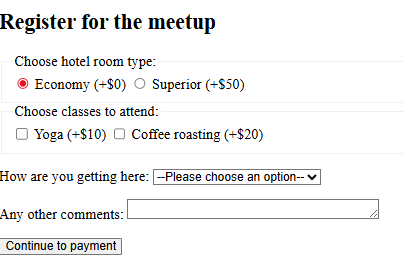

> Note: Besides structuring and labeling forms, fieldsets have other uses, such as disabling an entire set of controls as a single unit.

On submission, each value is submitted with a value of on if the checkbox was checked — yoga=on, balloon=on, etc.

### 2.1.12. [From object to iframe — general embedding technologies](https://developer.mozilla.org/en-US/docs/Learn_web_development/Core/Structuring_content/General_embedding_technologies)

CSP stands for content security policy and provides a set of HTTP Headers. When it comes to securing `<iframe>`s, you can configure your server to send an appropriate X-Frame-Options header. This can prevent other websites from embedding your content in their web pages.

## 2.2. [CSS styling basics](https://developer.mozilla.org/en-US/docs/Learn_web_development/Core/Styling_basics)

### 2.2.1. Basic CSS selectors

```CSS
body {
  font-family: sans-serif;
}
h1.highlight, h1#heading  {
  background-color: pink;
}
```

**Using the universal selector to make your selectors easier to read**

```css
article :first-child {
  font-weight: bold;
}
```
However, this selector could be confused with article:first-child, which will select any `<article>` element that is the first child of another element. To avoid this confusion, we can add the universal selector.
```CSS
article *:first-child {
  font-weight: bold;
}
```

### 2.2.2. Attribute selectors

**Presence and value selectors**

Selector | Example | Description
-|-|-
`[attr]` | `a[title]` | Matches elements with an attr attribute (whose name is the value in square brackets).
`[attr=value]` | `a[href="https://example.com"]` | Matches elements with an attr attribute whose value is exactly value — the string inside the quotes.
`[attr~=value]` | `p[class~="special"]` | Matches elements with an attr attribute whose value is exactly value, or contains value in its (space-separated) list of values.
`[attr\|=value]` | `div[lang\|="zh"]` | Matches elements with an attr attribute whose value is exactly value or begins with value immediately followed by a hyphen. (`<p lang="en-us">`)

**Substring matching selectors**

For example, if you had classes of `box-warning` and `box-error`.

Selector | Example | Description
-|-|-
[attr^=value] | li[class^="box-"] | Matches elements with an attr attribute, whose value begins with value.
[attr$=value] | li[class$="-box"] | Matches elements with an attr attribute whose value ends with value.
[attr*=value] | li[class*="box"] | Matches elements with an attr attribute whose value contains value anywhere within the string.

### 2.2.3. Pseudo-classes and pseudo-elements

A pseudo-class is a selector that selects elements that are in a specific state, for example, they are the first element of their type, or they are being hovered over by the mouse pointer.

```CSS
article p:first-child {
  font-size: 120%;
  font-weight: bold;
}
a:hover {
  color: hotpink;
}
```

Pseudo-elements behave in a similar way. However, they act as if you had added a whole new HTML element into the markup, rather than applying a class to existing elements. Pseudo-elements start with a double colon ::

> Note: Some early pseudo-elements used the single colon syntax. Modern browsers support the early pseudo-elements with single- or double-colon syntax for backwards compatibility.

if you wanted to select the first line of a paragraph you could wrap it in a `<span>` element and use an element selector; however, that would fail if the number of words you had wrapped were longer or shorter than the parent element's width

```CSS
article p::first-line {
  font-size: 120%;
  font-weight: bold;
}
```
It acts as if a `<span>` was magically wrapped around that first formatted line, and updated each time the line length changed.

Generated content is also frequently used to insert an empty string, which can then be styled just like any element on the page.

```CSS
.box::before {
  content: "";
  display: block;
  width: 100px;
  height: 100px;
}
```

### 2.2.4. Combinators

```css
article > p {} /* Child combinator */
p + img {} /* Next-sibling combinator */
p ~ img {} /* Subsequent-sibling combinator */
```

### 2.2.5. The box model

If a box has a display type of inline, then:

- The width and height properties will not apply.
- Top and bottom padding, margins, and borders will apply but will not cause other inline boxes to move away from the box.
- Left and right padding, margins, and borders will apply and will cause other inline boxes to move away from the box.

block and inline display values are said to be outer display types. You can change the inner display type by setting an inner display value, for example display: flex;. The element will still use the outer display type block but this changes the inner display type to flex.

**The standard CSS box model**

In the standard box model, if you set width and height property values on a box, these values define the width and height of the content box. Any padding and borders are then added to those dimensions to get the total size taken up by the box.

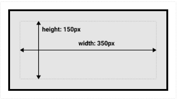

> Note: The margin is not counted towards the actual size of the box — sure, it affects the total space that the box will take up on the page, but only the space outside the box. The box's area stops at the border — it does not extend into the margin.

**The alternative CSS box model**

In the alternative box model, any width is the width of the visible box on the page. The content area width is that width minus the width for the padding and border (see image below). This is convenient as there is no need to add up the border and padding to get the real size of the box.

To turn on the alternative model for an element, set `box-sizing: border-box` on it.

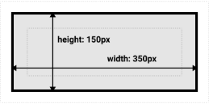

```CSS
html {
  box-sizing: border-box;
}

*,
*::before,
*::after {
  box-sizing: inherit;
}
```

**Margin collapsing**

- Two positive margins will combine to become one margin. Its size will be equal to the largest individual margin.
- Two negative margins will collapse and the smallest (furthest from zero) value will be used.
- If one margin is negative, its value will be subtracted from the total.

For further information see the detailed page on [mastering margin collapsing](https://developer.mozilla.org/en-US/docs/Web/CSS/CSS_box_model/Mastering_margin_collapsing).

>My Note: Also read [clear](https://developer.mozilla.org/en-US/docs/Web/CSS/clear), [Block formatting context](https://developer.mozilla.org/en-US/docs/Web/CSS/CSS_display/Block_formatting_context)

**The box model and inline boxes**

In the example below, we have a `<span>` inside a paragraph. You can see that the width and height are ignored. The padding and border overlap other words in the paragraph. The left and right padding, margins, and borders move other content away from the box.

```html
<style>
p {
  border: 2px solid rebeccapurple;
  width: 200px;
}
span {
  margin: 20px;
  padding: 20px;
  width: 80px;
  height: 150px;
  background-color: lightblue;
  border: 2px solid blue;
}
</style>
<p>
  I am a paragraph and this is a <span>span</span> inside that paragraph. A span
  is an inline element and so does not respect width and height.
</p>
```
Using `display: inline-block`: Use it if you do not want an item to break onto a new line, but do want it to respect width and height and avoid the overlapping.

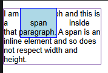
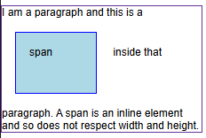

### 2.2.6. Handling conflicts

**Cascade**

When two rules both have equal specificity, the one that is defined last in the stylesheet is the one that will be used. 

**Specificity**

If multiple rules have different selectors that set different values for the same property and target the same element, specificity decides 

- A type (element) selector is less specific; it will select all elements of that type that appear on a page, so it has less weight. Pseudo-element selectors have the same specificity as regular element selectors.
- A class selector is more specific; it will select only the elements on a page that have a specific class attribute value, so it has more weight. Attribute selectors and pseudo-classes have the same weight as a class.
- An ID selector is even more specific — it only selects a single element with a specific id value. It therefore has even more weight.

**Inheritance**

some CSS property values set on parent elements are inherited by their child elements. For example, if you set a color and font-family.

> Note: On MDN CSS property reference pages, you can find a technical information box called "Formal definition", which lists a number of data points about that property, including whether it is inherited or not. See the [color property Formal definition section](https://developer.mozilla.org/en-US/docs/Web/CSS/color#formal_definition) as an example.

```html
<style>
body { 
  color: green;
}
a:-webkit-any-link { /*from user agent stylesheet by browser */
  color: -webkit-link;
}
.my-class-1 a {
  color: inherit; /*inherit from parent which is body*/
}
.my-class-2 a {
  color: initial; /*uses the initial value of the property (in this case black)*/
}
.my-class-3 a {
  color: unset; /*Resets the property to its natural value, either inherit or initial in this case inherit since color by default is inherited*/
}
</style>
<ul>
  <li>Default <a href="#">link</a> color</li>
  <li class="my-class-1">Inherit the <a href="#">link</a> color</li>
  <li class="my-class-2">Reset the <a href="#">link</a> color</li>
  <li class="my-class-3">Unset the <a href="#">link</a> color</li>
</ul>
```
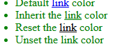

**Resetting all property values**

```html
<style>
blockquote {
  background-color: orange;
  border: 2px solid blue;
}
.fix-this {
  all: unset;
}
</style>
<blockquote><p>This blockquote is styled</p></blockquote>
<blockquote class="fix-this"><p>This blockquote is not styled</p></blockquote>
```
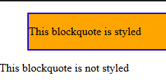

**Specificity**

- IDs: Score one in this column (100 points) for each ID selector contained inside the overall selector.
- Classes: Score one in this column (10 points) for each class selector, attribute selector, or pseudo-class contained inside the overall selector.
- Elements: Score one in this column (1 point) for each element selector or pseudo-element contained inside the overall selector.

> Note: The universal selector (*), combinators (+, >, ~, ' '), and specificity adjustment selector (:where()) along with its parameters, have no effect on specificity.

Selector | Identifiers | Classes | Elements | Total specificity
-|-|-|-|-
`h1` | 0 | 0 | 1 | 0-0-1
`h1 + p::first-letter` | 0 | 0 | 3 | 0-0-3
`li > a[href*="en-US"] > .inline-warning` | 0 | 2 | 2 | 0-2-2
`#identifier` | 1 | 0 | 0 | 1-0-0

> Note: Each selector type has its own level of specificity that cannot be overwritten by selectors with a lower specificity level. For example, a million class selectors combined would not be able to overwrite the specificity of one id selector.

because of the high specificity of ID selectors, it is preferable to add a class to an element instead of an ID. do not have access to the markup and cannot edit it — consider using the ID within an attribute selector, such as `p[id="header"]`.

Inline styles, that is, the style declaration inside a style attribute, take precedence over all normal styles, no matter the specificity

There is a special piece of CSS that you can use to overrule all of the above calculations, even inline styles - the `!important` flag.

### 2.2.7. CSS values and units

Note that 1px doesn't necessarily equal one physical device pixel. On HD displays, it may span multiple physical pixels. The lengths are perceptual: 16px looks roughly the same on a phone, laptop, or TV screen at typical viewing distance. [My Note](https://qr.ae/pCT0I3).

**Relative length units**

- em is relative to the font size of this element, or the font size of the parent element when used for font-size. 
- rem is relative to the font size of the root element.
- vh and vw are relative to the viewport's height and width, respectively.

see the reference page for the [`<length>`](https://developer.mozilla.org/en-US/docs/Web/CSS/length) type.

**Color**

The standard color system available in modern computers supports 24-bit colors `(2^8*2^8*2^8)`, which allows displaying about 16.7 million distinct colors via a combination of different red, green, and blue channels with 256 different values per channel (256 x 256 x 256 = 16,777,216).

**Hexadecimal RGB values**

Hexadecimal numbers use 16 characters from 0-9 and a-f, so the entire range is `0123456789abcdef`. Each hex color value consists of a hash/pound symbol (#) followed by six hexadecimal characters (`#ffc0cb`, for example). Each pair of hexadecimal characters represents one of the channels of an RGB color — red, green, and blue — and allows us to specify any of the 256 available values for each (16 x 16 = 256).

> Note: You might see hex color values written with three characters instead of six. This is a shorthand that can be used when the characters in each pair are the same. For example, `#ff00ff` and `#f0f` are equivalent. You might also see hex color values written using eight (or four) characters, with the fourth value representing the alpha-transparency of the previous three values — for example `#ff00ff66`.

**RGB values**

decimal number ranging from 0 and 255 or a percentage ranging from 0% and 100% (but not a mixture of the two). optional fourth value separated by a slash (/) representing opacity.

`background-color: rgb(2 121 139 / 0.3);`

**Using hues to specify a color**

Hue is the value type that allows us to tell the difference or similarity between colors like red, orange, yellow, green, blue, etc. The key concept is that you can specify a hue in an [`<angle>`](https://developer.mozilla.org/en-US/docs/Web/CSS/angle) because most of the color models describe hues using a [color wheel](https://developer.mozilla.org/en-US/docs/Glossary/Color_wheel).

**HSL**

- Hue: Again, this represents the base shade of the color.
- Saturation: How saturated is the color? This takes a value from 0–100%, where 0 is no color (it will appear as a shade of grey), and 100% is full color saturation.
- Lightness: How light or bright is the color? This takes a value from 0–100%, where 0 is no light (it will appear completely black) and 100% is full light (it will appear completely white).

`background-color: hsl(321 47% 57% / 0.7);`

### 2.2.8. Sizing items in CSS

When you use margin and padding set in percentages, the value is calculated from the inline size of the containing block — therefore the width when working in a horizontal language.

### 2.2.9. Backgrounds and borders

**Gradient backgrounds**

`
background-image: linear-gradient(105deg,
    rgb(0 249 255 / 100%) 39%, rgb(51 56 57 / 100%) 96%
);
`

**Multiple background images**

```CSS
background-image: url("image1.png"), url("image2.png"), url("image3.png"), url("image4.png");
background-repeat: no-repeat, repeat-x, repeat;
background-position: 10px 20px, top right;
background-size: 80px 10em, cover, contain;
background-attachment: scroll, fixed, local;
```

### 2.2.10. Images, media, and form elements

Images and video are described as replaced elements. This means that CSS cannot affect the internal layout of these elements

When using `object-fit` the replaced element can be sized to fit a box in a variety of ways.

replaced elements, when they become part of a specific layout system such as grid or flexbox, have different default behaviors. in a grid layout, elements are stretched by default to fill their entire grid areas. Images do not stretch.

**Form elements**

The [Web Forms extensions module](https://developer.mozilla.org/en-US/docs/Learn_web_development/Extensions/Forms) covers the trickier aspects of styling certain form input types, which we will not go into here.

**Styling text input elements**

`input[type="text"], input[type="email"] { ... }`

**Normalizing form behavior**

in some browsers, form elements do not inherit font styling by default. Therefore, if you want to be sure that your form fields use the font defined on the body, or on a parent element, you should add this rule to your CSS.

Across browsers, form elements use different box sizing rules for different widgets

you should also set overflow: auto on `<textarea>` elements to stop some older browsers from showing a scrollbar when there is no need for one

```css
button,
input,
select,
textarea {
  font-family: inherit;
  font-size: 100%;
  box-sizing: border-box;
  padding: 0;
  margin: 0;
}

textarea {
  overflow: auto;
}
```

> Note: check out [Normalize.css](https://necolas.github.io/normalize.css/), which is a very popular stylesheet used as a base by many projects.

### 2.2.11. Styling tables

```html
<table>
  <caption>
    A summary of the UK's most famous punk bands
  </caption>
  <thead>
    <tr>
      <th scope="col">Band</th>
      <th scope="col">Year formed</th>
      <th scope="col">No. of Albums</th>
      <th scope="col">Most famous song</th>
    </tr>
  </thead>
  <tbody>
    <tr>
      <th scope="row">Buzzcocks</th>
      <td>1976</td>
      <td>9</td>
      <td>Ever fallen in love (with someone you shouldn't've)</td>
    </tr>
    <tr>
      <th scope="row">The Clash</th>
      <td>1976</td>
      <td>6</td>
      <td>London Calling</td>
    </tr>
    <tr>
      <th scope="row">The Damned</th>
      <td>1976</td>
      <td>10</td>
      <td>Smash it up</td>
    </tr>
  </tbody>
  <tfoot>
    <tr>
      <th scope="row" colspan="2">Total albums</th>
      <td colspan="2">77</td>
    </tr>
  </tfoot>
</table>
```

we'll get you to mark it up using some best practices for table design — as outlined in [Web Typography: designing tables to be read not looked at](https://alistapart.com/article/web-typography-tables/).

```CSS
html {
  font-family: Arial, Helvetica, sans-serif;
}
table {
  table-layout: fixed;
  width: 80%;
  min-width: 1000px;
  margin: 0 auto;
  border-collapse: collapse;
  border-top: 1px solid #999999;
  border-bottom: 1px solid #999999;
}
th,
td {
  vertical-align: top;
  padding: 0.3em;
}
tr :nth-child(2),
tr :nth-child(3) {
  text-align: right;
  width: 15%;
}
tr :nth-child(1),
tr :nth-child(4) {
  text-align: left;
  width: 35%;
}
tfoot tr :nth-child(1) {
  text-align: right;
}
tfoot tr :nth-child(2) {
  text-align: left;
}
tfoot {
  border-top: 1px solid #999999;
}
tbody tr:nth-child(odd) {
  background-color: #eeeeee;
}
caption {
  padding: 1em;
  font-style: italic;
  caption-side: bottom;
  letter-spacing: 1px;
}
```

- A [`table-layout`](https://developer.mozilla.org/en-US/docs/Web/CSS/table-layout) value of fixed is generally a good idea to set on your table, as it makes the table behave a bit more predictably by default. Normally, table columns tend to be sized according to how much content they contain, which produces some strange results. Chris Coyier discusses this technique in more detail in [Fixed Table Layouts](https://css-tricks.com/fixing-tables-long-strings/).

- We've coupled the fixed layout with a `width` of `80%`, a `min-width` of `1000px`, and a `margin` of `0 auto`. These settings mean that the table will mostly fill a wider viewport and be centered horizontally, while on narrow viewports the table will stay at a legible width and extend off the screen. Mobile users, for example, can then scroll to read the whole table. This is preferable to having the table stretch the width of a narrow screen and be cramped and unreadable.

Best practice dictates that you should align text to the left and numbers to the right;

We should also make sure that our data items are aligned to the top of their cells, rather than the middle.

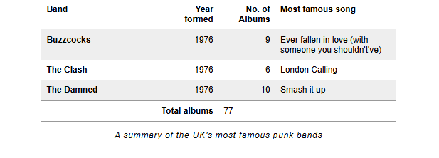

### 2.2.12. [Cascade layers](https://developer.mozilla.org/en-US/docs/Learn_web_development/Core/Styling_basics/Cascade_layers)

- Cascade layers: Within each of the six origin importance buckets, sort by cascade layer. The layer order for normal declarations is from the first layer created to the last, followed by unlayered normal styles. This order is inverted for important styles, with unlayered important styles having the lowest precedence.
- Scoping proximity: When two selectors in the origin layer with precedence have the same specificity, the property value within scoped rules with the smallest number of hops up the DOM hierarchy to the scope root wins. See How @scope conflicts are resolved for more details and an example.
- Order of appearance: When two selectors in the origin layer with precedence have the same specificity and scope proximity, the property value from the last declared selector with the highest specificity wins.

**Origin and cascade**

There are three cascade origin types: user-agent stylesheets, user stylesheets, and author stylesheets. The browser sorts each declaration into six origin buckets by origin and importance. There are eight levels of precedence: the six origin buckets, properties that are transitioning, and properties that are animating.

- user-agent normal styles
- user normal styles
- author normal styles
- styles being animated
- author important styles
- user important styles
- user-agent important styles
- styles being transitioned

**Origin and specificity**

the value from the origin with the highest precedence gets applied. If the winning origin has more than one property declaration for an element, the specificity of the selectors for those competing property values are compared. Specificity is never compared between selectors from different origins.

The first has no author styles applied, so only user-agent styles are applied (and your personal user styles, if any). The second has text-decoration and color set by author styles even though the selector in the author stylesheet has a specificity of 0-0-0.

```html
<style>
:where(a.author) {
  text-decoration: overline;
  color: red;
}  
</style>
<p><a href="https://example.org">User agent styles</a></p>
<p><a class="author" href="https://example.org">Author styles</a></p>
```

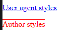

**Issues cascade layers can solve**

Large code bases can have styles coming from multiple teams, component libraries, frameworks, and third parties. 

Different teams may have different methodologies; one may have a best practice of reducing specificity, while another may have a standard of including an id in each selector.

Specificity conflicts can escalate quickly. A web developer may create a "quick fix" by adding an !important flag. While this may feel like an easy solution, it often just moves the specificity war from normal to important declarations.

In the same way that cascade origins provide a balance of power between user, user-agents, and author styles, cascade layers provide a structured way to organize and balance concerns within a single origin as if each layer in an origin were a sub-origin. A layer can be created for each team, component, and third party, with style precedence based on layer order.

**Issues nested cascade layers can solve**

Each cascade layer can contain nested layers. For example, a component library may be imported into a components layer. Within the components layer, a developer can choose to define various themes, each as a separate nested layer.

**Creating cascade layers**

- The `@layer` statement at-rule, declaring layers using @layer followed by the names of one or more layers. This creates named layers without assigning any styles to them.
- The `@layer` block at-rule, in which all styles within a block are added to a named or unnamed layer.
- The `@import` rule with the `layer()` function, which assigns the contents of the imported file into that layer.

> Note: The order of precedence of layers is the order in which they are created. Styles not in a layer, or "unlayered styles", cascade together into a final implicit label.

```CSS
/* unlayered styles */
body {
  color: #333333;
}

/* creates the first layer: `layout` */
@layer layout {
  main {
    display: grid;
  }
}

/* creates the second layer: an unnamed, anonymous layer */
@layer {
  body {
    margin: 0;
  }
}

/* creates the third and fourth layers: `theme` and `utilities` */
@layer theme, layout, utilities;

/* adds styles to the already existing `layout` layer */
@layer layout {
  main {
    color: black;
  }
}

/* creates the fifth layer: an unnamed, anonymous layer */
@layer {
  body {
    margin: 1vw;
  }
}
```

In the above CSS, we created five layers: `layout, <anonymous(01)>, theme, utilities, and <anonymous(02)>` – in that order - with a sixth, implicit layer of unlayered styles contained in the body style block. 

**Layer creation and media queries**

If you define a layer using media or feature queries, and the media is not a match or the feature is not supported, the layer is not created.

```html
<style>
@media (width >= 50em) {
  @layer site;
}
@layer page {
  h1 {
    text-decoration: overline;
    color: red;
  }
}
@layer site {
  h1 {
    text-decoration: underline;
    color: green;
  }
}
</style>
<h1>Is this heading underlined?</h1>
```

In wide screens, the site layer is declared in the first line, meaning site has less precedence than page. Otherwise, site has precedence over page because it is declared later on narrow screens. (It will be green in small screen and red in large.)

**Importing style sheets into named and anonymous layers with @import**

When importing stylesheets, the @import statement must be defined before any CSS styles within the stylesheet or `<style>` block.  but can be preceded by an @layer at-rule that creates one or more layers without assigning any styles to the layers. (@import can also be preceded by an @charset rule.)

The following layer imports the style sheets into a components layer, a nested dialog layer within the components layer, and an un-named layer, respectively:

```css
@import "components-lib.css" layer(components);
@import "dialog.css" layer(components.dialog);
@import "marketing.css" layer();
```

You can import styles and create layers based on specific conditions using media queries and feature queries. The following imports a style sheet into an international layer only if the browser supports display: ruby, and the file being imported is dependent on the width of the screen.

```css
@import "ruby-narrow.css" layer(international) supports(display: ruby) (width < 32rem);
@import "ruby-wide.css" layer(international) supports(display: ruby) (width >= 32rem);
```

**Determining the precedence based on the order of layers**

```css
@import "A.css" layer(firstLayer);
@import "B.css" layer(secondLayer);
@import "C.css";
```

1. `firstLayer` normal styles (A.css)
2. `secondLayer` normal styles (B.css)
3. unlayered normal styles (C.css)
4. inline normal styles
5. animating styles
6. unlayered important styles (C.css)
7. `secondLayer` important styles (B.css)
8. `firstLayer` important styles (A.css)
9. inline important styles
10. transitioning styles

Transitioning styles have the highest precedence. When a normal property value is being transitioned, it takes precedence over all other property value declarations, even inline important styles; but only while transitioning.

### 2.2.13. [Handling different text directions](https://developer.mozilla.org/en-US/docs/Learn_web_development/Core/Styling_basics/Handling_different_text_directions)

```html
<style>
h1 {
  color: white;
  background-color: black;
  padding: 10px;
  /*Right-to-left block flow direction. Sentences run vertically.*/
  writing-mode: vertical-rl;
  display: inline;
  margin: 0;
  line-height: 1em; /* em- depends on element font size */
  font-size: 3em; /* em- depends on parent font size */
}
#bob{
  /*Top-to-bottom block flow direction. Sentences run horizontally.*/
  writing-mode: horizontal-tb; 
  background: red;
}
</style>
<h1>Play with writing modes is fun fr real</h1>
<h1 id="bob">Play with writing modes is fun fr real yeah why not</h1>
```
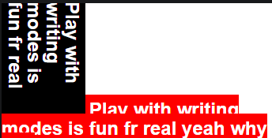

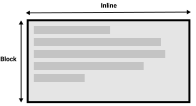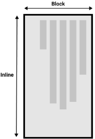

**Logical properties and values**

one with a horizontal-tb writing mode and one with vertical-rl. I have given both of these boxes a width. when the box is in the vertical writing mode, it still has a width, and this is causing the text to overflow. What we really want in this scenario is to essentially swap height with width in accordance to the writing mode.

To make this easier, CSS has recently developed a set of mapped properties. These essentially replace physical properties — things like width and height — with logical, or flow relative versions.

The property mapped to `width` when in a horizontal writing mode is called `inline-size` — it refers to the size in the inline dimension. The property for `height` is named `block-size` and is the size in the block dimension

The `margin-top` property is mapped to `margin-block-start` — this will always refer to the margin at the start of the block dimension.

The `padding-left` property maps to `padding-inline-start`, the padding that is applied to the start of the inline direction.

The `border-bottom` property maps to `border-block-end`, which is the border at the end of the block dimension.

There are a huge number of properties when you consider all of the individual border longhands, and you can see all of the mapped properties on the MDN page for [Logical Properties and Values](https://developer.mozilla.org/en-US/docs/Web/CSS/CSS_logical_properties_and_values).


There are also some properties that take physical values of `top, right, bottom, and left`. These values also have mappings, to logical values — `block-start, inline-end, block-end, and inline-start`.

Eg: `float: inline-start;`

**Should you use physical or logical properties?**

The logical properties and values are newer than their physical equivalents, and therefore have only recently been implemented in browsers.

## 2.3. [CSS text styling](https://developer.mozilla.org/en-US/docs/Learn_web_development/Core/Text_styling)

### 2.3.1. Fundamental text and font styling

**Web safe fonts**

there are only a certain number of fonts that are generally available across all systems and can therefore be used without much worry. These are the so-called web safe fonts. [Core fonts for the Web](https://en.wikipedia.org/wiki/Core_fonts_for_the_Web)

```CSS
font-family: "Helvetica", "Arial", "sans-serif";
font-family: "Courier New", "monospace";
font-family: "Georgia", "Times New Roman", "serif";
font-family: "Trebuchet MS", "Verdana", "sans-serif";
```

> Note: Among various resources, the [cssfontstack.com](https://www.cssfontstack.com/) website maintains a list of web safe fonts available on Windows and macOS operating systems.

**Default fonts**

CSS defines five generic names for fonts: `serif, sans-serif, monospace, cursive, and fantasy`.  a worst case scenario where the browser will try its best to provide a font that looks appropriate. `serif, sans-serif, and monospace` are quite predictable.

CSS provides four common properties to alter the visual weight/emphasis of text:

`font-style, font-weight, text-transform, text-decoration`

text-decoration can accept multiple values at once.

`text-align, line-height, letter-spacing, word-spacing`

With a unitless value, the font-size gets multiplied and results in the line-height.

`font-variant, text-underline-position`

`text-indent, text-overflow, white-space, word-break, overflow-wrap`

### 2.3.2. Styling lists

`list-style-type, list-style-position, list-style-image`

The `list-style-image` property allows you to use a custom image for your bullet. this property is a bit limited in terms of controlling the position, size, etc. of the bullets. You are better off using the `background` family of properties

```css
ul {
  padding-left: 2rem;
  list-style-type: none;
}
ul li {
  padding-left: 2rem;
  background-image: url("star.svg");
  background-position: 0 0;
  background-size: 1.6rem 1.6rem;
  background-repeat: no-repeat;
}
```

**Controlling list counting**

Sometimes you might want to count differently on an ordered list — e.g., starting from a number other than 1, or counting backwards, or counting in steps of more than 1. HTML and CSS have some tools to help you here.

`<ol start="4">`, `<ol start="4" reversed>`, `<li value="2">`

### 2.3.3. Styling links

`:link, :visited, :hover`

A link that is focused (e.g., moved to by a keyboard user using the Tab key or something similar, or programmatically focused using HTMLElement.focus()) — this is styled using the `:focus` pseudo class.

A link that is activated (for example, clicked on), styled using the `:active` pseudo class.

**Default styles**

- Links are underlined.
- Unvisited links are blue.
- Visited links are purple.
- Hovering a link makes the mouse pointer change to a little hand icon.
- Focused links have an outline around them — you should be able to focus on the links on this page with the keyboard by pressing the tab key.
- Active links are red.

**Including icons on links**

```css
a[href^="http"]::after {
  content: "";
  display: inline-block;
  width: 0.8em;
  height: 0.8em;
  margin-left: 0.25em;

  background-size: 100%;
  background-image: url("external-link-52.png");
}
```

### 2.3.4. Web fonts

```css
@font-face {
  font-family: "myFont";
  src: url("myFont.woff2");
}
```

- All major browsers support WOFF/WOFF2
- WOFF2 supports the entirety of the TrueType and OpenType specifications, including variable fonts, chromatic fonts, and font collections.

**Finding fonts**

- A free font distributor: This is a site that makes free fonts available for download (there may still be some license conditions, such as crediting the font creator). Examples include [Font Squirrel](https://www.fontsquirrel.com/), [DaFont](https://www.dafont.com/), and [Everything Fonts](https://everythingfonts.com/).


Let's find some fonts! Go to Font Squirrel and choose. It doesn't matter whether they are TTF (True Type Fonts) or OTF (Open Type Fonts).

> Note: In Font Squirrel, under the "Find fonts" section in the right-hand column, you can click on the different tags and classifications to filter the displayed choices.

**Generating the required code**

- Make sure you have satisfied any licensing requirement if you are going to use this in a commercial and/or Web project.
- Go to the Transfonter [Webfont Generator](https://transfonter.org/).
- Upload your two font files using the Add fonts button. (convert & download)

**Implementing the code in your demo**

Open up the stylesheet.css file and copy the two @font-face rulesets

```css
@font-face {
  font-family: "zantrokeregular";
  src:
    url("fonts/zantroke-webfont.woff2") format("woff2"),
    url("fonts/zantroke-webfont.woff") format("woff");
  font-weight: normal;
  font-style: normal;
  font-display: swap;
}
```

**Using an online font service**

[Google Fonts](https://fonts.google.com/)

> Note: In newer browsers, you can also specify a unicode-range value. In supporting browsers, the font will only be downloaded if the page contains those specified characters. [Creating Custom Font Stacks with Unicode-Range](https://24ways.org/2011/creating-custom-font-stacks-with-unicode-range/) by Drew McLellan provides some useful ideas.

## 2.4. [CSS layout](https://developer.mozilla.org/en-US/docs/Learn_web_development/Core/CSS_layout)

### 2.4.1. Introduction to CSS layout

The size of inline-level elements is just the size of their content. You can set width or height on some elements that have a default display property value of inline, like ``, but the display value will still remain inline.

By default, block-level elements are laid out in the block flow direction, which is based on the parent's writing mode (initial: horizontal-tb). block-level elements are laid out vertically.

Inline elements. They don't appear on new lines; instead, they all sit on the same line as long as there is space for them to do so inside the width of the parent block level element. If there isn't space, then the overflowing content will move down to a new line.

**Overriding normal flow**

- Standard values such as `block, inline or inline-block` can change how elements behave in normal flow, for example, by making a block-level element behave like an inline-level element
- Applying a `float` value such as left can cause block-level elements to wrap along one side of an element, like the way images sometimes have text floating around them in magazine layouts.
- The `position` property allows you to precisely control the placement of boxes inside other boxes. static positioning is the default in normal flow, but you can cause elements to be laid out differently using other values, for example, fixing them to the top of the browser viewport using position: fixed.
- entire layout methods that are enabled via specific display values. The most important ones for you to know about are `CSS grid and Flexbox`
- Responsive design refers to creating layouts that adapt to different devices `@media`

Other layout techniques

- Table layout
- [Multi-column layout](https://developer.mozilla.org/en-US/docs/Web/CSS/CSS_multicol_layout)

### 2.4.2. Floats

**Floating the box**
```CSS
.box {
  float: left;
  margin-right: 15px;
}
```
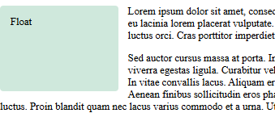

**Visualizing the float**

While we can add a margin to the float to push the text away, we can't add a margin to the text to move it away from the float. This is because a floated element is taken out of normal flow and the boxes of the following items actually run behind the float.

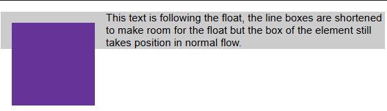

**Clearing floats**

We've seen that a float is removed from normal flow and that other elements will display beside it. If we want to stop the following element from moving up, we need to clear it;

`.cleared { clear: left; }`

You should see that the second paragraph now clears the floated element and no longer comes up alongside it.

**Clearing boxes wrapped around a float**

You now know how to clear something following a floated element, but let's see what happens if you have a tall float and a short paragraph, with a box containing both elements.

Change your document so that the first paragraph and the floated box are jointly wrapped with a `<div>`, which has a class of wrapper.

```html
<style>
.wrapper {
  background-color: rgb(148 255 172);
  padding: 10px;
  color: purple;
}
</style>
<div class="wrapper">
  <div class="box">Float1</div>
  <p> Lorem ipsum dolor ...</p>
</div>
...
```
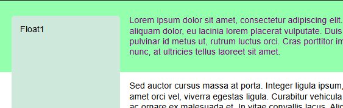

You might expect that by wrapping the floated box and the text of first paragraph that wraps around the float together, the subsequent content will be cleared of the box. But this is not the case.

To solve this problem is to use the value `flow-root` of the `display` property. This exists only to solve this particular problem without using [hacks](https://css-tricks.com/snippets/css/clear-fix/)

`.wrapper {... display: flow-root;}`

[My note](https://developer.mozilla.org/en-US/docs/Web/CSS/CSS_display/Block_formatting_context#contain_internal_floats)

### 2.4.3. Positioning

**Relative positioning**

This is very similar to static positioning, except that once the positioned element has taken its place in the normal flow, you can then modify its final position, including making it overlap other elements on the page

**Absolute positioning**

An absolutely positioned element no longer exists in the normal document flow. Instead, it sits on its own layer separate from everything else.

top, bottom, left, and right behave in a different way with absolute positioning. Rather than positioning the element based on its relative position within the normal document flow, they specify the distance the element should be from each of the containing element's sides.

> Note: Yes, margins still affect positioned elements. Margin collapsing doesn't, however.

If no ancestor elements have their position property explicitly defined, then by default all ancestor elements will have a static position. The result of this is the absolutely positioned element will be contained in the initial containing block. The initial containing block has the dimensions of the viewport and is also the block that contains the `<html>` element. In other words, the absolutely positioned element will be displayed outside of the `<html>` element and be positioned relative to the initial viewport.

**Introducing z-index**

positioned elements win over non-positioned elements. positioned elements later in the source order win over positioned elements earlier in the source order.

**Fixed positioning**

fixed positioning fixes an element in place relative to the visible portion of the viewport.

**Sticky positioning**

This is basically a hybrid between relative and fixed position. It allows a positioned element to act like it's relatively positioned until it's scrolled to a certain threshold (e.g., 10px from the top of the viewport), after which it becomes fixed.

> [My Note](https://developer.mozilla.org/en-US/docs/Web/CSS/position#sticky) The element is positioned according to the normal flow of the document, and then offset relative to its nearest scrolling ancestor and containing block (nearest block-level ancestor), including table-related elements, based on the values of top, right, bottom, and left. 

```html
<style>
body {margin: 0 auto;}
/* height of container must be greater than total height of sticky so that sticky can scroll inside it when threshhold (here top value) is reached relative to ancestor that has a "scrolling mechanism" (here the viewport)
*/
.sticky-container{
  height: 100px;
  background: green;
}
.sticky {
  background: rgb(245 15 42 / 50%);
  border: 2px solid red;
  padding: 10px;
  position: sticky;
  top: 30px;
}
</style>
<p>Lorem ipsum dolor sit amet</p>
<div>
  <div class="sticky-container">
    <div class="sticky">Sticky</div>
  </div>
</div>
<p>Nam vulputate diam nec tempor</p>
```

for horizontal scroll code -

```html
<style>
body {..., width: 1000px;}
p {display:inline-block;}
.sticky {..., left: 30px; display:inline-block;}
</style>
<p>Lorem ipsum dolor sit amet</p>
<div class="sticky">Sticky</div>
<p>Nam vulputate diam nec tempor</p>
```

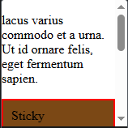 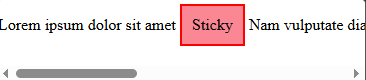

### 2.4.4. Flexbox

**Why flexbox?**

- Vertically center a block of content inside its parent.
- Make all the children of a container take up an equal amount of the available width/height

**Introducing a simple example**

```html
<style>
article {
  padding: 10px; margin: 10px; background: aqua;
}
section {
  display: flex;
  height:200px;
  background: green;
}
</style>
<section>
  <article>
    <h2>First article</h2>
    <p>Content…</p>
  </article>...
</section>
```

> My Note: by default `flex-direction: row; flex-wrap: nowrap;`, their default size is determined by their `flex-basis`, which is "auto," meaning the items' sizes are based on their content. On the cross-axis, items are stretched to the full height `align-items: stretch;`

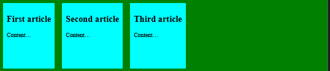

`height: 500px;flex-wrap: wrap;`

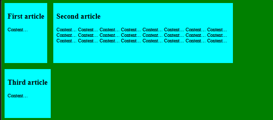

` align-content: start;`

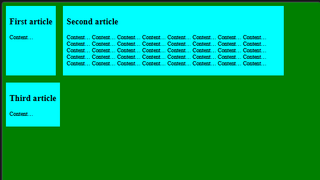

`... align-items: center;`

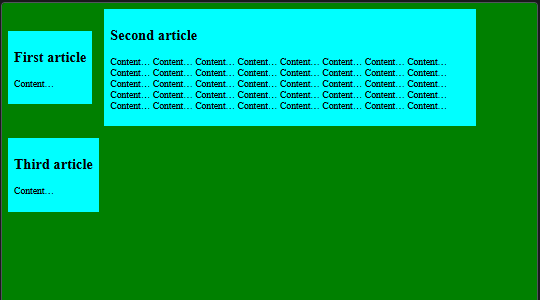

`... justify-content: center;`

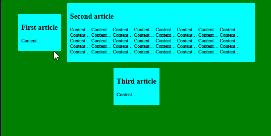


**The flex model**

When elements are laid out as flex items

- The main axis is the axis running in the direction the flex items are laid out (row or column)
- The cross axis is the axis running perpendicular to the direction the flex items are laid out in

**Columns or rows?**

direction the main axis runs. By default this is set to row (left to right).

`flex-direction: row-reverse;`


**Wrapping**

`flex-wrap: wrap-reverse;`

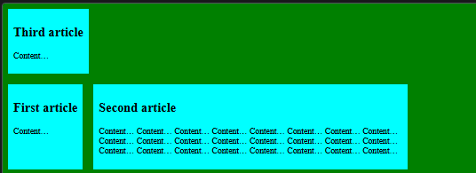

`flex-direction: row-reverse; flex-wrap: wrap-reverse;`

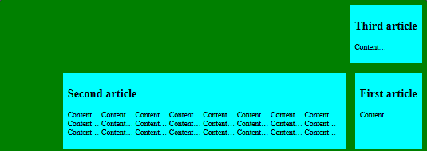

**flex-flow shorthand**

`flex-direction: row; flex-wrap: wrap;` = `flex-flow: row wrap;`

**Flexible sizing of flex items**

`article {..., flex: 1;}`

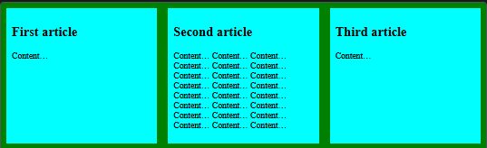

This is a unitless proportion value that dictates how much available space along the main axis each flex item will take up compared to other flex items. 1 means they'll all take up an equal amount of the spare space left after properties like padding and margin have been set. This value is proportionally shared among the flex items: giving each flex item a value of 400000 would have exactly the same effect.

`article:nth-of-type(3) {flex: 2;}`

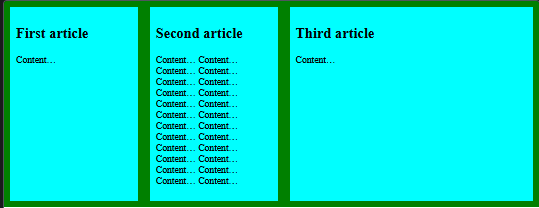

third `<article>` takes up twice as much of the available width as the other two. There are now four proportion units available in total (since 1 + 1 + 2 = 4). The first two flex items have one unit each, so they each take 1/4 of the available space. The third one has two units, so it takes up 2/4 of the available space (or one-half).

`article:nth-of-type(3) {flex: >= 10;}`

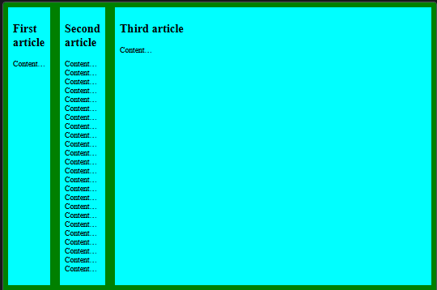

for all values >= 10 the first two will not shrink anymore since their content cannot be shrinked anymore. all the available space is taken by third.

`flex: 1 100px;` states, "Each flex item will first be given 100px of the available space. After that, the rest of the available space will be shared according to the proportion units."

`flex` is a shorthand property
- The unitless proportion value `flex-grow`
- unitless proportion value, `flex-shrink`. when the flex items are overflowing their container. This value specifies how much an item will shrink in order to prevent overflow. 
- The minimum size value `flex-basis`

```css
flex: none; /* 0 0 auto */
flex: 1; /* 1 1 0% */
flex: 2; /* 2 1 0% */
flex: auto; /* 1 1 auto */
flex: initial; /* 0 1 auto */
...
```

> [My Note](https://developer.mozilla.org/en-US/docs/Web/CSS/flex-basis)
> If flex-basis is set to a value other than auto and there is a width (or height in case of flex-direction: column) set for that same flex item, the flex-basis value takes precedence.
>
> `flex-basis: auto;` uses the value of the `width` in horizontal writing mode, and the value of the `height` in vertical writing mode; when the corresponding value is also `auto`, the `content` value is used instead.
> 
> `flex-basis: content;` Indicates automatic sizing, based on the flex item's content.
>
> `flex-basis: <percentage>;` sets a percentage of the width or height of the the flex container. If the flex container's size is indefinite, the used value for flex-basis is content.

> [My Note](https://stackoverflow.com/questions/63475073/css-flex-basis-0-has-different-behaviour-to-flex-basis-0px)
> flex container has say indefinite size - `min-height` set, no `height`. One of the flex item have `flex: 1` which means its `flex-basis: 0%;`. Then `flex-basis` will change to `content`. So if that flex item has `overflow-y: auto;` and content overflowing then scrollbar will not appear inside it as shown below -
> ```html
> <style>
> .outer {min-height: 100%;display: flex;flex-direction: column;}
> .middle {flex: 1;/*flex-basis: 0;*/overflow-y: auto;}
> </style>
> <div class='outer'>
>   <div class='top'>top</div>
>   <div class='middle'>
>     A<div style='height:800px'></div>B
>   </div>
>   <div class='bottom'>bottom</div>
> </div>
> ```
> 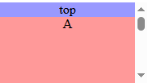 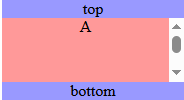

> [My Note](https://developer.mozilla.org/en-US/docs/Web/CSS/CSS_flexible_box_layout/Controlling_ratios_of_flex_items_along_the_main_axis#the_flex-shrink_property)
> `flex-shrink` determines how much the flex item will shrink relative to the rest of the flex items in the flex container when negative free space is distributed. This property deals with situations where the combined flex-basis value of the flex items is too large to fit in the flex container and would otherwise overflow. As long as an item's `flex-shrink` is a positive value, the item will shrink to not overflow the container. While `flex-grow` is used to add available space to items that can grow, `flex-shrink` is used to remove space to ensure items fit in their container without overflowing.
> ```html
> <style>
> .box > * {flex: 0 0 auto;width: 200px;}
> .box {width: 500px;display: flex;}
> </style>
> <div class="box">
>   <div>One</div>
>   <div>Two</div>
>   <div>Three has more content</div>
> </div>
> ```
> 
> 
> Change the `flex-shrink` value to `1`; each item will shrink by the same amount, fitting all the items into the container. The negative free space has been proportionally removed from each item, making each flex item smaller than its initial width.
> 
> 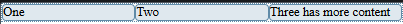

> [My Note](https://developer.mozilla.org/en-US/docs/Web/CSS/CSS_flexible_box_layout/Controlling_ratios_of_flex_items_along_the_main_axis#combining_flex-grow_and_flex-basis)
> 
> `flex: 1 1 auto;` on all items.
> In this case, the `flex-basis` value is `auto` and the items don't have a width set, so they are auto-sized. This means the `flex-basis` used is the `max-content` size of each item. After laying out the items, there is some positive free space in the flex container. This remaining space is then shared equally between the three items. The biggest item remains the largest because it started from a bigger size, even though it has the same amount of spare space as the others:
> 
>  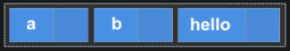
> To create three equally-sized items, even if the original elements have different sizes -
> 
> `flex: 1 1 0;`
> 
> Here, for the purpose of space distribution calculation, we are setting the size of each item to `0`. This means all the space is available for distribution. Since all the items have the same `flex-grow` factor, they each get an equal amount of space. This results in three equal-width flex items.

**Ordering flex items**

By default, all flex items have an `order` value of `0`. Flex items with higher specified order values will appear later in the display order. set negative order values to make items appear earlier.

### 2.4.5. CSS grid layout

```html
<style>
.container {zoom: 0.6; display: grid; width:500px;background: green;}
</style>
<div class="container">
  <div>One</div>...
</div>
```
Declaring display: grid gives you a one column grid, so your items will continue to display one below the other as they do in normal flow.

`grid-template-columns: 200px 200px 200px;`

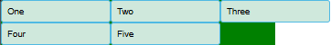

`grid-template-columns: 1fr 1fr 1fr;`

> Note: The fr unit distributes available space, not all space.

```
column-gap: len or %;
row-gap: len or %;
gap: <row-gap> <column-gap>;
```

`width: 500px; height: 250px; grid-template-columns: repeat(3, 1fr);`

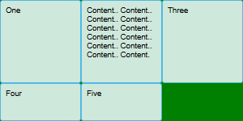

`... align-content: start;`

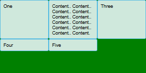

`... width: 700px; grid-template-columns: repeat(3, 175px); justify-content: center;`

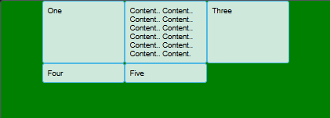

`... align-items: center;`

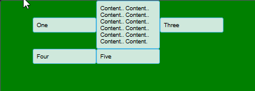

`... justify-items: center;`

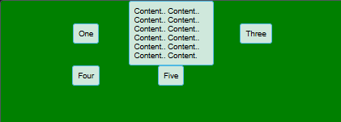

**Implicit and explicit grids**

> [My Note](https://css-tricks.com/difference-explicit-implicit-grids)
>
> - **Explicit Grids**: We can define a fixed number of lines and tracks that form a grid by using the properties `grid-template-rows, grid-template-columns, and grid-template-areas`.
> 
>   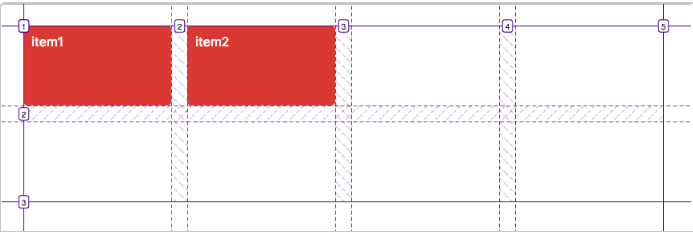
> 
>   An explicit grid with 4 vertical tracks (columns) and 2 horizontal tracks (rows).
> 
> - If there are more grid items than cells in the grid or when a grid item is placed outside of the explicit grid, the grid container automatically generates grid tracks by adding grid lines to the grid. The explicit grid together with these additional implicit tracks and lines forms implicit grid.
> 
>   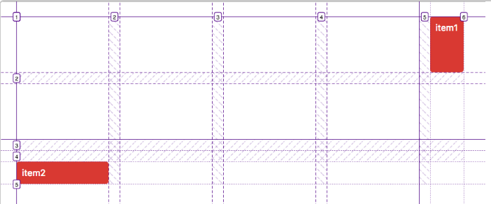
>   ```css
>   .item:first-child {grid-column-start: -1;}
>   .item:nth-child(2) {grid-row-start: 4;}
>   ```
>   The widths and heights of the implicit tracks are set automatically. They are only big enough to fit the placed grid items, but it’s possible to change this default behavior.


If you wish to give implicit grid tracks a size, you can use the `grid-auto-rows and grid-auto-columns` properties

`grid-template-columns: repeat(3, 1fr); grid-template-rows: auto; grid-auto-rows: 100px;`

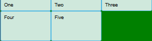

`... grid-auto-rows: minmax(10px, auto);`

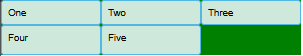

> [My Note](https://developer.mozilla.org/en-US/docs/Web/CSS/minmax) The `minmax()` CSS function defines a size range greater than or equal to `min` and less than or equal to `max`. If max < min, then max is ignored.
> 
> `auto`: As `min`, it represents the largest minimum size (as specified by `min-width/min-height`) of the grid items occupying the grid track. As `max`, it is identical to `max-content`. However, unlike max-content, it allows expansion of the track by the `align-content` and `justify-content` property values like `normal` and `stretch`.
> ```html
> <style>
> #container {
>   display: grid;grid-gap: 5px;box-sizing: border-box;height: 100px;width: 100%;
>   grid-template-columns: minmax(min-content, 300px) minmax(50px, 1fr) 150px;
> }
> </style>
> <div id="container">
>   <div>Item as wide as the content, but at most 300 pixels.</div>
>   <div>Item with flexible width but a minimum of 50 pixels.</div>
>   <div>Inflexible item of 150 pixels width.</div>
> </div>
> ```
> 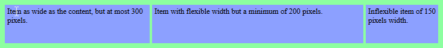
>
> `#container {... width: 50%;}`
> 
> 
>
> `#container {... width: 30%;}`
>
> 

**As many columns as will fit**

`... grid-template-columns: repeat(auto-fit, minmax(230px, 1fr));`


This works because grid is creating as many 230-pixel columns as will fit into the container, then sharing whatever space is leftover among all the columns. The maximum is 1fr which, as we already know, distributes space evenly between tracks.

> [My Note](https://css-tricks.com/auto-sizing-columns-css-grid-auto-fill-vs-auto-fit/)
> The `auto-fit` keyword behaves the same way as `auto-fill`, except that after grid item placement it will only create as many tracks as needed and any empty repeated track collapses.
> 
> `width: 800px; grid-template-columns: repeat(auto-fill, minmax(100px, 1fr));`
>
> 
>
> `width: 800px; grid-template-columns: repeat(auto-fit, minmax(100px, 1fr));`
> 
> 

**Line-based placement**

To position items along these lines, we can specify the start and end lines of the grid area-

- `grid-column` shorthand for `grid-column-start` and `grid-column-end`
- `grid-row` shorthand for `grid-row-start` and `grid-row-end`

```html
<style>
.container { display: grid; grid-template-columns: 1fr 3fr; gap: 20px; width: 500px; }
</style>
<div class="container">
  <header>Header</header>
  <main>...</main>
  <aside>...</aside>
  <footer>footer</footer>
</div>
```
```css
header {grid-column: 1 / 3;grid-row: 1;}
main {grid-column: 2;grid-row: 2;}
aside {grid-column: 1;grid-row: 2;}
footer {grid-column: 1 / 3;grid-row: 3;}
```

 

> Note: You can also use the value -1 to target the end column or row line, then count inwards from the end using negative values. Note also that lines count always from the edges of the explicit grid, not the implicit grid.

**Positioning with grid-template-areas**

```css
.container {... grid-template-areas:"header header" "sidebar content" "footer footer";}
header {grid-area: header;}
...
```

The rules for grid-template-areas are as follows:

- You need to have every cell of the grid filled.
- To span across two cells, repeat the name.
- To leave a cell empty, use a . (period).
- Areas can't be repeated in different locations.

**Nesting grids and subgrid**

```css
main {display: grid; grid-template-rows: 4fr 3fr 3fr; gap: inherit;}
```


To make it easier to work with layouts in nested grids, you can use `subgrid` on `grid-template-rows` and `grid-template-columns` properties. This allows you to leverage the tracks defined in the parent grid.

```html
<style>
.container {display: grid; grid-template-columns: repeat(4, 1fr); grid-template-rows: repeat(1, 1fr); gap: 10px; }
.subgrid {
  grid-column: 1 / 4; grid-row: 2 / 4;
  display: grid; gap: inherit;
  grid-template-columns: subgrid; grid-template-rows: 2fr 1fr;
}</style>
<div class="container">
  <div>One</div>...
  <div class="subgrid">
    <div>Five</div>...<div>Eight</div>
  </div>...
  <div>Ten</div>
</div>
```


> [My Notes](https://www.youtube.com/watch?v=qm0IfG1GyZU)
> 
> Exmaple-1: center item inside container - `.container {display: flex; place-items: center;}`
>
> Example-2:
> ```css
> .parent {display: grid; grid-template: auto 1fr auto / auto 1fr auto;}
> header {grid-column: 1 / 4;}
> .left-side {grid-column: 1 / 2;}
> main {grid-column: 2 / 3;}
> ...
> ```
> 


### 2.4.6. [Media query fundamentals](https://developer.mozilla.org/en-US/docs/Learn_web_development/Core/CSS_layout/Media_queries)

```css
@media media-type and (media-feature-rule) {}

@media screen and (width: 600px) {}
@media screen and (max-width: 600px) {}
@media (orientation: landscape) {}
@media screen and (hover: hover) {} /* test if the user has the ability to hover over an element */
@media (min-width: 30em) and (max-width: 50em) {}
@media (30em <= width <= 50em) {}

/* "and" logic in media queries */
@media screen and (width >= 600px) and (orientation: landscape) {}

/* "or" logic in media queries (comma separate these queries) */
@media screen and (width >= 600px), screen and (orientation: landscape) {}

/* "not" logic in media queries */
@media not (width >= 600px) {}
@media (not (width < 600px)) and (not (width > 1000px)) {}
@media (600px <= width <= 1000px)
```

**How to choose breakpoints**

There are now far too many devices, with a huge variety of sizes, to make that feasible. This means that instead of targeting specific sizes for all designs, a better approach is to change the design at the size where the content starts to break in some way. Perhaps the line lengths become far too long, or a sidebar gets squashed and hard to read. That's the point at which you want to use a media query to change the design to a better one for the space you have available. This approach means that it doesn't matter what the exact dimensions are of the device being used; every range is catered for.

**Mobile-first responsive design**

The view for the very smallest devices is quite often a simple single column of content, much as it appears in normal flow. This means that you probably don't need to do a lot of layout for small devices — order your source well (document is ordered in a way that makes the content readable like normal flow) and you will have a readable layout by default.

```html
<meta name="viewport" content="width=device-width,initial-scale=1" />
```

This viewport meta tag tells mobile browsers that they should set the width of the viewport to the device's width, and scale the document to 100% of its intended size, which shows the document at the mobile-optimized size that you intended. 

**Do you really need a media query?**

Flexbox and CSS Grid give you ways to create flexible and even responsive components without the need for a media query. However, in practice you will find that good use of modern layout methods, enhanced with media queries, will give the best results.

### 2.4.7. [Practical positioning examples](https://developer.mozilla.org/en-US/docs/Learn_web_development/Core/CSS_layout/Practical_positioning_examples)

```html
<style>
.info-box [role="tablist"] {display: flex;}
.info-box [role="tab"] {}
.info-box [role="tab"] :where(:focus,:hover) span {}
.info-box [role="tab"][aria-selected="true"] {}
.info-box .panels {position: relative;}
.info-box [role="tabpanel"] { position: absolute;}
.info-box [role="tabpanel"].is-hidden {display: none;}
</style>
<section class="info-box">
  <div role="tablist" class="manual">
    <button id="tab-1" type="button" role="tab" aria-selected="true" aria-controls="tabpanel-1">
      <span>Tab 1</span>
    </button>
    ...
  </div>

  <div class="panels">
    <article id="tabpanel-1" role="tabpanel" aria-labelledby="tab-1">
      <h2>The first tab</h2>
      <p> Lorem ipsum ...</p>
    </article>
    ...
  </div>
</section>
```

**A sliding hidden panel**

```html
<button type="button" id="menu-button" aria-haspopup="true" aria-controls="info-panel"  aria-expanded="false">❔</button>
<aside id="info-panel" aria-labelledby="menu-button">…</aside>
```

### 2.4.8. [Supporting older browsers](https://developer.mozilla.org/en-US/docs/Learn_web_development/Core/CSS_layout/Supporting_Older_Browsers)

If you don't have analytics or you're launching a brand new site, then sites such as [Statcounter](https://gs.statcounter.com/) can provide relevant statistics.

popular way to find out about how well a feature is supported is the [Can I Use](https://caniuse.com/) website.

**Feature support does not mean identical appearance**

Some of your users will be viewing the site on a phone and others on a large desktop screen. Similarly, some of your users will have an old browser version, and others the latest browser. Some of your users might be hearing your content read out to them by a screen reader, while others might need to zoom in on the page to be able to read it.

A basic level of support comes from structuring your content well so that the normal flow of your page makes sense. For users on a limited data plan, their browsers might not load images, fonts, or even your CSS. However, the content should be presented in a way such that it is accessible and readable even when these elements are not fully loaded. 

**Creating fallbacks in CSS**

`.container { display: inline-flex; display: inline flex;}`

**Using new selectors**

If a selector in a comma-separated list of selectors is invalid, the entire style block is ignored.

If using vendor-prefixed pseudo-elements or new pseudo-classes a browser may not yet support, include the prefixed values within a [forgiving selector](https://developer.mozilla.org/en-US/docs/Web/CSS/Selector_list#forgiving_selector_list) list by using :is() or :where() so the entire selector block doesn't get invalidated and ignored.

```css
:is(:-prefix-mistake, :unsupported-pseudo), .valid {
  font-family: sans-serif;
}
:-prefix-mistake, :unsupported-pseudo, .valid {
  color: red;
}
```

In the above example, the `.valid` content will be `sans-serif` but not red.

**Feature queries**

`@supports (grid-template-rows: subgrid) {}`

### 2.4.9. [Multiple-column layout]()

We enable multicol by using one of two properties: `column-count` or `column-width`

`.container {column-count: 3;}`

The columns that you create have flexible widths — the browser works out how much space to assign each column.

`.container {column-width: 200px;}`

The browser will now give you as many columns as it can of the size that you specify; any remaining space is then shared between the existing columns. 

**Styling the columns**

The columns created by multicol cannot be styled individually. There's no way to make one column bigger than other columns or to change the background or text color of a single column.

- Changing the size of the gap between columns using the `column-gap`.
- Adding a rule between columns with `column-rule`.

`column-rule` is a shorthand for `column-rule-color, column-rule-style, and column-rule-width`, and accepts the same values as `border`. 

`column-count: 3; column-gap: 20px; column-rule: 4px dotted rgb(79 185 227);`

**Spanning columns**

You can cause an element to span across all the columns. In this case, the content breaks where the spanning element's introduced and then continues below the element, creating a new set of columns. To cause an element to span all the columns, specify the value of `all` for the `column-span` property.

**Columns and fragmentation**

When you turn your content into a multicol container, it fragments into columns. In order for the content to do this, it must break.

Sometimes, this breaking will happen in places that lead to a poor reading experience. 

```html
<div class="container">
  <div class="card"><h2>...</h2><p>...</p></div>
  ...
</div>
```


To control this behavior, we can use properties from the [CSS Fragmentation](https://developer.mozilla.org/en-US/docs/Web/CSS/CSS_fragmentation) specification.

`.card {break-inside: avoid;}`

The addition of this property causes the boxes to stay in one piece—they now do not fragment across the columns.

## 2.5. [Dynamic scripting with JavaScript](https://developer.mozilla.org/en-US/docs/Learn_web_development/Core/Scripting)

### 2.5.1. Functions

```js
// first.js
const name = "Chris";
function greeting() {
  alert(`Hello ${name}: welcome to our company.`);
}
// second.js
const name = "Zaptec";
function greeting() {
  alert(`Our company is called ${name}.`);
}
```
```html
<script src="first.js"></script>
<script src="second.js"></script>
<script>
  greeting();
</script>
```

- greeting() function defined inside the first script file has been called by the greeting()
- The second script, however, does not load and run at all, and an error is printed in the console.
- If we were to remove the const name = "Zaptec"; line from second.js and reload the page, both scripts would execute. The alert box would now say `Our company is called Chris.` Functions can be redeclared, and the last declaration in the source order is used.

### 2.5.2. Event bubbling

An alternative form of event propagation is event capture. This is like event bubbling but the order is reversed.

```js
function handleClick(e) {
  console.log(`You clicked on a ${e.currentTarget.tagName} element\n`);
}

const container = document.querySelector("#container");
const button = document.querySelector("button");

document.body.addEventListener("click", handleClick, { capture: true });
container.addEventListener("click", handleClick, { capture: true });
button.addEventListener("click", handleClick);

// logs
// You clicked on a BODY element
// You clicked on a DIV element
// You clicked on a BUTTON element
```

**Event delegation**

```html
<div id="container">
  <div class="tile"></div>
   <!-- ... 16 tiles -->
</div>
<script>
const container = document.querySelector("#container");
container.addEventListener("click", (event) => {
  event.target.style.backgroundColor = "red";
});
</script>
```

### 2.5.3. JavaScript object basics

```js
function createPerson(name) {
  const obj = {};
  obj.name = name;
  obj.introduceSelf = function () {
    console.log(`Hi! I'm ${this.name}.`);
  };
  return obj;
}
```
This works fine but is a bit long-winded: we have to create an empty object, initialize it, and return it. A better way is to use a constructor. A constructor is just a function called using the new keyword.

```js
function Person(name) {
  this.name = name;
  this.introduceSelf = function () {
    console.log(`Hi! I'm ${this.name}.`);
  };
}
const salva = new Person("Salva");
```

### 2.5.4. DOM scripting introduction

**The document object model**

> Note: This DOM tree diagram was created using Ian Hickson's [Live DOM viewer](https://software.hixie.ch/utilities/js/live-dom-viewer/).

### 2.5.5. JSON

- parse(): Accepts a JSON string as a parameter, and returns the corresponding JavaScript object.
- stringify(): Accepts an object as a parameter, and returns the equivalent JSON string.

### 2.5.6. JavaScript debugging and error handling

**Throwing custom errors**

`throw new Error("A number was not provided. Please correct the input.");`

error thrown, along with a useful call stack to help you locate the source of the error (although note that the message still tells us that the error is "uncaught", or "unhandled")

```js
try {
  throw new Error("A number was not provided. Please correct the input.");
} catch (error) {
  console.error(error);
}
```

The error message and call stack as before, but this time, without a label of "uncaught", or "unhandled".

## 2.6. [Accessibility on the web](https://developer.mozilla.org/en-US/docs/Learn_web_development/Core/Accessibility)

### 2.6.1. Accessibility tools

To test source order, you can `turn off a site's CSS` and see how understandable it is without it -

- Firefox: Select View > Page Style > No Style from the main menu.
- Safari: Open the browser developer tools, click the Device Settings, then check the "Disable CSS" checkbox.
- Chrome/Edge: Install the Web Developer Toolbar extension

Use a tool like WebAIM's [Color Contrast Checker](https://webaim.org/resources/contrastchecker/) to check whether your scheme is contrasting enough.

**Auditing tools**

say we have [bad-form.html](https://mdn.github.io/learning-area/accessibility/html/bad-form.html).

- [Wave](https://wave.webaim.org/)

Other auditing tools that are worth checking out:

- [Firefox Accessibility Inspector](https://firefox-source-docs.mozilla.org/devtools-user/accessibility_inspector/index.html)
- [Google Lighthouse accessibility audits](https://developer.chrome.com/docs/lighthouse/accessibility/scoring)

> Note: Such tools aren't good enough to solve all your accessibility problems on their own. You'll need a combination of these, knowledge and experience, user testing, etc. to get a full picture.

[Deque's aXe tool](https://www.deque.com/axe/) goes a bit further than the auditing tools we mentioned above. Like the others, it checks pages and returns accessibility errors.

**Screen reader testing**

this section includes html flies for testing.

### 2.6.2. Accessible HTML

**Use meaningful text labels**

```html
<p>
  Whales are really awesome creatures.
  <a href="whales.html">Find out more about whales</a>.
</p>
```

**Text alternatives**

```html


<p id="dino-label">The Mozilla red Tyrannosaurus…</p>

<figure>
  
  <figcaption id="dinodescr">
    A red Tyrannosaurus Rex: A two legged dinosaur ...
  </figcaption>
</figure>
```

**Empty alt attributes**

```html
<h3>
  
  Tyrannosaurus Rex: the king of the dinosaurs
</h3>
```

There may be times where an image is included in a page's design, but its primary purpose is for visual decoration. alt attribute is empty — this is to make screen readers recognize the image, but not attempt to describe the image (instead they'd just say "image", or similar).

The reason to use an empty alt instead of not including it is because many screen readers announce the whole image URL if no alt is provided.

Another alternative is to use the aria role attribute role="presentation" as this also stops screen readers from reading out alternative text.

> Note: If possible you should use CSS to display images that are only decorative.

**More on links**

Anchor tags are often abused with the onclick event to create pseudo-buttons by setting href to "#" or "javascript:void(0)" to prevent the page from refreshing. In these cases, it is recommended to use a `<button>` instead.

Links that open in a new tab or window via the target="_blank" declaration and links to whose href value points to a file resource should include an indicator about the behavior that will occur when the link is activated.

```html
<a target="_blank" href="https://www.wikipedia.org/">Wikipedia (opens in a new window)</a>
<a target="_blank" href="2017-annual-report.ppt">2017 Annual Report (PowerPoint)</a>
```

**Skip links**

A skip link, also known as skipnav, is an a element placed as close as possible to the opening `<body>` element that links to the beginning of the page's main content.

### 2.6.3. Accessible CSS and JS

**Hiding things**

in our [Tabbed info box example](https://developer.mozilla.org/en-US/docs/Learn_web_development/Core/CSS_layout/Practical_positioning_examples#a_tabbed_info-box) we have three panels of information, but we are positioning them on top of one another and providing tabs that can be clicked to show each one

Screen reader users don't care about any of this — they are happy with the content as long as the source order makes sense,

you shouldn't use visibility: hidden or display: none, because they do hide content from screen readers

in the example  display: none is used to hide the panel but since we using aria attribute it might not be a problem ([see](https://developer.mozilla.org/en-US/docs/Web/CSS/display#display_none))

**Accept that users can override styles**

It is possible for users to override your styles with their own custom styles. As an example, you might want to make sure your main content area can handle bigger text (maybe it will start to scroll to allow it all to be seen).

**mouse-specific events**

mouseover, mouseout, dblclick, etc. Functionality that runs in response to these events will not be accessible using other mechanisms, like keyboard controls. you should double up these events with similar events that can be activated by other means — focus and blur would provide accessibility for keyboard users.

[mouse-and-keyboard-events.html](https://mdn.github.io/learning-area/accessibility/css/mouse-and-keyboard-events.html)

```js
imgThumb.onmouseover = showImg;
imgThumb.onmouseout = hideImg;
imgThumb.onfocus = showImg;
imgThumb.onblur = hideImg;
```
we've included the last two lines, which run the functions when the image is focused and blurred (when focus stops). This can be done by tabbing over the image, because we've included tabindex="0" on it.

The click event is interesting — it sounds mouse-dependent, but most browsers will activate onclick event handlers after Enter/Return is pressed on a link or form element (or element with tabindex) that has focus, or when such an element is tapped on a touchscreen device.

### 2.6.4. WAI-ARIA basics

WAI-ARIA (Web Accessibility Initiative - Accessible Rich Internet Applications) is a specification written by the W3C, defining a set of additional HTML attributes that can be applied to elements to provide additional semantics and improve accessibility wherever it is lacking

- Roles - These define what an element is or does. Many of these are so-called landmark roles, which largely duplicate the semantic value of structural elements, such as role="navigation" (`<nav>`), role="banner" (document `<header>`), role="complementary" (`<aside>`) or , role="search" (`<search>`). Some other roles describe different page structures that do not have elements with that match those roles, such as role="tablist", and role="tabpanel", which are commonly found in UIs.
- Properties - aria-required="true" specifies that a form input needs to be filled in order to be valid, whereas a  ria-labelledby="label" allows you to put an ID on an element, then reference it as being the label for anything else on the page, including multiple elements, which is not possible using `<label for="input">`
- States - define the current conditions of elements, such as aria-disabled="true", which specifies to a screen reader that a form input is currently disabled.

> Note: You can find a useful list of all the ARIA roles and their uses, with links to further information, in the WAI-ARIA spec — see [Definition of Roles](https://w3c.github.io/aria/#role_definitions) — on this site — see [ARIA roles](https://developer.mozilla.org/en-US/docs/Web/Accessibility/ARIA/Reference/Roles).
> 
> The spec also contains a list of all the properties and states, with links to further information — see [Definitions of States and Properties (all aria-* attributes)](https://w3c.github.io/aria/#state_prop_def).

**Where is WAI-ARIA supported?**

Screen reader support for ARIA features isn't quite at this level, but the most popular screen readers are getting there [WAI-ARIA Screen reader compatibility](https://www.powermapper.com/tests/screen-readers/aria/)

> Note: Some JavaScript libraries support WAI-ARIA, meaning that when they generate UI features like complex form controls, they add ARIA attributes to improve the accessibility of those features [Dojo/Dijit](https://dojotoolkit.org/reference-guide/1.10/dijit/a11y/statement.html).

**Signposts/Landmarks**

```html
<header>
  <h1>Header</h1>
  <!-- Even is it's not mandatory, it's common practice to put the main navigation menu within the main header -->
  <nav>
    <ul>
      <li><a href="#">Home</a></li> ...
    </ul>
    <!-- A Search form is another common non-linear way to navigate through a website. -->
    <form>
      <input type="search" name="q" placeholder="Search query" />
      <input type="submit" value="Go!" />
    </form>
  </nav>
</header>
<!-- Here is our page's main content -->
<main>
  <!-- It contains an article -->
  <article>
    <h2>Article heading</h2>
    <p>
      Lorem ipsum ...
    </p>
    <h3>subsection</h3>
    <p>
      Donec ut librero ...
    </p>
  </article>
  <!-- the aside content can also be nested within the main content -->
  <aside>
    <h2>Related</h2>
    <ul>
      <li><a href="#">Oh I do like to be beside the seaside</a></li>
      ...
    </ul>
  </aside>
</main>
<!-- And here is our main footer that is used across all the pages of our website -->
<footer>
  <p>©Copyright 2050 by nobody. All rights reversed.</p>
</footer>
```

If you try testing the example with a screen reader in a modern browser, you'll already get some useful information. For example, VoiceOver gives you the following:

- On the `<header>` element — "banner, 2 items" (it contains a heading and the `<nav>`).
- On the `<nav>` element — "navigation 2 items" (it contains a list and a form).
- On the `<main>` element — "main 2 items" (it contains an article and an aside).
- On the `<aside>` element — "complementary 2 items" (it contains a heading and a list).
- On the search form input — "Search query, insertion at beginning of text".
- On the `<footer>` element — "footer 1 item".

If you go to VoiceOver's landmarks menu (accessed using VoiceOver key + U) -


The search form is a really important landmark that people will want to find, but it is not listed in the landmarks menu or treated like a notable landmark beyond the actual input being called out as a search input (`<input type="search">`). We could improve it by the use of the ARIA `role="search"`, but using the `<search>` element implicitly gives that role to the form.

```html
<search>
  <form>
    <input type="search" name="q" placeholder="Search query" aria-label="Search through site content" />
    <input type="submit" value="Go!" />
  </form>
</search>
```

`aria-label`, which gives it a descriptive label to be read out by a screen reader, even though we haven't included a `<label>` element.

**Dynamic content updates**

The problem is that modern web apps are often not just static text — they often update parts of the page by fetching new content from the server (live regions)

```html
<section>
  <h1>Random quote generator</h1>
  <button>Start giving me quotes</button>
  <blockquote>
    <p></p>
  </blockquote>
</section>
```
the content update is not detected by screen readers, so their users would not know what is going on. [aria-live](https://developer.mozilla.org/en-US/docs/Web/Accessibility/ARIA/Reference/Attributes/aria-live) property. Applying this to an element causes screen readers to read out the content that is updated. How urgently the content is read out depends on the attribute value

`<blockquote aria-live="assertive">…</blockquote>`

> Note: There are some other ARIA properties related to aria-live that are also worth knowing about: aria-atomic, aria-relevant.

**Enhancing keyboard accessibility**

In terms of making non-focusable code focusable, WAI-ARIA extends the tabindex attribute with some new values:

- `tabindex="0"` — as indicated above, this value allows elements that are not normally tabbable to become tabbable. This is the most useful value of tabindex.
- `tabindex="-1"` — this allows not normally tabbable elements to receive focus programmatically, e.g., via JavaScript, or as the target of links.

[Building keyboard accessibility back in](https://developer.mozilla.org/en-US/docs/Learn_web_development/Core/Accessibility/HTML#building_keyboard_accessibility_back_in)

**Accessibility of non-semantic controls**

let's revisit the form example [Keeping it unobtrusive](https://developer.mozilla.org/en-US/docs/Learn_web_development/Core/Accessibility/CSS_and_JavaScript#keeping_it_unobtrusive) 

```HTML
<div class="errors" role="alert" aria-relevant="all">
  <ul></ul>
</div>
```

- `role="alert"` automatically turns the element it is applied to into a live region, so changes to it are read out; it also semantically identifies it as an alert message (important time/context-sensitive information), and represents a better, more accessible way of delivering an alert to a user (modal dialogs like alert() calls have a number of accessibility problems; see [Popup Windows](https://webaim.org/techniques/javascript/other#popups)).
- An `aria-relevan`t value of `all`. This is useful because the user will want to know what errors are left, not just what has been added or removed from the list.

a paragraph just above the opening `<form>` tag. This is normally how we mark required fields for sighted users.

`<p>Fields marked with an asterisk (*) are required.</p>`

This makes visual sense, but it isn't as easy to understand for screen reader users. `aria-required` attribute to give screen readers hints that they should tell users that form inputs need to be filled in.

`<input type="text" name="name" id="name" aria-required="true" />`

It might also be useful if we give screen reader users and sighted users an idea of what the age value should be. This is often presented as a tooltip or placeholder inside the form field. `aria-valuemin` and `aria-valuemax` properties to specify min and max values, and screen readers support the native `min` and `max` attributes.

```html
<label for="age">Your age:</label>
<input type="number" name="age" placeholder="Enter 1 to 150" ... />
```

While some screen readers announce the `placeholder` text, most do not. Acceptable substitutions for providing form controls with an accessible name include `aria-label` and `aria-labelledby`. But the `<label>` element with a for attribute is the preferred method as it provides usability for all users, including mouse users.

`aria-disabled="true"` can be used to indicate that a form field is disabled. If the disabled state of an input is likely to change, then it is also a good idea to indicate when it happens.  For example, in our
[form-validation-checkbox-disabled.html](https://mdn.github.io/learning-area/accessibility/aria/form-validation-checkbox-disabled.html) demo, there is a checkbox that when checked, enables another form input to allow further information to be entered. We've set up a hidden live region:

`<p class="hidden-alert" aria-live="assertive"></p>`

When this is checked/unchecked, we update the text inside the hidden live region to tell screen reader users what the result of checking this checkbox is, as well as updating the aria-disabled state:

```js
function toggleMusician(bool) {
  const instrument = form Items[formItems.length - 1];
  if (bool) {
    instrument.input.disabled = false;
    instrument.input.setAttribute("aria-disabled", "false");
    hiddenAlert.textContent =
      "Instruments played field now enabled; use it to tell us what you play.";
  } else {
    instrument.input.disabled = true;
    instrument.input.setAttribute("aria-disabled", "true");
    hiddenAlert.textContent = "Instruments played field now disabled.";
  }
}
```

If we test our [fake-div-buttons.html](https://mdn.github.io/learning-area/tools-testing/cross-browser-testing/accessibility/fake-div-buttons.html) example in a screen reader, our fake buttons will be reported using phrases like "Click me!, group", which is obviously confusing.

`<div tabindex="0" role="button">Click me!</div>` 

While this is much better, you still have to add in all the native button features users expect, like handling enter and click events [button role documentation](https://developer.mozilla.org/en-US/docs/Web/Accessibility/ARIA/Reference/Roles/button_role)


**Guiding users through complex widgets**

You can see several useful examples in the [Deque university code library](https://dequeuniversity.com/library/). you can also find several live examples in our [WAI-ARIA roles](https://developer.mozilla.org/en-US/docs/Web/Accessibility/ARIA/Reference/Roles) documentation. 

### 2.6.5. Accessible multimedia

HTML video and audio instances even come with a set of inbuilt controls that allow you to control the media straight out of the box. However, there are problems with these controls:

- They are not keyboard-accessible in most browsers, i.e., you can't tab between the controls inside the native player. Opera and Chrome provide this to some degree, but it still isn't ideal.
- Different browsers give the native controls differing styling and functionality, and they aren't stylable, meaning that they can't be easily made to follow a site style guide.

HTML video and audio share an API — HTML Media Element — which allows you to map custom functionality to buttons and other controls — both of which you define yourself.

```html
<section class="player">
  <video controls>
    <source src="rabbit320.mp4" type="video/mp4" />
    <source src="rabbit320.webm" type="video/webm" />
    <p>
      Your browser doesn't support HTML video. Here is a
      <a href="rabbit320.mp4">link to the video</a> instead.
    </p>
  </video>
  <div class="controls">
    <button class="play-pause">Play</button>
    <button class="stop">Stop</button>
    <button class="rwd">Rwd</button>
    <button class="fwd">Fwd</button>
    <div class="time">00:00</div>
  </div>
</section>
<script>
...
const player = document.querySelector("video");
/*
remove the native controls so they don't get in the way of our custom controls.
Doing it this way round rather than just not including the controls attribute in the first place has the advantage that if our JavaScript fails for any reason, the user still has some controls available.
*/
player.removeAttribute("controls");

playPauseBtn.onclick = () => {
  if (player.paused) {
    player.play(); playPauseBtn.textContent = "Pause";
  } else {
    player.pause(); playPauseBtn.textContent = "Play";
  }
};
...
</script>
```

For more information on how to add more complex features to video/audio players, see [Audio and video delivery](https://developer.mozilla.org/en-US/docs/Web/Media/Guides/Audio_and_video_delivery)

We've also created an advanced example to show how you could create an object-oriented system that finds every video and audio player on the page (no matter how many there are) and adds our custom controls to it. See [custom-controls-oojs](https://mdn.github.io/learning-area/accessibility/multimedia/custom-controls-OOJS/)

**Audio transcripts**

To provide deaf people with access to audio content, you need to create text transcripts. 

**Transcript examples**

 you can do it however you like, but it might make sense to include it in a showable/hidable panel; see our [audio-transcript-ui](https://mdn.github.io/learning-area/accessibility/multimedia/audio-transcript-ui/) example

**Video text tracks**

- Captions — There for the benefit of deaf users who can't hear the audio track, including the words being spoken, and contextual information such as who spoke the words, if the people were angry or sad, and what mood the music is currently creating.
- Subtitles — Include translations of the audio dialog, for users that don't understand the language being spoken.
- Descriptions — These include descriptions for visually impaired people who can't see the video, for example, what the scene looks like.
- Chapter titles — Chapter markers intended to help the user navigate the media resource

Text tracks for displaying with HTML video need to be written in WebVTT (.vtt file)

```html
<video controls>
  <source src="example.mp4" type="video/mp4" />
  <source src="example.webm" type="video/webm" />
  <track kind="subtitles" src="subtitles_en.vtt" srclang="en" />
</video>
```

For a full-fledged application and its source code, see [Adding captions and subtitles to HTML video](https://developer.mozilla.org/en-US/docs/Web/Media/Guides/Audio_and_video_delivery/Adding_captions_and_subtitles_to_HTML5_video)

> Note: Text tracks and transcriptions also help you with SEO, since search engines especially thrive on text. Text tracks even allow search engines to link directly to a spot partway through the video.

### 2.6.6. Mobile accessibility

Not disabling zoom

`<meta name="viewport" content="width=device-width; user-scalable=yes" />`

Keeping menus accessible

[good hamburger menu example](https://fritz-weisshart.de/meg_men/)

# 3. [Extension modules](https://developer.mozilla.org/en-US/docs/Learn_web_development/Extensions)

## 3.1. [Advanced JavaScript objects](https://developer.mozilla.org/en-US/docs/Learn_web_development/Extensions/Advanced_JavaScript_objects)

### 3.1.1. Object prototypes

**The prototype chain**

Every object in JavaScript has a built-in property, which is called its **prototype**. The prototype is itself an object, so the prototype will have its own prototype, making what's called a prototype chain. The chain ends when we reach a prototype that has `null` for its own prototype.

> Note: The property of an object that points to its prototype is not called prototype. Its name is not standard, but in practice all browsers use `__proto__`. The standard way to access an object's prototype is the `Object.getPrototypeOf()` method.

When you try to access a property of an object: if the property can't be found in the object itself, the prototype is searched for the property. or the end of the chain is reached, in which case `undefined` is returned.

**Setting a prototype**

```js
const personPrototype = {
  greet() {
    console.log("hello!");
  },
};
const carl = Object.create(personPrototype);
carl.greet(); // hello!
```

In JavaScript, all functions have a property named `prototype`. When you call a function as a constructor, this property is set as the prototype of the newly constructed object (by convention, in the property named `__proto__`).

```js
const personPrototype = {
  greet() {
    console.log(`hello, my name is ${this.name}!`);
  },
};
function Person(name) {
  this.name = name;
}
// put the methods defined in personPrototype onto the Person function's prototype
Object.assign(Person.prototype, personPrototype);
// or
// Person.prototype.greet = personPrototype.greet;

const reuben = new Person("Reuben");
reuben.greet(); // hello, my name is Reuben!

console.log(Object.hasOwn(reuben, "name")); // true
```

> Note: `Object.hasOwn()` is recommended over `hasOwnProperty()`, in browsers where it is supported.

### 3.1.2. Object-oriented programming

First, in class-based OOP there is a distinction between the feature used to define a class (the class syntax itself) and the feature used to instantiate an object (a constructor). In JavaScript, we can and often do create objects without any separate class definition, either using a function or an object literal. 

Second, When a subclass is instantiated, a single object is created which combines properties defined in the subclass with properties defined further up the hierarchy. With prototyping, each level of the hierarchy is represented by a separate object, and they are linked together via the `__proto__` property (delegation).

### 3.1.3. Classes in JavaScript

```js
class Person {
  name;
  constructor(name) {this.name = name;}
  introduceSelf() {console.log(`Hi! I'm ${this.name}`);}
}
class Professor extends Person {
  teaches;
  constructor(name, teaches) { super(name); this.teaches = teaches;}
  ...
}
class Student extends Person {
  #year; // private field.
  #somePrivateMethod() { console.log("You called me?");}
}
summers.#year; // SyntaxError but can be accessed in Chrome console
```

## 3.2. [Client-side web APIs](https://developer.mozilla.org/en-US/docs/Learn_web_development/Extensions/Client-side_APIs)

### 3.2.1. Client-side storage

**Old school: Cookies**

they are still used commonly to store data related to user personalization and state, e.g., session IDs and access tokens. For more information on cookies see our [Using HTTP cookies](https://developer.mozilla.org/en-US/docs/Web/HTTP/Guides/Cookies) article.

**New school: Web Storage and IndexedDB**

- The [Web Storage API](https://developer.mozilla.org/en-US/docs/Web/API/Web_Storage_API) This is useful when you just need to store some simple data, like the user's name, whether they are logged in etc.
- The [IndexedDB API](https://developer.mozilla.org/en-US/docs/Web/API/IndexedDB_API) This can be used for things from complete sets of customer records to even complex data types like audio or video files.

**The Cache API**

The [Cache](https://developer.mozilla.org/en-US/docs/Web/API/Cache) API is designed for storing HTTP responses to specific requests. Cache is usually used in combination with the [Service Worker API](https://developer.mozilla.org/en-US/docs/Web/API/Service_Worker_API), although it doesn't have to be.

**Storing simple data — web storage**

All of your web storage data is contained within two object-like structures inside the browser: [sessionStorage](https://developer.mozilla.org/en-US/docs/Web/API/Window/sessionStorage) and [localStorage](https://developer.mozilla.org/en-US/docs/Web/API/Window/localStorage). The first one persists data for as long as the browser is open (the data is lost when the browser is closed)

```js
localStorage.setItem("name", "Chris");
localStorage.removeItem("name");
localStorage.getItem("name"); // null
```

**Storing complex data — IndexedDB**

The IndexedDB API allows you to create a database, then create object stores within that database. Object stores are like tables in a relational database, and each object store can contain a number of objects. However, this does come at a cost: IndexedDB is much more complex to use than the Web Storage API.

```js
let db;
// open version 1 of a database called notes_db, created if it doesn't
const openRequest = window.indexedDB.open("notes_db", 1);
openRequest.addEventListener("error", () => console.error("Database failed to open"));
openRequest.addEventListener("success", () => {
  // Store the opened database object
  db = openRequest.result;
  // Run the displayData() function to display the notes already in the IDB
  displayData();
});
// Set up the database tables if this has not already been done or database is opened with a bigger version number
// will run before the success event handler,
openRequest.addEventListener("upgradeneeded", (e) => {
  // Grab a reference to the opened database
  db = e.target.result;

  // Create an objectStore in our database to store notes and an auto-incrementing key
  // An objectStore is similar to a 'table' in a relational database
  const objectStore = db.createObjectStore("notes_os", {
    keyPath: "id",
    autoIncrement: true,
  });

  // Define what data items the objectStore will contain
  objectStore.createIndex("title", "title", { unique: false });
  objectStore.createIndex("body", "body", { unique: false });
});

function addData(e) {
  e.preventDefault();
  const newItem = { title: titleInput.value, body: bodyInput.value };
  // open a read/write db transaction, ready for adding the data
  const transaction = db.transaction(["notes_os"], "readwrite");
  // call an object store that's already been added to the database
  const objectStore = transaction.objectStore("notes_os");
  const addRequest = objectStore.add(newItem);

  // successfully queued and its changes are ready to be committed
  addRequest.addEventListener("success", () => { 
    titleInput.value = bodyInput.value = ""; 
  });
  // successful finalization of all operations within that transaction
  transaction.addEventListener("complete", () => {
    console.log("Transaction completed: database modification finished.");
    displayData();
  });
  transaction.addEventListener("error", () =>
    console.log("Transaction not opened due to error"),
  );
}

function displayData() {
  // Open our object store and then get a cursor - which iterates through all the different data items in the store
  const objectStore = db.transaction("notes_os").objectStore("notes_os");
  objectStore.openCursor().addEventListener("success", (e) => {
    // Get a reference to the cursor
    const cursor = e.target.result;
    // If there is still another data item to iterate through, keep running this code
    if (cursor) {
      cursor.value.title;
      cursor.value.body;
      cursor.value.id;
      // Iterate to the next item in the cursor
      cursor.continue();
    } else {
      console.log("Notes all displayed");
    }
  });
}

function deleteItem(e) {
  const noteId = Number(e.target.parentNode.getAttribute("data-note-id"));
  const transaction = db.transaction(["notes_os"], "readwrite");
  const objectStore = transaction.objectStore("notes_os");
  const deleteRequest = objectStore.delete(noteId);
  transaction.addEventListener("complete", () => {});
}
```

**Storing complex data via IndexedDB**

[running live here](https://mdn.github.io/learning-area/javascript/apis/client-side-storage/indexeddb/video-store/) When you first run the example, it downloads all the videos from the network, stores them in an IndexedDB database, and then displays the videos. The second time you run it, it finds the videos in the database.

```js
const videos = [{ name: "crystal" }, { name: "elf" }, ...];
function init() {
  for (const video of videos) {
    const objectStore = db.transaction("videos_os").objectStore("videos_os");
    const request = objectStore.get(video.name);
    request.addEventListener("success", () => {
      if (request.result) { // (is not undefined)
        displayVideo(
          request.result.mp4,
          request.result.webm,
          request.result.name,
        );
      } else {
        fetchVideoFromNetwork(video);
      }
    });
  }
}

// fetchVideoFromNetwork
const mp4Blob = fetch(`videos/${video.name}.mp4`).then((response) => response.blob());
const webmBlob = fetch(`videos/${video.name}.webm`).then((response) => response.blob());
Promise.all([mp4Blob, webmBlob]).then((values) => {
  displayVideo(values[0], values[1], video.name);
  storeVideo(values[0], values[1], video.name);
});

function storeVideo(mp4, webm, name) {
  const objectStore = db.transaction(["videos_os"], "readwrite").objectStore("videos_os");
  const request = objectStore.add({ mp4, webm, name });
  request.addEventListener("success", () =>{});
  request.addEventListener("error", () => console.error(request.error));
}

function displayVideo(mp4Blob, webmBlob, title) {
  const mp4URL = URL.createObjectURL(mp4Blob);
  const webmURL = URL.createObjectURL(webmBlob);
}
```

**Offline asset storage**

there is still one thing missing — the main HTML, CSS, and JavaScript files still need to be downloaded each time the site is accessed. This is where [Service workers](https://developer.mozilla.org/en-US/docs/Web/API/Service_Worker_API) and the closely-related [Cache API](https://developer.mozilla.org/en-US/docs/Web/API/Cache) come in.

A service worker example - [live](https://mdn.github.io/learning-area/javascript/apis/client-side-storage/cache-sw/video-store-offline/)

```js
// Registering the service worker
if ("serviceWorker" in navigator) {
  navigator.serviceWorker
  // register a service worker contained in the sw.js file against the origin it resides at, so it can control pages in the same directory as it, or subdirectories. 
    .register(
      "/learning-area/javascript/apis/client-side-storage/cache-sw/video-store-offline/sw.js",
    ).then(() => console.log("Service Worker Registered"));
}
```
The next time any page under the service worker's control is accessed, the service worker is installed against that page, meaning that it will start controlling it. When this occurs, an `install` event is fired against the service worker; 

```js
// self keyword is a way to refer to the global scope of the service worker from inside the service worker file
self.addEventListener("install", (e) => {
  e.waitUntil(
    caches
      .open("video-store") // open a new cache object in which responses can be stored
      .then((cache) =>
        cache.addAll([
          "/learning-area/javascript/apis/client-side-storage/cache-sw/video-store-offline/",
          "/learning-area/javascript/apis/client-side-storage/cache-sw/video-store-offline/index.html",
          "/learning-area/javascript/apis/client-side-storage/cache-sw/video-store-offline/index.js",
          "/learning-area/javascript/apis/client-side-storage/cache-sw/video-store-offline/style.css",
        ]),
      ),
  );
});

self.addEventListener("fetch", (e) => {
  console.log(e.request.url);
  e.respondWith(
    caches.match(e.request) // check whether a matching request can be found in any cache
    .then((response) => response || fetch(e.request)),
  );
});
```

There is a whole load more you can do with them — for a lot more detail, see the [service worker cookbook](https://github.com/mdn/serviceworker-cookbook)

## 3.3. [Asynchronous JavaScript](https://developer.mozilla.org/en-US/docs/Learn_web_development/Extensions/Async_JS)

### 3.3.1. How to use promises

```js
fetch("") // pending
  .then((response) => { // fulfilled
    if (!response.ok)
      throw new Error(`HTTP error: ${response.status}`);
    return response.json();
  })
   // fulfilled
  .then((data) =>  console.log(data[0].name))
  // rejected
  .catch((error) => console.error(`Could not get products: ${error}`));


(async function () {
  try {
    const response = await fetch(""); // return a Response or throw an error
    if (!response.ok) throw new Error(`HTTP error: ${response.status}`);
    const data = await response.json(); // return JSON object or throw an error
  } catch (error) {
    console.error(`Could not get products: ${error}`);
  }
})();

```
note that you can only use await inside an async function, unless your code is in a [JavaScript module](https://developer.mozilla.org/en-US/docs/Web/JavaScript/Guide/Modules).

### 3.3.2. How to implement a promise-based API

```js
function alarm(person, delay) {
  return new Promise((resolve, reject) => {
    if (delay < 0) {
      reject(new Error("Alarm delay must not be negative"));
    else
      setTimeout(() => resolve(true), delay);
  });
}
```

### 3.3.3. Introducing workers

```js
// Create a new worker, giving it the code in "generate.js"
const worker = new Worker("./generate.js");

// When the user clicks "Generate primes", send a message to the worker.
document.querySelector("#generate").addEventListener("click", () => {
  worker.postMessage({ command: "generate",1000000 });
});

// When the worker sends a message back to the main thread,
worker.addEventListener("message", (message) => {
  document.querySelector("#output").textContent =`${message.data} primes!`;
});

// generate.js

// Listen for messages from the main thread.
addEventListener("message", (message) => {
  if (message.data.command === "generate")
    generatePrimes();
});

// Generate primes (very inefficiently)
function generatePrimes() {
  // When we have finished, send a message to the main thread,
  postMessage(10);
}
```

**Other types of workers**

The worker we just created was what's called a dedicated worker. This means it's used by a single script instance.

- [Shared workers](https://developer.mozilla.org/en-US/docs/Web/API/SharedWorker) can be shared by several different scripts running in different windows.
- [Service workers](https://developer.mozilla.org/en-US/docs/Web/API/Service_Worker_API) act like proxy servers, caching resources so that web applications can work when the user is offline.

## 3.4. [Web forms](https://developer.mozilla.org/en-US/docs/Learn_web_development/Extensions/Forms)

### 3.4.1. How to structure a web form

```html
<div>
  <label for="username">Name: <span aria-label="required">*</span></label>
  <input id="username" type="text" name="username" required />
</div>
```
the label read out with the input is "name required edit text".

[A payment form Example](https://developer.mozilla.org/en-US/docs/Learn_web_development/Extensions/Forms/How_to_structure_a_web_form/Example)
```html
<form method="post">
  <h1>Payment form</h1>
  <p> Required fields are followed by <strong><span aria-label="required">*</span></strong>.</p>
  <section>
    <h2>Contact information</h2>
    <fieldset>
      <legend>Title</legend>
      <ul>
        <li>
          <label for="title_1">
            <input type="radio" id="title_1" name="title" value="A" />Ace
          </label>
        </li>...
      </ul>
    </fieldset>
    <p>
      <label for="name">
        <span>Name: </span>
        <strong><span aria-label="required">*</span></strong>
      </label>
      <input type="text" id="name" name="username" required />
    </p>...
  </section>
  <section>
    <h2>Payment information</h2>
    <p>...</p>...
  </section>
  <section>
    <p><button type="submit">Validate the payment</button></p>
  </section>
</form>
```

### 3.4.2. The HTML5 input types

**Slider controls**

```html
<input type="range" name="price" .../>
<output class="price-output" for="price"></output>
```
One problem with sliders is that they don't offer any kind of visual feedback as to what the current value is. To actually display the current value, and update it as it changes, you must use JavaScript.

### 3.4.3. Other form controls

**Drop-down controls**

```html
<select id="groups" name="groups">
  <optgroup label="fruits">
    <option value="banana">Banana</option>
    <option selected>Cherry</option> ...
  </optgroup>
  <optgroup label="vegetables">
    <option>Carrot</option> ...
  </optgroup>
</select>

<!-- all values are displayed at once in a list, with the optional size attribute determining the height of the widget -->
<select id="multi" name="multi" multiple size="5">...</select>
```

**Autocomplete box**

You can provide suggested, automatically-completed values for form widgets using the `<datalist>`

```html
<label for="myFruit">What's your favorite fruit?</label>
<input type="text" name="myFruit" id="myFruit" list="mySuggestion" />
<datalist id="mySuggestion">
  <option>Apple</option>...
</datalist>
```

**Meters and progress bars**

A meter bar represents a fixed value in a range -

`min` <= lower =< `low` < medium  < `high` =< higher =< `max`

The `optimum` value defines the optimum value -

- if `optimum` in lower then lower=preferred, medium=average, higher=worst
- if `optimum` in medium then lower=higher=average
- if `optimum` in higher then lower=worst, medium=average, higher=preferred

```html
<meter min="0" max="100" value="75" low="33" high="66" optimum="0">75</meter>

<progress max="100" value="75">75/100</progress>
```

### 3.4.4. Styling web forms

[see here for the finished version](https://mdn.github.io/learning-area/html/forms/postcard-example/)

we've used some CSS grid and Flexbox to lay out the form

### 3.4.5. Advanced form styling

**appearance: controlling OS-level styling**

The [appearance](https://developer.mozilla.org/en-US/docs/Web/CSS/appearance) property was created as a way to control what OS- or system-level styling was applied to web form controls

`input { appearance: none; }`

default on the left, and with the above CSS applied on the right.


The `appearance: none;` value used to be particularly useful for consistently styling `<input type="search">` elements. Without it, Safari (Safari < 16) didn't allow height or font-size values to be set on them.

**Search boxes and appearance**

In search inputs, the "x" delete button, which appears when the value is not null, disappears when the input loses focus in Edge and Chrome, but stays put in Safari. To remove via CSS, you can use this following rule:

```css
input[type="search"]:not(:focus, :active)::-webkit-search-cancel-button {
  display: none;
}
```

**Styling checkboxes and radio buttons using appearance**

Styling a checkbox or a radio button is tricky by default. A much better approach is to remove the default appearance of checkboxes and radio buttons altogether with `appearance: none;`. [EXAMPLE](https://developer.mozilla.org/en-US/docs/Learn_web_development/Extensions/Forms/Advanced_form_styling#styling_checkboxes_and_radio_buttons_using_appearance)

**What can be done about the "ugly" elements?**

these are drop-down boxes, complex control types like `color` and `datetime-local`, and feedback—oriented controls like `<progress>` and `<meter>`.

these elements have very different default looks across browsers, and while you can style them in some ways, some parts of their internals are impossible to style.

If you are prepared to live with some differences in look and feel, you can use some simple styling to improve things significantly. [example](https://developer.mozilla.org/en-US/docs/Learn_web_development/Extensions/Forms/Advanced_form_styling#what_can_be_done_about_the_ugly_elements)


**"Global" styles**

We applied some global normalizing CSS [see](https://developer.mozilla.org/en-US/docs/Learn_web_development/Extensions/Forms/Advanced_form_styling#global_styles)

**Selects and datalists**

Some browsers now support [Customizable select elements](https://developer.mozilla.org/en-US/docs/Learn_web_development/Extensions/Forms/Customizable_select). a set of HTML and CSS features that together enable full customization of `<select>` elements and their contents just like any regular DOM elements.

the select's "arrow" icon that indicates it is a dropdown differs across browsers.

```css
select {
  appearance: none;
}
```

We then created our own icon using generated content. We put an extra wrapper around the control, because `::before/::after` don't work on `<select>`

```html
<label for="select">Select a fruit</label>
<div class="select-wrapper">
  <select id="select" name="select">
    <option>Banana</option>
  </select>
</div>
```
The second, slightly more important issue is that you don't have control over the box that appears containing the options when you click on the `<select>` box to open it. The same is true for the autocomplete list that appears with `<datalist>`.

> Note: It is worth mentioning `<input type="number">` here too — this also has a spinner that you can use to increment/decrement values, However, in the case of the `number` type the data being collected is simpler, and it is easy to just use a `tel` input type instead.

**Range input types**

`<input type="range">` is annoying to style. You can use something [like the following](https://developer.mozilla.org/en-US/docs/Learn_web_development/Extensions/Forms/Advanced_form_styling#range_input_types)

it is very difficult to customize the style of the range control's drag handle. Check out [Styling Cross-Browser Compatible Range Inputs with CSS](https://css-tricks.com/styling-cross-browser-compatible-range-inputs-css/)

**Color input types**

`input[type="color"] { border: 0; padding: 0; }`

**File input types**

 the button you press to open the file picker is completely unstylable — it can't be sized or colored, and it won't even accept a different font. [One way around this](https://developer.mozilla.org/en-US/docs/Learn_web_development/Extensions/Forms/Advanced_form_styling#file_input_types)

**Meters and progress bars**

They don't handle height settings consistently between each other and between browsers, you can color the background but not the foreground bar, and setting appearance: none on them makes things worse, not better. [progressbar.js](https://kimmobrunfeldt.github.io/progressbar.js/#examples)

### 3.4.6. UI pseudo-classes

```css
input:required { border: 2px solid; }
input:optional { border: 2px dashed; }
```

**Using generated content with pseudo-classes**

The idea is that we can use the `::before` and `::after` pseudo-elements along with the `content` property. The chunk of content is not added to the DOM, so it may be invisible to some screen readers.

Not all `<input>` types support having generated content put on them. All input types that show dynamic text in them, such as `text, password, or button`, don't display generated content. Others, including `range, color, checkbox`, etc., display generated content.

```html
<style>
fieldset > div {display: flex; flex-flow: row wrap; }
input + span { position: relative; }
input:required + span::after {position: absolute;content: "required";}

</style>
<p>Required fields are labeled with "required".</p>
...
  <div>
    <label for="fname">First name: </label>
    <input id="fname" name="fname" type="text" required />
    <span></span>
  </div>
```

Screen reader users will get "required" read out as an extra bit of information when they get to each required input, while sighted users will get our label.


**Styling controls based on whether their data is valid**

```css
input:invalid + span::before {content: "✖";color: red;}
```

there are two other related pseudo-classes to consider — `:in-range` and `:out-of-range`. These match numeric inputs where range limits are specified by the `min` and `max`. inputs whose data is in-range will also be matched by the `:valid` pseudo-class and inputs whose data is out-of-range will also be matched by the `:invalid` pseudo-class. 

the `:default` pseudo-class matches radios/checkboxes that are checked by default, on page load, even when unchecked. This could be useful for adding an indicator to a list of options to remind the user what the defaults were.

```html
<p>
  <input type="radio" name="fruit" value="cherry" id="cherry" checked  />
  <label for="banana">Banana</label>
  <span></span>
</p>
```
`input:default ~ span::after {content: "Default";}`

For the `:indeterminate` example, we've got no default selected radio button — this is important — if there was, then there would be no indeterminate state to style. 

`input[type="radio"]:indeterminate { animation: ...;}`

 

### 3.4.7. Client-side form validation

If you want to change the text of the native error messages, JavaScript is needed. The Constraint Validation API makes the following properties available -

- `validationMessage`: Returns a localized message describing the validation constraints that the control doesn't satisfy (if any). If the control is not a candidate for constraint validation (`willValidate` is `false`) or the element's value satisfies its constraints (is valid), this will return an empty string.
- `validity`: Returns a [ValidityState](https://developer.mozilla.org/en-US/docs/Web/API/ValidityState) object that contains several properties describing the validity state of the element. available properties: `patternMismatch`, `tooLong`, `typeMismatch`, `valid`, `valueMissing` etc.
- `willValidate`: Returns `true` if the element will be validated when the form is submitted; `false` otherwise.

The Constraint Validation API also makes the following methods available

- `checkValidity()`: If the element is invalid, this method also fires an [invalid event](https://developer.mozilla.org/en-US/docs/Web/API/HTMLInputElement/invalid_event) on the element.
- `reportValidity()`
- `setCustomValidity(message)`

browser automated messages have two drawbacks -
- no standard way to change their look and feel with CSS.
- depend on the browser locale, which means that you can have a page in one language but an error message displayed in another language

```js
email.addEventListener("input", (event) => {
  if (email.validity.typeMismatch) email.setCustomValidity("I am expecting an email address!");
  else email.setCustomValidity("");
});
```
when you try to submit the form, submission fails and the custom error message is displayed.

```js
email.addEventListener("input", (event) => {
  // Validate with the built-in constraints
  email.setCustomValidity("");
  if (!email.validity.valid) return;

  // Extend with a custom constraints
  if (!email.value.endsWith("@example.com"))
    email.setCustomValidity("Please enter an email address of @example.com");
});
```
A more detailed example -

```html
<form novalidate> 
... <input type="email" id="mail" name="mail" required minlength="8" />
    <span class="error" aria-live="polite"></span>...
```
Setting the `novalidate` attribute on the form stops the form from showing its own error message bubbles. this doesn't disable support for the constraint validation API nor the application of CSS pseudo-classes like :valid, etc.

```js
email.addEventListener("input", (event) => {
  if (email.validity.valid) {
    emailError.textContent = ""; // Remove the message content
    emailError.className = "error"; // Removes the `active` class
  } else showError();
});
form.addEventListener("submit", (event) => {
  if (!email.validity.valid) { showError(); event.preventDefault(); }
});

function showError() {
  if (email.validity.valueMissing)
    emailError.textContent = "You need to enter an email address.";
  else if (email.validity.typeMismatch)
    emailError.textContent = "Entered value needs to be an email address.";
  else if (email.validity.tooShort)
    emailError.textContent = `Email should be at least ${email.minLength} characters; you entered ${email.value.length}.`;
  emailError.className = "error active";
}
```

How can I help the user to correct invalid data? -
[How to Report Errors in Forms: 10 Design Guidelines](https://www.nngroup.com/articles/errors-forms-design-guidelines/)


### 3.4.8. How to build custom form controls

it should have the same behaviors and semantics as the native HTML element. We require our control to be usable with a mouse as well as with a keyboard, and comprehensible to a screen reader. 

it's important to remember JavaScript in the browser is an unreliable technology. we'll fall back to displaying a standard `<select>` element. We include our control and the `<select>`; which one is displayed depends on the class of the body element. . There is a benefit to having this -  we will use this select to send data.

```html
<body class="no-widget">
  <form>
    <select name="myFruit">
      <option>Cherry</option>...
    </select>
    <div class="select">...</div>
  </form>
</body>
```
```css
.widget select, .no-widget .select {
  position: absolute; left: -5000em; height: 0; overflow: hidden;
}
```
This CSS visually hides one of the elements, but it is still available to screen readers.

> Note: If you really want to make your code generic and reusable, instead of doing a class switch it's far better to just add the widget class to hide the `<select>` elements, and to dynamically add the DOM tree representing the custom control after every `<select>` element in the page.

```js
...
const selectList = document.querySelectorAll(".select");
selectList.forEach((select) => {
  const optionList = select.querySelectorAll(".option");
  // We make our custom control focusable
  select.tabIndex = 0;
  // We make the native control no longer focusable
  select.previousElementSibling.tabIndex = -1;
  ...
});
```

**Making it accessible**

`<ul>` element matches the role list. we want to make sure the listbox role of our control will supersede the list. we will use the role `presentation` to let us indicate that an element has no special meaning.

```html
<div class="select" role="listbox">
  <span class="value">Cherry</span>
  <ul class="optList" role="presentation">
    <li role="option" class="option">Cherry</li>...
  </ul>
</div>
```
The `aria-selected` attribute is used to mark which option is currently selected;

```js
optionList.forEach((other) => {
  other.setAttribute("aria-selected", "false");
});
optionList[index].setAttribute("aria-selected", "true");
```

It might have seemed simpler to let a screen reader focus on the off-screen select and ignore our stylized one, but this is not an accessible solution. Screen readers are not limited to blind people; people with low vision and even perfect vision use them as well. 

[AXE accessible custom select dropdowns](https://www.webaxe.org/accessible-custom-select-dropdowns/)

[msDropDown](https://github.com/marghoobsuleman/ms-Dropdown)

## 3.5. Understanding client-side web development tools

### 3.5.1. [Client-side tooling overview](https://developer.mozilla.org/en-US/docs/Learn_web_development/Extensions/Client-side_tools/Overview)

Environment

Linters

Code formatters

Transformation

Deployment tools

## 3.6. Server-side websites

### 3.6.1. First steps > Server-side frameworks

**How to select a web framework**

- Framework purpose/origin: Django was created to support development of a newspaper website.  Flask is a much lighter-weight framework and is great for creating web apps running on embedded devices.
- Opinionated vs. unopinionated: An opinionated framework is one in which there are recommended "best" ways to solve a particular problem. less flexible.
- Scalability: you may need to scale horizontally or scale "geographically" because some of your customers are based a long way away from your server. The web framework you choose can make a big difference.

### 3.6.2. First steps > Website security

**Cross-Site Scripting (XSS)**

The best defense against XSS vulnerabilities is to remove or disable any markup that can potentially contain instructions to run the code. For HTML this includes elements, such as `<script>, <object>, <embed>, and <link>`.

**Cross-Site Request Forgery (CSRF)**

Josh is a malicious user who knows that a particular site allows logged-in users to send money to a specified account using an HTTP `POST`. Josh constructs a form that includes his bank details and an amount of money as hidden fields, and emails it to other site users (with the Submit button). If a user clicks the submit button, an HTTP `POST` request will be sent to the server containing the transaction details and any client-side cookies that the browser associated with the site (adding associated site cookies to requests is normal browser behavior).

One way to prevent this type of attack is for the server to require that `POST` requests include a user-specific site-generated secret. The secret would be supplied by the server when sending the web form used to make transfers. This approach prevents Josh from creating his own form, because he would have to know the secret that the server is providing for the user.

**Other threats**

- Clickjacking. As a defense, your site can prevent itself from being embedded in an iframe in another site by setting the appropriate HTTP headers.
- Denial of Service (DoS).  flooding a target site with fake requests so that access to a site is disrupted for legitimate users.
- Directory Traversal. a malicious user attempts to access parts of the web server file system that they should not be able to access. This vulnerability occurs when the user is able to pass filenames that include file system navigation characters (for example, `../../`). The solution is to sanitize input before using it.

https://en.wikipedia.org/wiki/Category:Web_security_exploits

https://owasp.org/www-community/attacks/

**A few key messages**

> Warning: The single most important lesson you can learn about website security is to never trust data from the browser. This includes, but is not limited to data in URL parameters of GET requests, POST requests, HTTP headers and cookies, and user-uploaded files. Always check and sanitize all incoming data. Always assume the worst.

- Encourage strong passwords. Consider two-factor authentication for your site, so that in addition to a password the user must enter another authentication code
- Configure your web server to use HTTPS and HTTP Strict Transport Security (HSTS). 
- Keep track of the most popular threats (the [current OWASP list is here](https://owasp.org/www-project-top-ten/)) and address the most common vulnerabilities first.
- Use [vulnerability scanning tools](https://owasp.org/www-community/Vulnerability_Scanning_Tools) to perform automated security testing on your site.
- Only store and display data that you need. For example, if your users must store sensitive information like credit card details, only display enough of the card number that it can be identified by the user.
- Keep software up-to-date.

### 3.6.3. Express (Node.js) > Express/Node introduction

```js
const express = require("express");
const app = express();
app.get("/", (req, res) => res.send("Hello World!"));
app.listen(3000, () => console.log(`listening on port 3000!`));
```

**Importing and creating modules**

```js
// square.js
exports.area = function (width) {
  return width * width;
};
// another file
const square = require("./square");
console.log(square.area(4));
```
```js
// export a complete object in one assignment
module.exports = {
  area(width) {return width * width;}
};
```

> [My Note](https://nodejs.org/api/modules.html#modules_exports_shortcut) The `exports` is assigned the value of `module.exports` before the module is evaluated. It allows a shortcut, so that `module.exports.f = ...` can be written more succinctly. if a new value is assigned to `exports`, it is no longer bound to `module.exports`.

**Using middleware**

Whereas route functions end the HTTP request-response cycle by returning some response to the HTTP client, middleware functions typically perform some operation.

> Note: The middleware can perform any operation and it can also end the request-response cycle. If it does not end the cycle then it must call `next()` to pass control to the next middleware function (or the request will be left hanging).

You can find a [list of middleware packages maintained by the Express team](https://expressjs.com/en/resources/middleware.html)

The only difference between a middleware function and a route handler callback is that middleware functions have a third argument `next`.

```js
function middlewareFunction(req, res, next) {
  // Perform some operations
  next();
}
// Function added with use() for all routes and verbs
app.use(middlewareFunction);
// Function added with use() for a specific route
app.use("/some-route", middlewareFunction);
// A middleware function added for a specific HTTP verb and route
app.get("/", middlewareFunction);
```

**Handling errors**

```js
app.use((err, req, res, next) => {
  console.error(err.stack);
  res.status(500).send("Something broke!");
});
```
Express comes with a built-in error handler, the error will be written to the client with the stack trace (when `NODE_ENV=development`)


### 3.6.4. Express (Node.js) > Local library tutorial

https://github.com/mdn/express-locallibrary-tutorial

### 3.6.5. Express (Node.js) > Setting up a Node development environment

```bash
npx express-generator helloworld

# Run helloworld on Windows with Command Prompt
SET DEBUG=helloworld:* & npm start
# Run helloworld on Linux/macOS
DEBUG=helloworld:* npm start
```

https://stackoverflow.com/questions/36240385/explanation-for-what-debug-myapp-npm-start-is-actually-doing

https://expressjs.com/en/guide/debugging.html

### 3.6.6. Express (Node.js) > Using a Database with Mongoose

[What ORM/ODM should I use?](https://developer.mozilla.org/en-US/docs/Learn_web_development/Extensions/Server-side/Express_Nodejs/mongoose#what_ormodm_should_i_use)

...

[Setting up the MongoDB database](https://developer.mozilla.org/en-US/docs/Learn_web_development/Extensions/Server-side/Express_Nodejs/mongoose#setting_up_the_mongodb_database)

...

[Testing — create some items](https://developer.mozilla.org/en-US/docs/Learn_web_development/Extensions/Server-side/Express_Nodejs/mongoose#testing_%E2%80%94_create_some_items)

...

### 3.6.7. Express (Node.js) > Routes and controllers


**Route parameters**
```js
app.get("/users/:userId/books/:bookId", (req, res) => {
  // req.params.userId, req.params.bookId
});
```
**Wildcards**
```js
// http://localhost:3000/users/34/books/8989
app.get("/users/*example", (req, res) => {
  // req.params would contain { "example": ["34", "books", "8989"]}
});
```
**Optional parts**

Braces can be used to define parts of the path that are optional.
```js
app.get("/file/:filename{.:ext}", (req, res) => {
  // Given URL: http://localhost:3000/file/somefile.md`
  // req.params would contain { "filename": "somefile", "ext": "md"}
});
```

**Reserved characters**

`(()[]?+!)` & `|`

**Handling errors and exceptions in the route functions**
```js
app.get("/", (req, res) => {
  // Express will catch this
  throw new Error("SynchronousException");
}); 

// you must catch() exceptions occurring in asynchronous code
app.get("/", (req, res, next) => {
  setTimeout(() => {
    try {
      throw new Error("AsynchronousException");
    } catch (err) {
      next(err);
    }
  }, 100);
});
```

### 3.6.8. [Express (Node.js) > Working with forms](https://developer.mozilla.org/en-US/docs/Learn_web_development/Extensions/Server-side/Express_Nodejs/forms)


https://www.npmjs.com/package/express-validator

### 3.6.9. [Express (Node.js) > Deploying](https://developer.mozilla.org/en-US/docs/Learn_web_development/Extensions/Server-side/Express_Nodejs/deployment)

**Set NODE_ENV to 'production'**

We can remove stack traces in error pages by setting the NODE_ENV environment variable to *production*. In addition setting the variable to *production* caches view templates and CSS files generated from CSS extensions.

**Log appropriately**

One way to minimize "debug" logging in production is to use a module like debug. See

https://www.npmjs.com/package/debug

https://expressjs.com/en/guide/debugging.html

**Use gzip/deflate compression for responses**

https://www.npmjs.com/package/compression

**Use Helmet to protect against well known vulnerabilities**

https://www.npmjs.com/package/helmet

**Add rate limiting to the API routes**

https://www.npmjs.com/package/express-rate-limit

**[Provision and connect a MongoDB database](https://developer.mozilla.org/en-US/docs/Learn_web_development/Extensions/Server-side/Express_Nodejs/deployment#provision_and_connect_a_mongodb_database)**

...

**See Also**

https://expressjs.com/en/advanced/best-practice-performance.html

https://expressjs.com/en/advanced/best-practice-security.html

https://docs.railway.com/guides/cli

## 3.7. [Web performance](https://developer.mozilla.org/en-US/docs/Learn_web_development/Extensions/Performance)

### 3.7.1. Perceived performance

The perception of how quickly (and smoothly) pages load and respond to user interaction is even more important than the actual time required to fetch the resources. 

Making a content request on keydown rather than waiting for keyup can reduce the perceived load time of the content by 200ms. Adding an interesting but unobtrusive 200ms animation to that keyup event can reduce another 200ms of the perceived load.

### 3.7.2. Measuring performance

**General performance reporting tools**

https://pagespeed.web.dev/

https://www.webpagetest.org/

**Performance monitor tools**

https://firefox-source-docs.mozilla.org/devtools-user/performance/index.html

**Performance APIs**

https://developer.mozilla.org/en-US/docs/Web/Performance/Guides/Navigation_and_resource_timings

### 3.7.3. Multimedia: Images

`loading="lazy"` attribute on the `` element, and there are also many client-side JavaScript libraries that can do this.

**The most optimal format**

The SVG format is more appropriate for images that have few colors. Should such an image only exist as a bitmap, then PNG would be the fallback format to choose. PNGs can be saved with three different output combinations:

- 24-bit color + 8-bit transparency — offer full-color accuracy and smooth transparency
- 8-bit color + 8-bit transparency — offer no more than 255 colors but maintain smooth transparencies.
- 8-bit color + 1-bit transparency — offer no more than 255 colors and just offer no or full transparency per pixel. 

tool for optimizing SVGs is [SVGOMG](https://jakearchibald.github.io/svgomg/). For PNGs there is [ImageOptim online](https://imageoptim.com/online) or [Squoosh](https://squoosh.app/)

Progressive JPEGs, in contrast to normal JPEGs, render progressively meaning the user sees a low-resolution version that gains clarity as the image downloads. A good compressor for these would be MozJPEG, e.g., available to use in the online image optimization tool [Squoosh](https://squoosh.app/). A quality setting of 75% should yield decent results.

- WebP — Excellent choice for both images and animated images. Supported by all major browsers except Safari 14 on macOS desktop Big Sur or earlier.
- AVIF — even more efficient than WebP, but not as widely supported

the only serious contender for JPEG is WebP (you could offer via `<picture>` element with the help of a `<source>` element)

there are also online services that you can use as image CDNs that will automate the serving of the correct image format on the fly, according to the type of device or browser requesting the image. Popular choices include [Cloudinary](https://cloudinary.com/blog/make_all_images_on_your_website_responsive_in_3_easy_steps), [Image Engine](https://cloudinary.com/blog/make_all_images_on_your_website_responsive_in_3_easy_steps), [ImageKit](https://imagekit.io/docs/image-optimization#automatic-format-conversion), and [imgix](https://imagekit.io/docs/image-optimization#automatic-format-conversion).

Finally, should you want to include animated images on your page, then know that Safari allows the use of video files within `` and `<picture>` elements. These also allow you to add in an Animated WebP for all other modern browsers.
```html
<picture>
  <source type="video/mp4" src="giphy.mp4" />
  <source type="image/webp" src="giphy.webp" />
  
</picture>
```

**Serving the optimal size**

smaller screens you would want to serve images with smaller resolution. higher resolution images to those devices that boast a high DPI screen (e.g., "Retina"). [Responsive images done right: A guide to <picture> and srcset](https://www.smashingmagazine.com/2014/05/responsive-images-done-right-guide-picture-srcset/)

- with a high DPI screen, humans will spot compression artifacts a lot later
- [Only a very few people can spot an increase in resolution beyond 2× DPI](https://observablehq.com/@eeeps/visual-acuity-and-device-pixel-ratio)

**Controlling the priority (and ordering) of downloading images**

images referenced in `` elements are assigned a higher loading priority than background images. you can control the priority further by adding a `fetchPriority` attribute to your image tags.

### 3.7.4. Multimedia: video

- Order video source from smallest to largest
- Remove audio from muted hero videos
- Setting `preload="none"` results in none of the video being downloaded until playback

### 3.7.5. JavaScript performance optimization

By default, JavaScript parsing and execution are render-blocking. If a script is really important you can load it inside the `<head>`.  A better strategy is to use [rel="preload|modulepreload"](https://developer.mozilla.org/en-US/docs/Web/HTML/Reference/Attributes/rel/preload).

you should aim to defer parsing and execution of non-critical JavaScript to later on.

[My Note](https://developer.mozilla.org/en-US/docs/Web/HTML/Reference/Elements/script) if the `async` attribute is present, then the classic script will be fetched in parallel to parsing and evaluated as soon as it is available.

> Note: `defer` causes the script to be executed after the document has been parsed, but before firing the `DOMContentLoaded` event.

JavaScript modules can be dynamically loaded using the `import()` function:
```JS
import("./modules/myModule.js").then((module) => {});
```

**Breaking down long tasks**

When a single task takes longer than 50 ms to run, it is classified as a long task. To mitigate this issue, you need to break down long tasks into smaller tasks. This gives the browser more chances to perform vital user interaction handling or UI rendering updates. 

```js
function main() {
  a();
  b(); ...
}
```
this kind of structure doesn't help with main thread blocking. Since all the five functions are being run inside one main function, the browser runs them all as a single long task.

To handle this, we tend to run a "yield" function periodically to get the code to yield to the main thread

```js
function yieldFunc() {return new Promise((resolve) => setTimeout(resolve, 0));}

async function main() {
  // Create an array of functions to run
  const tasks = [a, b, c, d, e];
  while (tasks.length > 0) {
    const task = tasks.shift();
    // Run the task
    task();
    // Yield to the main thread
    await yieldFunc();
  }
}
```

**Handling JavaScript animations**

For essential DOM animations, you are advised to use [CSS animations](https://developer.mozilla.org/en-US/docs/Web/CSS/CSS_animations/Using_CSS_animations) where possible, rather than JavaScript animations (the [Web Animations API](https://developer.mozilla.org/en-US/docs/Web/API/Web_Animations_API) provides a way to directly hook into CSS animations using JavaScript).

For animations that can't be handled in JavaScript, for example, animating an HTML `<canvas>`, you are advised to use `Window.requestAnimationFrame()`

You can find a nice introduction to canvas animations at [Drawing graphics > Animations](https://developer.mozilla.org/en-US/docs/Learn_web_development/Extensions/Client-side_APIs/Drawing_graphics#animations), and a more in-depth example at [Object building practice](https://developer.mozilla.org/en-US/docs/Learn_web_development/Extensions/Advanced_JavaScript_objects/Object_building_practice). You can also find a full set of [canvas tutorial](https://developer.mozilla.org/en-US/docs/Web/API/Canvas_API/Tutorial).

**Optimizing event performance**

Events can be expensive for the browser to track and handle (`mousemove`). It is, therefore, a good idea to remove event listeners that are no longer needed. (`removeEventListener()`). Another tip is to use event delegation (set an event listener on their parent).

**Tips for writing more efficient code**

- Reduce DOM manipulation
- Batch DOM changes - build the entire fragment first (typically inside a `DocumentFragment`)
- Simplify your HTML
- Reduce the amount of looped code
- Run computation off the main thread - Use asynchronous code, Web Workers, WebGPU

### 3.7.6. HTML performance optimization

**Providing different image resolutions via srcset**

```html

```
if `width <= 600px` is true, the browser will likely choose to load the 480w.jpg file.

```html

```

If the image is styled to be 320px-wide (CSS), the browser will load `320w.jpg` if the device is low resolution, or `640w.jpg` if the device is high resolution.

**Providing different sources for images and videos**

```html
<picture>
  <source media="(width < 800px)" srcset="narrow-banner-480w.jpg" />
  <source media="(width >= 800px)" srcset="wide-banner-800w.jpg" />
  
</picture>
```

**Handling embedded content**

Loading the content into an `<iframe>` is much more expensive than loading the content as part of the same direct page — not only does it require extra HTTP requests to load the content, but the browser also needs to create a separate page instance for each one. you can also use the `loading` attribute to instruct the browser to lazy-load

**Preloading content with rel="preload"**

It is useful to preload high-priority resources that the user will encounter early on in a page so that the experience is as smooth as possible.

> Note: There are other `rel` values that are also designed to speed up various aspects of page loading: `dns-prefetch, preconnect, modulepreload, and prefetch`. Go to the linked page and find out what they do.

### 3.7.7. CSS performance optimization

- Remove unnecessary styles
  https://css-tricks.com/how-do-you-remove-unused-css-from-a-site/
- Split CSS into separate modules
  ```html
  <!-- Loading and parsing styles.css is render-blocking -->
  <link rel="stylesheet" href="styles.css" />

  <!-- Loading and parsing mobile.css is not render-blocking on large screens -->
  <link rel="stylesheet" href="mobile.css" media="screen and (width <= 480px)" />
  ```
- Minify and compress your CSS
- Simplify selectors
- Don't apply styles to more elements than needed - A common mistake is to apply styles to all elements using the universal selector
- Cut down on image HTTP requests with [CSS sprites](https://css-tricks.com/css-sprites/)
- Preload important assets -  use rel="preload" to turn <link> elements into preloaders for critical assets. This includes CSS files, fonts, and images (https://web.dev/articles/preload-critical-assets)

**Handling animations**

There is also a media query called `prefers-reduced-motion` that can be used to selectively serve animation styles or not based on a user's OS-level preferences for animation.

Certain properties, when animated, trigger a reflow (and therefore also a repaint) and should be avoided - 

- Alter an element's dimensions, such as `width, height, border, and padding`.
- Reposition an element, such as `margin, top, bottom, left, and right`.
- Change an element's layout, such as `align-content, align-items, and flex`.
- Add visual effects that change the element geometry, such as `box-shadow`

it is better to animate properties that do not cause reflow/repaint - [Transforms](https://developer.mozilla.org/en-US/docs/Web/CSS/CSS_transforms), `opacity, filter`

you should consider moving animation onto the device's GPU (done by choosing specific types of animations that the browser will automatically send)

- 3D transform animations such as `transform: translateZ() and rotate3d()`.
- Elements with certain other properties animated such as `position: fixed`.
- Elements with [will-change](https://developer.mozilla.org/en-US/docs/Web/CSS/will-change) applied
- Certain elements that are rendered in their own layer, including `<video>, <canvas>, and <iframe>`.

**Improving font performance**

a font is only loaded when it is actually applied to an element using the `font-family` property. It can therefore be beneficial to use `rel="preload"` to load important fonts early.  font files are quite large, and if you preload too many of them, you may delay other resources.

- Using `rel="preconnect"` to make an early connection with the font provider
- Using the [CSS Font Loading API](https://developer.mozilla.org/en-US/docs/Web/API/CSS_Font_Loading_API) to customize the font loading behavior via JavaScript.

Loading only the glyphs you need -

The `unicode-range` `@font-face` descriptor can then be used to specify when your subset font is used. If the page doesn't use any character in this range, the font is not downloaded.

`font-display` descriptor defines how font files are loaded and displayed by the browser, allowing text to appear with a fallback font while a font loads

**Optimizing styling recalculation with CSS containment**

By using the properties defined in the [CSS containment](https://developer.mozilla.org/en-US/docs/Web/CSS/CSS_containment) module, you can instruct the browser to isolate different parts of a page and optimize their rendering independently from one another.


## 3.8. Testing

### 3.8.1. Testing strategies

A much more accurate source of data, if you can get it, is an analytics app like [Google Analytics](https://marketingplatform.google.com/about/analytics/), which tells you exactly what browsers people are using to browse your site. Others - [Open Web Analytics](https://www.openwebanalytics.com/)

Use browser's private mode functionality when running tests

Trying to get your functionality working on a low end device will make it more likely that the experience will be good on higher-end devices.
