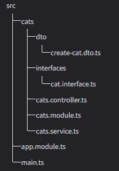

- [1. Introduction](#1-introduction)
- [2. Overview](#2-overview)
  - [2.1. First steps](#21-first-steps)
  - [2.2. Controllers](#22-controllers)
  - [2.3. Providers](#23-providers)
  - [2.4. Modules](#24-modules)
  - [2.5. Middleware](#25-middleware)
  - [2.6. Exception filters](#26-exception-filters)
  - [2.7. Pipes](#27-pipes)
  - [2.8. Guards](#28-guards)
  - [2.9. Interceptors](#29-interceptors)
  - [2.10. Custom route decorators](#210-custom-route-decorators)
- [3. Fundamentals](#3-fundamentals)
  - [3.1. Custom providers](#31-custom-providers)
  - [3.2. Asynchronous providers](#32-asynchronous-providers)
  - [3.3. Dynamic modules](#33-dynamic-modules)
  - [3.4. Injection scopes](#34-injection-scopes)
  - [3.5. Circular dependency](#35-circular-dependency)
  - [3.6. Execution context](#36-execution-context)
  - [3.7. Lifecycle Events](#37-lifecycle-events)
- [4. Techniques](#4-techniques)
  - [4.1. Configuration](#41-configuration)
  - [4.2. Database](#42-database)
  - [4.3. Mongo](#43-mongo)
  - [4.4. Validation](#44-validation)
  - [4.5. Caching](#45-caching)
  - [4.6. Serialization](#46-serialization)
  - [4.7. Versioning](#47-versioning)
  - [4.8. Task scheduling](#48-task-scheduling)
  - [4.9. Queues](#49-queues)
  - [4.10. Logger](#410-logger)
  - [4.11. Cookies](#411-cookies)
  - [4.12. Events](#412-events)
  - [4.13. Compression](#413-compression)
  - [4.14. File upload](#414-file-upload)
  - [4.15. Streaming files](#415-streaming-files)
  - [4.16. HTTP module](#416-http-module)
  - [4.17. Session](#417-session)
  - [4.18. Server-Sent Events](#418-server-sent-events)
- [5. Security](#5-security)
- [6. Microservices](#6-microservices)
- [7. Deployment](#7-deployment)
- [8. OpenAPI](#8-openapi)
- [9. RECIPES](#9-recipes)
- [10. FAQ](#10-faq)
  - [10.1. Request lifecycle](#101-request-lifecycle)


# 1. [Introduction](https://docs.nestjs.com/)

# 2. Overview

## 2.1. [First steps](https://docs.nestjs.com/first-steps)

## 2.2. Controllers

```
nest g controller [name]
```
```ts
// cats.controller.ts

import { Controller, Get } from '@nestjs/common';

@Controller('cats')
export class CatsController {
  @Get()
  findAll(): string {
    return 'This action returns all cats';
  }
}
```
Nest uses two different options for manipulating responses:
- return the value, and Nest takes care of the rest
- `findAll(@Res() response)` with Express, you can construct responses using code like `response.status(200).send()`

```ts
import type { Request } from 'express'; // @types/express
..
  findAll(@Req() request: Request): string {}
```

list of the provided decorators and the corresponding platform-specific objects they represent -
https://docs.nestjs.com/controllers#request-object

```ts
@Get(':id')
findOne(@Param() params: any): string {console.log(params.id); ...}

@Controller({ host: 'admin.example.com' })
export class AdminController {
  @Get() index() { }
}
@Controller({ host: ':account.example.com' })
export class AccountController {
  @Get()
  getInfo(@HostParam('account') account: string) { return account;}
}

async findAll(): Promise<any[]> { return []; }
findAll(): Observable<any[]> { return of([]); }
```
```ts
/*Classes are part of the JavaScript ES6 standard, so they remain intact as real entities in the compiled JavaScript. In contrast, TypeScript interfaces are removed during transpilation, meaning Nest can't reference them at runtime. This is important because features like Pipes rely on having access to the metatype of variables at runtime, which is only possible with classes.*/
export class CreateCatDto { name: string; age: number; breed: string; }
@Post()
async create(@Body() createCatDto: CreateCatDto) {}

@Get() // GET /cats?age=2&breed=Persian
async findAll(@Query('age') age: number, @Query('breed') breed: string) {}
```
```ts
// app.module.ts
import { CatsController } from './cats/cats.controller';

@Module({
  controllers: [CatsController],
})
export class AppModule {}
```

To inject a specific response object, we can use the `@Res()` decorator.  by using this approach, you lose compatibility with Nest features that rely on standard response handling, such as Interceptors and the `@HttpCode() / @Header()` decorators. To address this, you can enable the `passthrough`
```ts
@Get()
findAll(@Res({ passthrough: true }) res: Response) {
  res.status(HttpStatus.OK);
  return [];
}
```

## 2.3. Providers

[Intro](https://angular.dev/guide/di)

Controllers should handle HTTP requests and delegate more complex tasks to providers. Providers are plain JavaScript classes declared as `providers` in a NestJS module
```
nest g service cats
```
```ts
// cats.service.ts
@Injectable()
export class CatsService {
  private readonly cats: Cat[] = [];
  create(cat: Cat) {this.cats.push(cat);}
  findAll(): Cat[] { return this.cats;}
}

// cats.controller.ts
@Controller('cats')
export class CatsController {
  constructor(private catsService: CatsService) {}
  @Post()
  async create(@Body() createCatDto: CreateCatDto) {
    this.catsService.create(createCatDto);
  }
}
```
Nest will resolve the `catsService` by creating and returning an instance of `CatsService` (or, in the case of a singleton, returning the existing instance if it has already been requested elsewhere). Now that we've defined a provider (CatsService) and a consumer (CatsController), we need to register the service with Nest so that it can handle the injection. We do that in module.

## 2.4. Modules

Every Nest application has at least one module, the root module, which serves as the starting point for Nest to build the application graph. This graph is an internal structure that Nest uses to resolve relationships and dependencies between modules and providers

-|-
-|-
providers |	the providers that will be instantiated by the Nest injector and that may be shared at least across this module
controllers |	the set of controllers defined in this module which have to be instantiated
imports |	the list of imported modules that export the providers which are required in this module
exports	| the subset of providers that are provided by this module and should be available in other modules which import this module. You can use either the provider itself or just its token (provide value)

the `CatsController` and `CatsService` are closely related and serve the same application domain. It makes sense to group them into a feature module. This is particularly important as the application or team grows, and it aligns with the [SOLID](https://en.wikipedia.org/wiki/SOLID) principles.
```
nest g module cats
```
```ts
// cats/cats.module.ts
@Module({
  controllers: [CatsController],
  providers: [CatsService],
})
export class CatsModule {}

// app.module.ts

@Module({
  imports: [CatsModule],
})
export class AppModule {}
```


```ts
@Module({
  ...
  exports: [CatsService]
})
export class CatsModule {}
```
Now any module that imports the `CatsModule` has access to the `CatsService` and will share the same instance with all other modules that import it as well. If we were to directly register the `CatsService` in every module that requires it, it would result in each module getting its own separate instance of the `CatsService`.

```ts
@Module({
  imports: [CommonModule],
  exports: [CommonModule], // re-export module making it available for other modules which import this one
})
export class CoreModule {}
```
A module class can inject providers as well (e.g., for configuration purposes):
```ts
@Module({
  controllers: [CatsController],
  providers: [CatsService],
})
export class CatsModule {
  constructor(private catsService: CatsService) {}
}
```

Nest, encapsulates providers inside the module scope. When you want to provide a set of providers which should be available everywhere out-of-the-box (e.g., helpers, database connections, etc.), make the module global with the `@Global()` decorator.
```ts
@Global()
@Module({
  controllers: [CatsController],
  providers: [CatsService],
  exports: [CatsService],
})
export class CatsModule {}
```
Global modules should be registered only once, generally by the root or core module. modules that wish to inject `CatsService` will not need to import the `CatsModule` in their imports array.

https://docs.nestjs.com/modules#dynamic-modules

## 2.5. Middleware

Middleware is a function which is called before the route handler. You implement custom Nest middleware in either a function, or in a class. Nest middleware fully supports Dependency Injection like providers and controllers.
```ts
// logger.middleware.ts
import { Injectable, NestMiddleware } from '@nestjs/common';
import { Request, Response, NextFunction } from 'express';

@Injectable()
export class LoggerMiddleware implements NestMiddleware {
  use(req: Request, res: Response, next: NextFunction) {}
}

// app.module.ts
import { LoggerMiddleware } from './common/middleware/logger.middleware';
import { CatsModule } from './cats/cats.module';

@Module({
  imports: [CatsModule],
})
export class AppModule implements NestModule {
  configure(consumer: MiddlewareConsumer) {
    consumer.apply(LoggerMiddleware).forRoutes('cats');
    // forRoutes({ path: 'cats', method: RequestMethod.GET });
    // forRoutes({ path: 'abcd/*nik', method: RequestMethod.ALL, });
  }
}
```
`abcd/` with no additional characters will not match the route. For this, you need to wrap the wildcard in braces to make it optional: `abcd/{*nik}`.

`forRoutes()` method can take a single string, multiple strings, a `RouteInfo` object, a controller class and even multiple controller classes. 

`exclude()` method accepts a single string, multiple strings, or a `RouteInfo` object. It supports wildcard parameters using the [path-to-regexp](https://github.com/pillarjs/path-to-regexp#parameters) package.
```ts
consumer.apply(LoggerMiddleware)
  .exclude(
    { path: 'cats', method: RequestMethod.GET },
    'cats/{*nik}',
  ).forRoutes(CatsController);
```
```ts
// Functional middleware
export function logger(req: Request, res: Response, next: NextFunction) {};
consumer.apply(logger).forRoutes(CatsController);

// Multiple middleware
consumer.apply(cors(), helmet(), logger).forRoutes(CatsController);

// Global middleware#
const app = await NestFactory.create(AppModule);
app.use(logger);
```
Accessing the DI container in a global middleware is not possible. You can use a functional middleware instead when using `app.use()`. Alternatively, you can use a class middleware and consume it with `.forRoutes('*')` within the AppModule (or any other module).

## 2.6. Exception filters

When an exception is not handled by your application code, it is caught by this layer, which then automatically sends an appropriate user-friendly response. this action is performed by a built-in global exception filter, which handles exceptions of type `HttpException`. When an exception is unrecognized the following default JSON response: `{ "statusCode": 500, "message": "Internal server error" }`

```ts
// cats.controller.ts
@Get()
async findAll() {
  throw new HttpException('Forbidden', HttpStatus.FORBIDDEN);
}
```
When the client calls this endpoint, the response looks like this: `{ "statusCode": 403, "message": "Forbidden" }`

```
HttpException(response, status, options?)
response: string or object
```
To override just the message portion of the JSON response body, supply a string in the `response` argument. To override the entire JSON response body, pass an object in the `response`.
```ts
  try {
    await this.service.findAll()
  } catch (error) {
    throw new HttpException(
      { status: HttpStatus.FORBIDDEN, error: 'bla bla'}, 
      HttpStatus.FORBIDDEN, 
      { cause: error}
    );
  }
```
By default, the exception filter does not log built-in exceptions like `HttpException` (and any exceptions that inherit from it).
```ts
// forbidden.exception.ts
export class ForbiddenException extends HttpException {
  constructor() { super('Forbidden', HttpStatus.FORBIDDEN);}
}
```

https://docs.nestjs.com/exception-filters#built-in-http-exceptions

```ts
throw new BadRequestException('Something bad happened', {
  cause: new Error(),
  description: 'Some error description',
});
// {
//   "message": "Something bad happened",
//   "error": "Some error description",
//   "statusCode": 400
// }
```
Let's create an exception filter that is responsible for catching exceptions which are an instance of the HttpException class, and implementing custom response logic for them
```ts
// http-exception.filter.ts
import { Request, Response } from 'express';

@Catch(HttpException) // comma-separated list
export class HttpExceptionFilter implements ExceptionFilter {
  catch(exception: HttpException, host: ArgumentsHost) {
    const ctx = host.switchToHttp();
    const response = ctx.getResponse<Response>();
    const request = ctx.getRequest<Request>();
    const status = exception.getStatus();

    response.status(status)
      .json({
        statusCode: status,
        timestamp: new Date().toISOString(),
        path: request.url,
      });
  }
}

// method-scoped
@Post()
@UseFilters(HttpExceptionFilter) // comma-separated list
async create(@Body() createCatDto: CreateCatDto) {
  throw new ForbiddenException();
}
// controller-scoped
@Controller()
@UseFilters(new HttpExceptionFilter())
export class CatsController {}
// global-scoped
const app = await NestFactory.create(AppModule);
app.useGlobalFilters(new HttpExceptionFilter());
```

In order to catch every unhandled exception, leave the `@Catch()` decorator's parameter list empty.

https://docs.nestjs.com/exception-filters#inheritance

## 2.7. Pipes

Pipes have two typical use cases:

- transformation: transform input data to the desired form (e.g., from string to integer)
- validation: evaluate input data and if valid, simply pass it through unchanged; otherwise, throw an exception

https://docs.nestjs.com/pipes#built-in-pipes

```ts

@Get(':id')
async findOne(@Param('id', ParseIntPipe) id: number) {
  return this.catsService.findOne(id);
}
// customization
async findOne(@Param('id', new ParseIntPipe({ /*options*/ })) id: number) {}
```
These pipes all work in the context of validating route parameters, query string parameters and request body values.

https://docs.nestjs.com/pipes#custom-pipes

```ts
// validation.pipe.ts
@Injectable()
export class ValidationPipe implements PipeTransform {
  transform(value: any, metadata: ArgumentMetadata) {
    return value;
  }
}
// PipeTransform<T, R> -- T input type, R return value
```
we have to validate the three members of the `createCatDto` object. We could do this inside the route handler method, but doing so is not ideal as it would break the single responsibility principle (SRP) of SOLID.
```
npm install --save zod
```
```ts
import { ZodSchema  } from 'zod';

export class ZodValidationPipe implements PipeTransform {
  constructor(private schema: ZodSchema) {}
  transform(value: unknown, metadata: ArgumentMetadata) {
    try {
      const parsedValue = this.schema.parse(value);
      return parsedValue;
    } catch (error) {
      throw new BadRequestException('Validation failed');
    }
  }
}


import { z } from 'zod';

export const createCatSchema = z.object({
    name: z.string(),
    age: z.number(),
    breed: z.string(),
  }).required();

export type CreateCatDto = z.infer<typeof createCatSchema>;


@Put('/:id')
async update(
  @Param('id', ParseIntPipe) id: number,
  @Body(new ZodValidationPipe(createCatSchema)) body: CreateCatDto
): void {}
```

Let's look at an alternate implementation for our validation technique.
https://docs.nestjs.com/pipes#class-validator

you don't have to build a generic validation pipe on your own since the `ValidationPipe` is provided by Nest out-of-the-box. You can find full details [here](https://docs.nestjs.com/techniques/validation)

https://docs.nestjs.com/pipes#global-scoped-pipes

useful transformation case would be to select an existing user entity from the database using an id supplied in the request:
```ts
@Get(':id')
findOne(@Param('id', UserByIdPipe) userEntity: UserEntity) {}

// Providing defaults
@Get()
async findAll(
  @Query('page', new DefaultValuePipe(0), ParseIntPipe) page: number,
) {}
```

## 2.8. Guards

Guards have a single responsibility. They determine whether a given request will be handled by the route handler or not, depending on certain conditions (like permissions, roles). This is often referred to as authorization. Authorization (and authentication) has typically been handled by middleware in traditional Express applications since things like token validation and attaching properties to the request object are not strongly connected with a particular route context (and its metadata).

But middleware, by its nature, is dumb. It doesn't know which handler will be executed after calling the `next()` function.  Guards have access to the `ExecutionContext` instance, and thus know exactly what's going to be executed next. Guards are executed after all middleware, but before any interceptor or pipe.

```ts
// roles.guard.ts
import { Roles } from './roles.decorator';
@Injectable()
export class RolesGuard implements CanActivate {
  constructor(private reflector: Reflector) {}
  canActivate(context: ExecutionContext): boolean {
    const roles = this.reflector.get(Roles, context.getHandler());
    if (!roles)  return true;

    const request = context.switchToHttp().getRequest();
    const user = request.user;
    return matchRoles(roles, user.roles);
  }
}

// roles.decorator.ts
export const Roles = Reflector.createDecorator<string[]>();

// cats.controller.ts
@Controller('cats')
@UseGuards(RolesGuard)
export class CatsController {
  @Post()
  @Roles(['admin'])
  async create(@Body() createCatDto: CreateCatDto) {}
}
```
to bind guard globally [see](https://docs.nestjs.com/guards#binding-guards)

Alternatively, instead of using the Reflector.createDecorator method, we could use the built-in `@SetMetadata()` decorator. Learn more about [here](https://docs.nestjs.com/fundamentals/execution-context#low-level-approach).

when a guard returns false, the framework throws a `ForbiddenException`. If you want to return a different error response throw `throw new UnauthorizedException();`. Any exception thrown by a guard will be handled by the exceptions layer

## 2.9. Interceptors

https://docs.nestjs.com/interceptors

The `CallHandler` interface implements the handle() method, which you can use to invoke the route handler method. As a result, you may implement custom logic both before and after the execution of the final route handler. `handle()` method returns an `Observable` we can use to further manipulate the response.

```ts
// logging.interceptor.ts
@Injectable()
export class LoggingInterceptor implements NestInterceptor {
  intercept(context: ExecutionContext, next: CallHandler): Observable<any> {
    console.log('Before...');
    const now = Date.now();
    return next.handle().pipe(
        tap(() => console.log(`After... ${Date.now() - now}ms`)),
      );
  }
}

// cats.controller.ts
@UseInterceptors(LoggingInterceptor)
export class CatsController {}
```

[global interceptors](https://docs.nestjs.com/interceptors#binding-interceptors)

The response mapping feature doesn't work with the library-specific response strategy (using the `@Res()` object directly is forbidden).
```ts
// transform.interceptor.ts
export interface Response<T> {
  data: T;
}

@Injectable()
export class TransformInterceptor<T> implements NestInterceptor<T, Response<T>> {
  intercept(context: ExecutionContext, next: CallHandler): Observable<Response<T>> {
    return next.handle().pipe(map(data => ({ data })));
  }
}
```
When your endpoint doesn't return anything after a period of time, you want to terminate with an error response. [See](https://docs.nestjs.com/interceptors#more-operators)

## 2.10. [Custom route decorators](https://docs.nestjs.com/custom-decorators)

# 3. Fundamentals

## 3.1. Custom providers

```ts
providers: [CatsService],
// equivalent to 
providers: [
  { provide: CatsService, useClass: CatsService},
];
```
The `useValue` syntax is useful for injecting a constant value, putting an external library into the Nest container, or replacing a real implementation with a mock object.
```ts
// Non-class-based provider tokens
import { connection } from './connection';

@Module({
  providers: [
    // associating a string-valued token with a pre-existing object
    // provide can also be JavaScript symbols or TypeScript enums.
    // it's best practice to define tokens in a separate file
    { provide: 'CONNECTION', useValue: connection },
  ],
})
export class AppModule {}

@Injectable()
export class CatsRepository {
  constructor(@Inject('CONNECTION') connection: Connection) {}
}
```

https://docs.nestjs.com/fundamentals/custom-providers#factory-providers-usefactory
```ts
// Non-service based providers
const configFactory = {
  provide: 'CONFIG',
  useFactory: () => {
    return process.env.NODE_ENV === 'development' ? devConfig : prodConfig;
  },
};
@Module({
  providers: [configFactory],
  exports: ['CONFIG'],
})
export class AppModule {}
```

## 3.2. Asynchronous providers

For example, you may not want to start accepting requests until the connection with the database has been established. Nest will await resolution of the promise before instantiating any class that depends on (injects) such a provider.
```ts
{
  provide: 'ASYNC_CONNECTION',
  useFactory: async () => {
    const connection = await createConnection(options);
    return connection;
  },
}
```
[The TypeORM recipe](https://docs.nestjs.com/recipes/sql-typeorm) has a more substantial example.

## 3.3. Dynamic modules

brief introduction to [dynamic modules](https://docs.nestjs.com/modules#dynamic-modules)

A dynamic module is nothing more than a module created at run-time, with the same exact properties as a static module, plus one additional property called `module`
The `module` property serves as the name of the module, and should be the same as the class name of the module.
```ts
import * as fs from 'node:fs';
import * as path from 'node:path';
import * as dotenv from 'dotenv';
import { EnvConfig } from './interfaces';

@Injectable()
export class ConfigService {
  private readonly envConfig: EnvConfig;

  constructor(@Inject('CONFIG_OPTIONS') private options: Record<string, any>) {
    const filePath = `${process.env.NODE_ENV || 'development'}.env`;
    const envFile = path.resolve(__dirname, '../../', options.folder, filePath);
    this.envConfig = dotenv.parse(fs.readFileSync(envFile));
  }

  get(key: string): string { return this.envConfig[key]; }
}
//
@Module({})
export class ConfigModule {
  static register(options: Record<string, any>): DynamicModule {
    return {
      module: ConfigModule,
      providers: [
        { provide: 'CONFIG_OPTIONS', useValue: options },
        ConfigService,
      ],
      exports: [ConfigService],
    };
  }
}
//
@Module({
  imports: [ConfigModule.register({ folder: './config' })],
})
export class AppModule {}

```
Our `ConfigModule` is providing `ConfigService`. `ConfigService` in turn depends on the `options` object that is only supplied at run-time

https://docs.nestjs.com/fundamentals/dynamic-modules#community-guidelines

https://docs.nestjs.com/fundamentals/dynamic-modules#configurable-module-builder
- https://docs.nestjs.com/fundamentals/dynamic-modules#custom-method-key
- https://docs.nestjs.com/fundamentals/dynamic-modules#custom-options-factory-class
- https://docs.nestjs.com/fundamentals/dynamic-modules#extra-options
- https://docs.nestjs.com/fundamentals/dynamic-modules#extending-auto-generated-methods

## 3.4. Injection scopes

https://docs.nestjs.com/fundamentals/injection-scopes#provider-scope

```ts
// Provider scope
@Injectable({ scope: Scope.REQUEST })
export class CatsService {}

// Controller scope
@Controller({
  path: 'cats',
  scope: Scope.REQUEST, // a new instance is created for each inbound request
})
export class CatsController {}
```
The `REQUEST` scope bubbles up the injection chain. A controller or provider that depends on a request-scoped provider will, itself, be request-scoped.

`CatsController <- CatsService <- CatsRepository`

`CatsService` is request-scoped => `CatsController` will become request-scoped. `CatsRepository` remain singleton-scoped.

you may want to access a reference to the original request object when using request-scoped providers. You can do this by injecting the `REQUEST` object.
```ts
@Injectable({ scope: Scope.REQUEST })
export class CatsService {
  constructor(@Inject(REQUEST) private request: Request) {}
}
```

https://docs.nestjs.com/fundamentals/injection-scopes#inquirer-provider

Request-scoped providers may lead to increased latency since having at least 1 request-scoped provider (injected into the controller instance, or deeper - injected into one of its providers) makes the controller request-scoped as well. That means it must be recreated (instantiated) per each individual request (and garbage collected afterward). Now, that also means, that for let's say 30k requests in parallel, there will be 30k ephemeral instances of the controller.

For instance, we have 10 different customers. you want to make sure customer A will never be able to reach customer B's database. One way to achieve this could be to declare a request-scoped "data source" provider that - based on the request object - determines what's the "current customer" and retrieves its corresponding database. This will impact performance.

Since we only have 10 customers, couldn't we have 10 individual DI sub-trees per customer (instead of recreating each tree per request)?
```ts
const tenants = new Map<string, ContextId>();

export class AggregateByTenantContextIdStrategy implements ContextIdStrategy {
  attach(contextId: ContextId, request: Request) {
    const tenantId = request.headers['x-tenant-id'] as string;
    let tenantSubTreeId: ContextId;

    if (tenants.has(tenantId)) {
      tenantSubTreeId = tenants.get(tenantId);
    } else {
      tenantSubTreeId = ContextIdFactory.create();
      tenants.set(tenantId, tenantSubTreeId);
    }

    // If tree is not durable, return the original "contextId" object
    return (info: HostComponentInfo) =>
      info.isTreeDurable ? tenantSubTreeId : contextId;
  }
}
```
Similar to the request scope, durability bubbles up the injection chain (unless durable is explicitly set to false for container provider). this strategy is not ideal for applications operating with a large number of tenants.

`tenantSubTreeId` should be used instead of the auto-generated `contextId` object, when the host component (e.g., request-scoped controller) is flagged as durable

If you want to register the payload for a durable tree, use the following construction instead:
```ts
return {
  resolve: (info: HostComponentInfo) =>
    info.isTreeDurable ? tenantSubTreeId : contextId,
  payload: { tenantId },
};
```
Now whenever you inject the `REQUEST` provider using the `@Inject(REQUEST)`, the `payload` object would be injected.
```ts
// main.ts
ContextIdFactory.apply(new AggregateByTenantContextIdStrategy());

// Scope.REQUEST not needed if the scope is in the injection chain
@Injectable({ scope: Scope.REQUEST, durable: true })
export class CatsService {}

// setting scope in custom providers
{
  provide: 'foobar',
  useFactory: () => { ... },
  scope: Scope.REQUEST,
  durable: true,
}
```

## 3.5. [Circular dependency](https://docs.nestjs.com/fundamentals/circular-dependency)

## 3.6. Execution context

The `ArgumentsHost` class provides methods for retrieving the arguments being passed to a handler. It allows choosing the appropriate context (e.g., HTTP, RPC (microservice), or WebSockets) to retrieve the arguments from.
```ts
if (host.getType() === 'http') { // REST
  const ctx = host.switchToHttp();
  const request = ctx.getRequest<Request>();
  const response = ctx.getResponse<Response>();
} 
else if (host.getType() === 'rpc') {} // Microservice
else if (host.getType<GqlContextType>() === 'graphql') {} // GraphQL
```
`ExecutionContext` extends `ArgumentsHost`, providing additional details about the current execution process. 
```ts
const methodKey = ctx.getHandler().name; // "create"
const className = ctx.getClass().name; // "CatsController"
```
it gives us the opportunity to access the metadata

for `Reflector#createDecorator` example [see](#28-guards)

to extract controller metadata:
```ts
const roles = this.reflector.get(Roles, context.getClass());
```
The `Reflector` class provides two utility methods used to extract both controller and method metadata at once
```ts
@Roles(['user'])
@Controller('cats')
export class CatsController {
  @Post()
  @Roles(['admin'])
  async create(@Body() createCatDto: CreateCatDto) {}
}

// 'user' as the default role, and override it selectively for certain methods
const roles = this.reflector.getAllAndOverride(Roles, [context.getHandler(), context.getClass()]); // ['admin']

const roles = this.reflector.getAllAndMerge(Roles, [context.getHandler(), context.getClass()]); // ['user', 'admin']
```
```ts
@SetMetadata('roles', ['admin'])
// or
export const Roles = (...roles: string[]) => SetMetadata('roles', roles);
@Roles('admin')

const roles = this.reflector.get<string[]>('roles', context.getHandler());
```
comapred to `Reflector#createDecorator`, `@SetMetadata` have more control over the metadata key and value, and also can take more than one argument.

## 3.7. [Lifecycle Events](https://docs.nestjs.com/fundamentals/lifecycle-events)

# 4. Techniques

## 4.1. Configuration

```
npm i --save @nestjs/config # internally uses dotenv.
```
```ts
import { ConfigModule } from '@nestjs/config';
@Module({
  imports: [
    // by default reads .env file
    ConfigModule.forRoot({
      envFilePath: ['.env.development.local', '.env.development'],
    })
  ],
})
export class AppModule {}
```

If you need some env variables to be available even before the ConfigModule is loaded and Nest application is bootstrapped you can
```
nest start --env-file .env
```
If you don't want to load the .env file, but instead would like to simply access environment variables from the runtime environment (as with OS shell exports like `export DATABASE_USER=test`), set `ignoreEnvFile: true`
```ts
ConfigModule.forRoot({ ignoreEnvFile: true, });

// no need to import ConfigModule in other modules 
ConfigModule.forRoot({ isGlobal: true  });

// config/configuration.ts
export default () => ({
  port: parseInt(process.env.PORT, 10) || 3000,
  database: {
    host: process.env.DATABASE_HOST,
    port: parseInt(process.env.DATABASE_PORT, 10) || 5432
  }
});

@Module({
  imports: [
    ConfigModule.forRoot({ load: [configuration] }),
  ],
})
export class AppModule {}
```
```ts
// in some class
constructor(private configService: ConfigService) {}
// get an environment variable
const dbUser = this.configService.get<string>('DATABASE_USER');
// get a custom configuration value
const dbHost = this.configService.get<string>('database.host');

const dbConfig = this.configService.get<{ host: string; port: number; }>('database');


interface EnvironmentVariables { 
  PORT: number; TIMEOUT: string;
  database: { host: string };
}
constructor(private configService: ConfigService<EnvironmentVariables>) {
  // typeof port === "number | undefined"
  const port = this.configService.get('PORT', { infer: true });
  // TypeScript Error: URL property is not defined in EnvironmentVariables
  const url = this.configService.get('URL', { infer: true });
  // typeof dbHost === "string | undefined"  
  const dbHost = this.configService.get('database.host', { infer: true });
}
```
Alternatively to custom config file shown above you can return a "namespaced" configuration object with the registerAs() function as follows:
```ts
// config/database.config.ts
export default registerAs('database', () => ({
  host: process.env.DATABASE_HOST,
  port: process.env.DATABASE_PORT || 5432
}));

@Module({
  imports: [
    // load array will merge as { anamespace: aconfig, bnamespace: bconfig }
    ConfigModule.forRoot({ load: [databaseConfig] }),
  ],
})
export class AppModule {}

const dbHost = this.configService.get<string>('database.host');

// inject the database namespace directly.
constructor(
  @Inject(databaseConfig.KEY)
  private dbConfig: ConfigType<typeof databaseConfig>,
) {}
```
https://docs.nestjs.com/techniques/configuration#namespaced-configurations-in-modules

```ts
// icrease the performance of ConfigService#get method when it comes to variables stored in process.env
ConfigModule.forRoot({ cache: true, });
```
we've processed configuration files in our root module (e.g., `AppModule`), with the `forRoot()` method. Perhaps you have a more complex project structure, with feature-specific configuration files located in multiple different directories. Use the `forFeature()` method to references only the configuration files associated with that feature module
```ts
@Module({
  imports: [ConfigModule.forFeature(databaseConfig)],
})
export class DatabaseModule {}
```

> In some circumstances, you may need to access properties loaded via partial registration using the `onModuleInit()` hook, rather than in a constructor. 

https://docs.nestjs.com/techniques/configuration#schema-validation

// or

https://docs.nestjs.com/techniques/configuration#custom-validate-function

you can use this hook to ensure that the `.env` file was loaded before interacting with the `process.env` object
```ts
export async function getStorageModule() {
  await ConfigModule.envVariablesLoaded;
  return process.env.STORAGE === 'S3' ? S3StorageModule : DefaultStorageModule;
}
```
**conditional module loading**-
https://docs.nestjs.com/techniques/configuration#conditional-module-configuration


https://docs.nestjs.com/techniques/configuration#expandable-variables
```
APP_URL=mywebsite.com
SUPPORT_EMAIL=support@${APP_URL}
```

While our config is stored in a service, it can still be used in the `main.ts` file.
```ts
const configService = app.get(ConfigService);
const port = configService.get('PORT');
```

## 4.2. Database

**TypeORM Integration**

we'll demonstrate using the popular MySQL Relational DBMS, but TypeORM provides support for many relational databases, such as PostgreSQL. The procedure is same just need to install the associated client API libraries for your selected database.
```
npm install --save @nestjs/typeorm typeorm mysql2
```
```ts
@Module({
  imports: [
    TypeOrmModule.forRoot({
      type: 'mysql', host: 'localhost', port: 3306,
      username: 'root', password: 'root', database: 'test',
      entities: [],
      synchronize: true, // dont use in production
    }),
  ],
})
export class AppModule {}
```
The `forRoot()` method supports all the configuration properties exposed by the DataSource constructor from the [TypeORM](https://typeorm.io/docs/data-source/data-source-options/#common-data-source-options) package. In addition, there are several extra configuration properties: `retryAttempts, retryDelay, autoLoadEntities`

the TypeORM `DataSource` and `EntityManager` objects will be available to inject across the entire project (without needing to import any modules)
```ts
export class AppModule {
  constructor(private dataSource: DataSource) {}
}
```
TypeORM supports the repository design pattern, so each entity has its own repository
```ts
// user.entity.ts
@Entity()
export class User {
  @PrimaryGeneratedColumn()
  id: number;
  @Column()
  firstName: string;
  @Column()
  lastName: string;
  @Column({ default: true })
  isActive: boolean;
}

// users.module.ts
import { UsersService } from './users.service';
import { UsersController } from './users.controller';
import { User } from './user.entity';
@Module({
  imports: [TypeOrmModule.forFeature([User])],
  providers: [UsersService],
  controllers: [UsersController],
})
export class UsersModule {}

// app.module.ts
import { User } from './users/user.entity';
@Module({
  imports: [
    UsersModule,
    TypeOrmModule.forRoot({... entities: [User] }),
  ],
})
export class AppModule {}

// users.service.ts
@Injectable()
export class UsersService {
  constructor(
    @InjectRepository(User)
    private usersRepository: Repository<User>,
  ) {}

  findAll(): Promise<User[]> {
    return this.usersRepository.find();
  }
  findOne(id: number): Promise<User | null> {
    return this.usersRepository.findOneBy({ id });
  }
  async remove(id: number): Promise<void> {
    await this.usersRepository.delete(id);
  }
}
```
`forFeature()` method to define which repositories are registered in the current scope.
If you want to use the repository outside of the module you'll need to re-export the providers
```ts
@Module({
  imports: [TypeOrmModule.forFeature([User])],
  exports: [TypeOrmModule]
})
export class UsersModule {}
```

https://docs.nestjs.com/techniques/database#relations
```ts
import { Photo } from '../photos/photo.entity';
@Entity()
export class User {
  ...
  @OneToMany(type => Photo, photo => photo.user)
  photos: Photo[];
} 
```

Manually adding entities to the `entities` array of the data source options can be tedious. To automatically load entities, set the `autoLoadEntities`
```ts
TypeOrmModule.forRoot({ ... autoLoadEntities: true, }),
```
Now every entity registered through the `forFeature()` method will be automatically added to the `entities` array of the configuration object.

https://docs.nestjs.com/techniques/database#typeorm-transactions

https://docs.nestjs.com/techniques/database#subscribers

https://docs.nestjs.com/techniques/database#migrations

https://docs.nestjs.com/techniques/database#multiple-databases

https://docs.nestjs.com/techniques/database#testing

https://docs.nestjs.com/techniques/database#async-configuration

https://docs.nestjs.com/techniques/database#custom-datasource-factory

working example of whatever done so far - https://docs.nestjs.com/techniques/database#example

**Sequelize Integration**

...

## 4.3. [Mongo](https://docs.nestjs.com/techniques/mongodb)

## 4.4. Validation

https://docs.nestjs.com/techniques/validation#using-the-built-in-validationpipe

We'll start by binding `ValidationPipe` at the application level, thus ensuring all endpoints are protected from receiving incorrect data.
```ts
const app = await NestFactory.create(AppModule);
app.useGlobalPipes(new ValidationPipe());


// https://github.com/typestack/class-validator#validation-decorators
import { IsEmail, IsNotEmpty } from 'class-validator';
export class CreateUserDto {
  @IsEmail()
  email: string;
  @IsNotEmpty()
  password: string;
}


@Post()
create(@Body() createUserDto: CreateUserDto) {
  return 'This action adds a new user';
}
// if a request hits our endpoint with an invalid email property
{
  "statusCode": 400,
  "error": "Bad Request",
  "message": ["email must be an email"]
}


export class FindOneParams {
  @IsNumberString()
  id: string;
}
@Get(':id')
findOne(@Param() params: FindOneParams) {
  return 'This action returns a user';
}
```
> When importing your DTOs, you can't use a type-only import as that would be erased at runtime, i.e. remember to `import { CreateUserDto }` instead of `import type { CreateUserDto }`.

```ts
new ValidationPipe({ 
  disableErrorMessages: true, // disable error message in response
  whitelist: true, // remove non-whitelisted properties (those without any decorator in the validation class)
  forbidNonWhitelisted: true, // stop the request from processing when non-whitelisted properties are present
})
```
The `ValidationPipe` can automatically transform payloads to be objects typed according to their DTO classes. It will also perform conversion of primitive types
```ts
@UsePipes(new ValidationPipe({ transform: true })) // method level
async create(@Body() createCatDto: CreateCatDto) {}
// global level
app.useGlobalPipes(new ValidationPipe({ transform: true, }));

// By default, every path and query parameter is string.
// we specified the id type as a number (in the method signature)
@Get(':id')
findOne(@Param('id') id: number) {
  console.log(typeof id === 'number'); // true
}

// Explicit conversion (transform: false)
@Get(':id')
findOne(
  @Param('id', ParseIntPipe) id: number,
  @Query('sort', ParseBoolPipe) sort: boolean,
) {}
```

https://docs.nestjs.com/techniques/validation#mapped-types

we will use imports from `@nestjs/mapped-types`. If using openAPI use [@nestjs/swagger](https://docs.nestjs.com/openapi/mapped-types). Technique is same.

When building input validation types (also called DTOs), it's often useful to create variations. For example, the create variant may require all fields, while the update variant may make all fields optional.
```ts
// By default, all of these fields are required
export class CreateCatDto { name: string; age: number; breed: string; }

// all the properties set to optional
export class UpdateCatDto extends PartialType(CreateCatDto) {}
```
The `PickType()` constructs a new type (class) by picking a set of properties from an input type
```ts
export class UpdateCatAgeDto extends PickType(CreateCatDto, ['age'] as const) {}
// include every property except name
export class UpdateCatDto extends OmitType(CreateCatDto, ['name'] as const) {}
```
The `IntersectionType()` function combines two types into one new type (class)
```ts
export class UpdateCatDto extends IntersectionType(CreateCatDto,AdditionalCatInfo) {}
// composable
export class UpdateCatDto extends PartialType(
  OmitType(CreateCatDto, ['name'] as const),
) {}
```
TypeScript does not store metadata about generics or interfaces, so when you use them in your DTOs, `ValidationPipe` may not be able to properly validate incoming data. Eg: this won't be correctly validated
```ts
createBulk(@Body() createUserDtos: CreateUserDto[]) {}
```
To validate the array, create a dedicated class which contains a property that wraps the array, or use the `ParseArrayPipe`
```ts
createBulk(
  @Body(new ParseArrayPipe({ items: CreateUserDto }))
  createUserDtos: CreateUserDto[],
) {}
// GET /?ids=1,2,3
findByIds(
  @Query('ids', new ParseArrayPipe({ items: Number, separator: ',' }))
  ids: number[],
) {}
```
Read more about custom validators, error messages, and available decorators as provided by the class-validator package [here](https://github.com/typestack/class-validator).

## 4.5. [Caching](https://docs.nestjs.com/techniques/caching)

## 4.6. [Serialization](https://docs.nestjs.com/techniques/serialization)

## 4.7. [Versioning](https://docs.nestjs.com/techniques/versioning)

## 4.8. [Task scheduling](https://docs.nestjs.com/techniques/task-scheduling)

## 4.9. [Queues](https://docs.nestjs.com/techniques/queues)

## 4.10. [Logger](https://docs.nestjs.com/techniques/logger)

## 4.11. [Cookies](https://docs.nestjs.com/techniques/cookies)

## 4.12. [Events](https://docs.nestjs.com/techniques/events)

## 4.13. [Compression](https://docs.nestjs.com/techniques/compression)

## 4.14. [File upload](https://docs.nestjs.com/techniques/file-upload)

## 4.15. [Streaming files](https://docs.nestjs.com/techniques/streaming-files)

## 4.16. [HTTP module](https://docs.nestjs.com/techniques/http-module)

## 4.17. [Session](https://docs.nestjs.com/techniques/session)

## 4.18. [Server-Sent Events](https://docs.nestjs.com/techniques/server-sent-events)

# 5. Security
...

# 6. Microservices
...

# 7. [Deployment](https://docs.nestjs.com/deployment)

# 8. OpenAPI
...

# 9. RECIPES
...

# 10. FAQ
...
## 10.1. [Request lifecycle](https://docs.nestjs.com/faq/request-lifecycle)